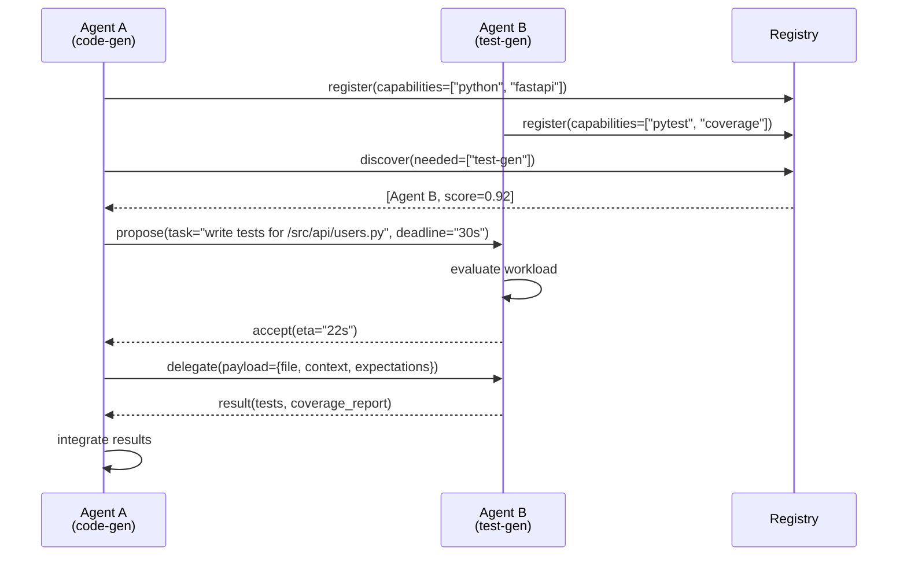

Most multi-agent systems still route everything through a central orchestrator. One agent receives the task, decides who handles what, and forwards work. It works until it doesn't — the orchestrator becomes a bottleneck, a single point of failure, and a context ceiling. When any agent's output needs to flow through a planner before the next step can start, your latency budget is gone before the real work begins.

Peer coordination changes the model. Agents advertise capabilities, negotiate task boundaries directly with each other, and only escalate to a planner when they genuinely can't resolve something locally.



---

## Peer Coordination vs Hierarchical

Hierarchical coordination makes sense when tasks genuinely require a global view — when you need to sequence five agents in order and each step's output is the next step's input. The orchestrator earns its place.

Peer coordination is better when tasks can be split without a global view — when Agent A knows it needs test coverage for the code it just generated, and Agent B can produce that without knowing anything about the broader workflow. Forcing that exchange through a central planner adds two network hops and burns context tokens on a routing decision that adds no value.

The practical question is: does the agent requesting help need the other agent's output before it can continue, or can it hand off and move on? If it needs to wait anyway, a direct request-reply between peers is simpler and faster than routing through a planner.

---

## Capability Advertisement

For peer coordination to work, agents need to find each other. A registry that tracks what each agent can do is the simplest approach.

```python
from dataclasses import dataclass, field
from typing import Optional
import httpx
import time

@dataclass
class AgentCapability:
    agent_id: str
    capabilities: list[str]
    max_concurrent_tasks: int = 3
    avg_latency_ms: int = 5000
    registered_at: float = field(default_factory=time.time)

class CapabilityRegistry:
    def __init__(self):
        self._agents: dict[str, AgentCapability] = {}

    def register(self, cap: AgentCapability) -> None:
        self._agents[cap.agent_id] = cap

    def discover(self, needed: list[str], exclude: Optional[str] = None) -> list[AgentCapability]:
        results = []
        for agent_id, cap in self._agents.items():
            if agent_id == exclude:
                continue
            if all(c in cap.capabilities for c in needed):
                results.append(cap)
        # Sort by average latency — fastest first
        return sorted(results, key=lambda a: a.avg_latency_ms)

    def deregister(self, agent_id: str) -> None:
        self._agents.pop(agent_id, None)
```

Keep the registry simple. A Redis hash with a 60-second TTL per agent entry is enough for most deployments — agents heartbeat to stay registered, and a missed heartbeat removes them automatically. You don't need a distributed consensus protocol for capability advertisement.

---

## Task Delegation Protocol

A clean delegation exchange needs four things: a proposal (what is being asked), an acceptance or rejection with a reason, the actual payload, and a result. Keep it synchronous when the requesting agent blocks on the response; use a callback pattern when it can proceed with other work.

```python
import asyncio
from dataclasses import dataclass
from typing import Any

@dataclass
class DelegationProposal:
    task_id: str
    task_type: str
    payload: dict[str, Any]
    deadline_ms: int
    requesting_agent: str

@dataclass
class DelegationResponse:
    task_id: str
    accepted: bool
    eta_ms: Optional[int] = None
    rejection_reason: Optional[str] = None

@dataclass
class TaskResult:
    task_id: str
    success: bool
    output: Any
    error: Optional[str] = None

class PeerAgent:
    def __init__(self, agent_id: str, capabilities: list[str]):
        self.agent_id = agent_id
        self.capabilities = capabilities
        self._active_tasks: set[str] = set()
        self._max_tasks = 3

    async def propose_delegation(
        self,
        peer_url: str,
        proposal: DelegationProposal
    ) -> DelegationResponse:
        async with httpx.AsyncClient() as client:
            resp = await client.post(
                f"{peer_url}/delegate",
                json=proposal.__dict__,
                timeout=5.0
            )
            resp.raise_for_status()
            data = resp.json()
            return DelegationResponse(**data)

    async def handle_proposal(self, proposal: DelegationProposal) -> DelegationResponse:
        if len(self._active_tasks) >= self._max_tasks:
            return DelegationResponse(
                task_id=proposal.task_id,
                accepted=False,
                rejection_reason="at_capacity"
            )
        if proposal.deadline_ms < self._estimate_duration(proposal):
            return DelegationResponse(
                task_id=proposal.task_id,
                accepted=False,
                rejection_reason="deadline_too_tight"
            )
        self._active_tasks.add(proposal.task_id)
        return DelegationResponse(
            task_id=proposal.task_id,
            accepted=True,
            eta_ms=self._estimate_duration(proposal)
        )

    def _estimate_duration(self, proposal: DelegationProposal) -> int:
        # Placeholder — real implementation inspects payload size, task type
        return 8000
```

The rejection reasons matter. "at_capacity" tells the requesting agent to try a different peer. "deadline_too_tight" tells it to either relax the deadline or handle the task itself.

---

## Failure Handling When a Peer Goes Down

Peer coordination introduces a failure mode that centralized orchestration doesn't: the agent you delegated to disappears mid-task. You need a recovery path.

The minimum viable approach: every delegation has a deadline. If the requesting agent hasn't received a result by the deadline, it either retries with a different peer (if the registry has one) or falls back to handling the task itself.

```python
async def delegate_with_fallback(
    self,
    proposal: DelegationProposal,
    registry: CapabilityRegistry,
    needed_capabilities: list[str]
) -> TaskResult:
    candidates = registry.discover(
        needed=needed_capabilities,
        exclude=self.agent_id
    )

    for candidate in candidates[:3]:  # Try up to 3 peers
        try:
            peer_url = f"http://{candidate.agent_id}"
            resp = await self.propose_delegation(peer_url, proposal)
            if not resp.accepted:
                continue

            result = await asyncio.wait_for(
                self._await_result(proposal.task_id),
                timeout=proposal.deadline_ms / 1000
            )
            return result

        except (httpx.ConnectError, asyncio.TimeoutError):
            # Peer is down or too slow — deregister and try next
            registry.deregister(candidate.agent_id)
            continue

    # All peers failed — handle locally as fallback
    return await self._handle_locally(proposal)
```

Don't retry the same peer after a timeout. Remove it from the registry immediately so other agents don't waste time on it. The next heartbeat cycle will re-register it if it recovers.

---

## What Breaks in Practice

Three failure modes that will bite you before anything else:

**Circular delegation.** Agent A delegates to Agent B, which decides it needs Agent A's help. Without cycle detection, this loops forever. The fix is a delegation chain header — each agent appends its ID before forwarding. Any agent that sees its own ID in the chain refuses to accept.

**Context amnesia.** When Agent A delegates to Agent B and B returns a result, A may not have enough context to integrate it correctly. The original task context needs to travel with the delegation payload, not just the sub-task description.

**Cascading load.** When a popular capability (say, embedding generation) gets a rush of delegation requests, the few agents offering it get overwhelmed. Implement back-pressure: if an agent is at 80% capacity, it starts rejecting non-urgent proposals before hitting 100%. This spreads load more gracefully than hard cutoffs.

---

## When to Use This Pattern

Peer coordination pays off when your agents are specialists — each one good at a narrow domain — and tasks frequently require combining two or three domains. Code generation plus test generation plus documentation is a clean fit. A single generalist agent handling all three is simpler to operate but will hit context limits on any sufficiently large task.

If your current orchestrator is a bottleneck, instrument it first. If the orchestrator is spending more than 20% of wall-clock time on routing decisions rather than doing real work, peer coordination is worth the added complexity.

---

*Day 1 of 7. Previous: [Spec-Driven Development](/posts/spec-driven-development-with-ai-agents/). Next: [Debugging Production Agents](/posts/debugging-production-agents-trace-analysis/)*
