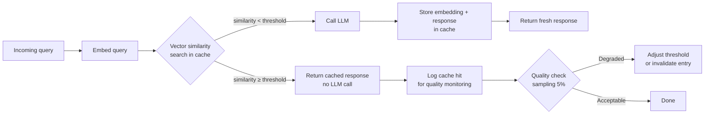

Exact-match caching for LLM calls has a near-zero hit rate in practice. Users don't ask the same question with identical wording. "What's the refund policy?" and "how do I get a refund?" are semantically identical and an exact cache misses both. Semantic caching changes the cache key from a string to a vector, and uses similarity search to decide whether a new query is close enough to a cached one to reuse the answer.

The tradeoff is real: you're accepting some probability of returning a cached answer to a query that's subtly different enough to deserve a fresh one. Getting the similarity threshold right is the core engineering problem. Set it too high and your hit rate is nearly as bad as exact matching. Set it too low and you return incorrect answers to queries that deserved fresh responses.



---

## Why Exact Caching Fails for LLM Workloads

The fundamental problem is that LLM inputs aren't stable identifiers. A SQL query cache key works because `SELECT * FROM users WHERE id = 5` is deterministic — the same string always means the same query. But LLM prompts include conversation history, retrieved context, and user phrasing — none of which are stable.

Even if you strip context and cache only on the user message, natural language queries have massive surface area variation. In a customer support bot we measured, fewer than 3% of queries were exact duplicates within a 24-hour window, across roughly 40,000 daily queries. A semantic cache at cosine similarity 0.92 brought the effective duplicate rate to 34% — meaning we could serve 34% of queries from cache. At 20,000 input tokens average and $0.003/1K tokens on input, that's real money at scale.

---

## Cosine Similarity Threshold Tuning

The threshold is the parameter that controls the quality-cost tradeoff. There's no universal right value — it depends on your domain's semantic density.

Dense domains (legal, medical, financial) have many queries that are semantically similar but not interchangeable. "Can I get a refund on a digital product?" and "Are digital products refundable?" might score 0.94 cosine similarity but the policy answer could differ depending on jurisdiction. In these domains, use 0.95+.

Sparse domains (general Q&A, FAQ bots, documentation assistants) have more forgiving similarity. 0.90 is usually safe. Below 0.88 you'll start seeing noticeable quality issues.

```python
import numpy as np
from sentence_transformers import SentenceTransformer
from typing import Optional
import redis
import json
import hashlib

class SemanticCache:
    def __init__(
        self,
        model_name: str = "text-embedding-3-small",
        similarity_threshold: float = 0.92,
        ttl_seconds: int = 3600,
    ):
        self.encoder = SentenceTransformer(model_name)
        self.threshold = similarity_threshold
        self.ttl = ttl_seconds
        self.redis = redis.Redis(decode_responses=True)

    def _embed(self, text: str) -> np.ndarray:
        return self.encoder.encode(text, normalize_embeddings=True)

    def get(self, query: str) -> Optional[tuple[str, float]]:
        query_vec = self._embed(query)

        # Scan recent cache entries (use a vector DB like Qdrant in production)
        keys = self.redis.keys("semantic_cache:*")
        best_score = 0.0
        best_response = None

        for key in keys[:500]:  # Cap scan for performance
            entry = self.redis.hgetall(key)
            if not entry:
                continue
            cached_vec = np.array(json.loads(entry["embedding"]))
            score = float(np.dot(query_vec, cached_vec))

            if score > best_score:
                best_score = score
                best_response = entry["response"]

        if best_score >= self.threshold:
            return best_response, best_score
        return None

    def set(self, query: str, response: str) -> None:
        query_vec = self._embed(query)
        key = f"semantic_cache:{hashlib.sha256(query.encode()).hexdigest()[:16]}"
        self.redis.hset(key, mapping={
            "query": query,
            "embedding": json.dumps(query_vec.tolist()),
            "response": response,
        })
        self.redis.expire(key, self.ttl)
```

For production, replace the Redis key scan with a proper vector database — Qdrant, Weaviate, or pgvector. The scan approach above is fine for prototyping but will hit performance problems above a few thousand cache entries.

---

## Cache Invalidation Strategies

The hardest problem in caching applies here too. For LLM caches, you have three practical invalidation handles:

**TTL-based**: set a time-to-live appropriate for how often your source data changes. FAQ answers that change quarterly get a 24-hour TTL. Real-time data queries (stock prices, live inventory) should not be cached semantically at all.

**Source-document-triggered**: when a document in your knowledge base is updated, invalidate all cache entries whose query embeddings are within 0.85 similarity of the updated document's topic embedding. This requires storing the source document reference with each cache entry.

**Feedback-triggered**: when a user flags a response as wrong, invalidate the cache entry and all entries with similarity >0.90 to the flagged query. This is the most targeted approach but requires a feedback loop from the UI.

```python
def invalidate_by_topic(self, topic_text: str, similarity_threshold: float = 0.85) -> int:
    topic_vec = self._embed(topic_text)
    keys = self.redis.keys("semantic_cache:*")
    invalidated = 0

    for key in keys:
        entry = self.redis.hgetall(key)
        if not entry:
            continue
        cached_vec = np.array(json.loads(entry["embedding"]))
        score = float(np.dot(topic_vec, cached_vec))
        if score >= similarity_threshold:
            self.redis.delete(key)
            invalidated += 1

    return invalidated
```

---

## Measuring the Hit Rate vs Quality Tradeoff

A cache hit rate metric without a quality metric is misleading. You want to know not just how often the cache serves a response, but how often the cached response is actually correct for the query it served.

The simplest quality check is sampling: for 5% of cache hits, also fire the LLM call and compare outputs using an LLM judge or a task-specific metric. If the cached response and fresh response agree >95% of the time at your current threshold, you can safely lower the threshold slightly and capture more hits. If they disagree >10% of the time, raise the threshold.

```python
import random

async def get_with_quality_sampling(
    self,
    query: str,
    llm_fn,
    sample_rate: float = 0.05
) -> dict:
    cache_result = self.get(query)

    if cache_result is None:
        response = await llm_fn(query)
        self.set(query, response)
        return {"response": response, "cache_hit": False}

    cached_response, similarity = cache_result

    # Probabilistic quality sampling
    if random.random() < sample_rate:
        fresh_response = await llm_fn(query)
        quality_ok = await self._judge_equivalence(cached_response, fresh_response)
        self._log_quality_check(query, similarity, quality_ok)

        if not quality_ok:
            # Evict and return fresh
            self._evict_entry(query)
            return {"response": fresh_response, "cache_hit": False, "evicted": True}

    return {"response": cached_response, "cache_hit": True, "similarity": similarity}
```

---

## Real Cost Numbers

On an enterprise support chatbot handling 50,000 queries per day, at an average of 800 input tokens and 300 output tokens per query, using Claude Sonnet pricing:

- **Without cache**: ~$X/day at current pricing
- **With semantic cache at 0.92 threshold**: 31% hit rate → 31% reduction in LLM calls → proportional cost reduction
- **Cache infrastructure cost** (Qdrant instance + compute for embedding): roughly 8% of the LLM savings

The net saving was significant enough to pay for the engineering time to implement it within 3 weeks of deployment.

One caveat: embeddings aren't free. If you're using a commercial embedding API (OpenAI `text-embedding-3-small`, for example), you're paying for every query to generate the cache-lookup embedding. At high query volume, self-hosting an embedding model (via sentence-transformers) eliminates this cost entirely and adds roughly 10ms latency for embedding generation on CPU.

---

## What Not to Cache Semantically

Some LLM workloads should never go through a semantic cache:

- **Queries that depend on the current date/time** — "what's today's schedule?" has different correct answers every day
- **Personalized responses** — if the answer depends on the user's account state, caching the response means you might serve user A's data to user B
- **Agentic tasks with side effects** — if the LLM is deciding whether to trigger a payment or send an email, a stale cached decision is a bug, not a feature
- **Low-repetition, high-specificity queries** — unique queries that never repeat have a 0% hit rate and you're just paying for embedding generation with no return

Semantic caching is a tool for repetitive, stateless, read-only query patterns. Profile your workload first and confirm you have enough repetition to make the investment worthwhile.

---

*Day 3 of 7. Previous: [Debugging Production Agents](/posts/debugging-production-agents-trace-analysis/)*
