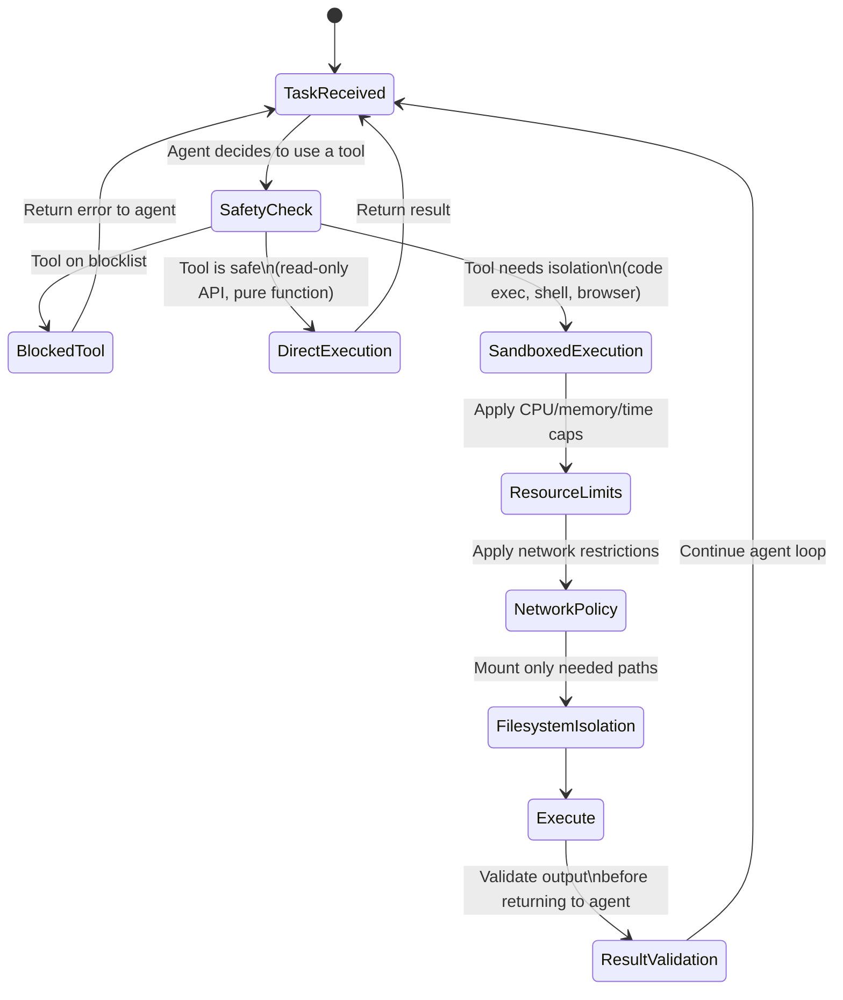

An agent that can call `subprocess.run()` or `os.system()` on your production host can do anything your process user can do. That includes reading environment variables, accessing other services on the same network, writing to shared filesystems, and exfiltrating data through outbound HTTP. The model that issued the command might be well-intentioned — but the tool outputs it acts on might not be. Prompt injection via a malicious web page or document is a real attack vector, not a theoretical one.

Sandboxing isn't about not trusting your own agents. It's about containing the damage radius when something goes wrong, whether that's a prompt injection, a logic error, or a model hallucinating a destructive command.



---

## What Needs Sandboxing

Not everything an agent does requires isolation. The overhead of spinning up a container or cloud sandbox for every tool call will kill your latency budget. The decision tree is straightforward:

**Sandbox required:**
- Code execution (Python, JavaScript, bash, any shell command)
- File system writes, especially in shared paths
- Browser automation and web scraping
- Any tool that takes external user-supplied content as input

**Safe to run directly:**
- Read-only API calls to well-defined external services
- Pure functions with no side effects
- Retrieval from a vector database or search index
- Structured data lookups in your own systems (with appropriate auth)

The line is: does this tool have side effects that could propagate beyond the task? If yes, sandbox it.

---

## Docker-Based Sandboxing

The most portable sandbox is a Docker container with explicit resource limits, a stripped network policy, and a read-only filesystem except for a designated scratch directory.

```python
import docker
import tempfile
import os
from pathlib import Path

def run_in_sandbox(
    code: str,
    language: str = "python",
    timeout_seconds: int = 30,
    memory_mb: int = 256,
) -> dict:
    client = docker.from_env()

    with tempfile.TemporaryDirectory() as tmpdir:
        # Write the code to a temp file
        if language == "python":
            code_file = Path(tmpdir) / "main.py"
            image = "python:3.12-slim"
            cmd = ["python", "/sandbox/main.py"]
        elif language == "javascript":
            code_file = Path(tmpdir) / "main.js"
            image = "node:20-slim"
            cmd = ["node", "/sandbox/main.js"]
        else:
            raise ValueError(f"Unsupported language: {language}")

        code_file.write_text(code)

        try:
            container = client.containers.run(
                image=image,
                command=cmd,
                volumes={tmpdir: {"bind": "/sandbox", "mode": "ro"}},
                network_mode="none",          # No network access
                mem_limit=f"{memory_mb}m",
                memswap_limit=f"{memory_mb}m",  # No swap
                cpu_period=100000,
                cpu_quota=50000,              # 50% of one CPU
                read_only=True,              # Read-only root filesystem
                tmpfs={"/tmp": "size=64m"},  # Writable /tmp only
                remove=True,
                detach=False,
                stdout=True,
                stderr=True,
                timeout=timeout_seconds,
                security_opt=["no-new-privileges"],
                cap_drop=["ALL"],            # Drop all Linux capabilities
            )
            return {
                "success": True,
                "output": container.decode("utf-8"),
                "error": None,
            }
        except docker.errors.ContainerError as e:
            return {
                "success": False,
                "output": None,
                "error": e.stderr.decode("utf-8") if e.stderr else str(e),
            }
        except Exception as e:
            return {
                "success": False,
                "output": None,
                "error": str(e),
            }
```

The critical flags: `network_mode="none"` prevents outbound connections. `read_only=True` blocks writing to the container's root filesystem. `cap_drop=["ALL"]` removes Linux capabilities including the ability to bind to privileged ports or modify network interfaces. `no-new-privileges` prevents privilege escalation via setuid binaries.

---

## Filesystem Isolation

When an agent task requires file access, mount only what it needs and mount everything else as read-only.

```yaml
# docker-compose.yml for a code-execution agent
services:
  code-executor:
    image: python:3.12-slim
    volumes:
      - ./workspace:/workspace:rw     # Agent's working directory
      - ./shared-libs:/libs:ro        # Shared dependencies, read-only
      - /etc/ssl/certs:/etc/ssl/certs:ro  # SSL certs for HTTPS
    tmpfs:
      - /tmp:size=128m,mode=1777
    read_only: true
    networks:
      - restricted
    cap_drop:
      - ALL
    security_opt:
      - no-new-privileges:true

networks:
  restricted:
    driver: bridge
    internal: true  # No external network access
```

Never mount the host's home directory, `/var/run/docker.sock` (this lets a container escape to the host by controlling Docker), or any path containing secrets or credentials. If the agent needs an API key to make an outbound call, inject it as an environment variable scoped to that specific call, not as a mounted credentials file.

---

## Resource Limits

Without limits, a misbehaving agent can consume all available CPU, exhaust memory and crash the host, or run indefinitely. Hard limits on all three:

```python
# Resource limit config — tune per use case
SANDBOX_LIMITS = {
    "code_execution": {
        "timeout_seconds": 30,
        "memory_mb": 256,
        "cpu_cores": 0.5,
        "max_output_bytes": 1_000_000,  # 1MB output cap
    },
    "browser_automation": {
        "timeout_seconds": 60,
        "memory_mb": 1024,
        "cpu_cores": 1.0,
        "max_output_bytes": 5_000_000,
    },
    "shell_commands": {
        "timeout_seconds": 15,
        "memory_mb": 128,
        "cpu_cores": 0.25,
        "max_output_bytes": 512_000,
    }
}
```

The output cap matters. An agent in a loop writing 10MB of output per iteration will exhaust your context window and your memory before you notice. Truncate at the tool layer, not at the agent layer.

---

## Cloud Sandboxes: E2B and Daytona

For teams that don't want to manage Docker infrastructure, managed cloud sandboxes are a practical alternative.

**E2B** (formerly e2b.dev) provides on-demand sandboxed Python environments via API. Each sandbox is an isolated VM that starts in under a second, can run arbitrary code, and is terminated automatically after use.

```python
from e2b_code_interpreter import Sandbox

async def run_agent_code(code: str) -> dict:
    async with Sandbox() as sandbox:
        execution = await sandbox.run_code(code)

        if execution.error:
            return {
                "success": False,
                "error": execution.error.value,
                "traceback": execution.error.traceback,
            }

        return {
            "success": True,
            "output": "\n".join(str(r) for r in execution.results),
            "logs": execution.logs.stdout,
        }
```

**Daytona** focuses on development environment sandboxes — more appropriate when your agent needs to clone a repo, install dependencies, run tests, and report results. The sandbox persists for the duration of a task and supports SSH access for interactive debugging.

The tradeoff against self-managed Docker: you're paying per-sandbox-second, which is more expensive at high volume but cheaper than operating your own sandbox infrastructure at low volume. The break-even is roughly 10,000–20,000 sandbox runs per day depending on average duration.

---

## What You Can Skip

Sandboxing everything by default is the safe instinct but the wrong default in practice. Overhead adds up:

- A Docker container cold-start adds 1-3 seconds per tool call
- A managed cloud sandbox adds 800ms-2s
- Container image pulls on first use can add 10-30 seconds

For tools that read from an internal API with proper authentication, that call doesn't need a sandbox — the auth layer is the isolation boundary. For pure computation (parsing JSON, running a regex, formatting data), sandboxing adds cost with no security benefit.

Build a tool classification layer that routes tool calls to the right execution context — direct execution, local Docker, or cloud sandbox — based on the tool's risk profile. The classification itself should be static (based on the tool definition) rather than dynamic (based on the model's assessment of the current call). Trust the tool definition, not the model's judgment about whether a particular invocation is safe.

---

*Day 4 of 7. Previous: [Semantic Caching](/posts/semantic-caching-for-ai-workloads/)*
