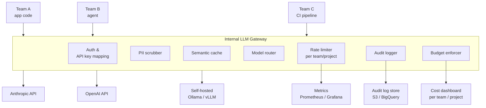

When a company has three teams using LLMs, everyone can call the provider APIs directly. When it has thirty teams, each team is independently managing API keys, rate limits, costs, and compliance requirements — and no one has a clear picture of what's actually being sent to external models. An internal LLM gateway is the solution: a single proxy layer that all internal traffic passes through, which handles routing, rate limiting, cost attribution, audit logging, and PII scrubbing in one place.

The thing that makes it worth building is the OpenAI-compatible API surface. If your gateway speaks the same HTTP API as OpenAI, every team using the OpenAI SDK or any LangChain/LlamaIndex integration changes exactly one environment variable (`OPENAI_BASE_URL`) to point at the gateway. Their code doesn't change.



---

## The Core Routing Layer

The gateway's job starts with receiving a request that looks like an OpenAI API call and deciding where to send it. Routing logic ranges from simple (always send to Provider X) to sophisticated (send to the cheapest model that can handle this request's complexity).

```python
from fastapi import FastAPI, HTTPException, Request, Depends
from fastapi.responses import StreamingResponse
import httpx
import json
from typing import Optional

app = FastAPI()

MODEL_ROUTING = {
    # Map gateway model aliases to actual provider endpoints + models
    "gpt-4o": {
        "provider": "openai",
        "model": "gpt-4o",
        "endpoint": "https://api.openai.com/v1/chat/completions",
    },
    "claude-sonnet": {
        "provider": "anthropic",
        "model": "claude-sonnet-4-5",
        "endpoint": "https://api.anthropic.com/v1/messages",
    },
    "llama-70b": {
        "provider": "self-hosted",
        "model": "llama3.1:70b",
        "endpoint": "http://ollama.internal:11434/v1/chat/completions",
    },
    # Fallback alias — route to cheapest capable model
    "auto": {
        "provider": "openai",
        "model": "gpt-4o-mini",
        "endpoint": "https://api.openai.com/v1/chat/completions",
    },
}

@app.post("/v1/chat/completions")
async def chat_completions(request: Request, team_id: str = Depends(get_team_from_key)):
    body = await request.json()
    model_alias = body.get("model", "auto")

    route = MODEL_ROUTING.get(model_alias)
    if not route:
        raise HTTPException(status_code=400, detail=f"Unknown model: {model_alias}")

    # Pipeline: rate limit → budget check → PII scrub → cache → upstream
    await check_rate_limit(team_id, model_alias)
    await check_budget(team_id)
    body = await scrub_pii(body)

    cache_result = await semantic_cache.get(body["messages"][-1]["content"])
    if cache_result:
        await log_audit(team_id, model_alias, body, cache_result, cache_hit=True)
        return format_response(cache_result, model_alias)

    response = await forward_to_provider(route, body, request.headers)
    await log_audit(team_id, model_alias, body, response)
    await attribute_cost(team_id, model_alias, response)

    return response
```

The gateway translates between API formats transparently. A request using the OpenAI message format gets reformatted to Anthropic's `messages` API format before forwarding, and the Anthropic response gets normalized back to OpenAI format before returning to the caller. Teams don't know or care which underlying model served their request.

---

## Rate Limiting Per Team and Project

Rate limits at the provider level don't map to your internal teams. Provider limits protect the provider; internal rate limits protect fairness between teams and prevent one runaway agent from consuming the entire organization's quota.

```python
import redis.asyncio as aioredis
import time

class TeamRateLimiter:
    def __init__(self, redis_url: str):
        self.redis = aioredis.from_url(redis_url)

    async def check_and_increment(
        self,
        team_id: str,
        model: str,
        tokens_requested: int,
    ) -> None:
        # Token-bucket rate limiting: tokens per minute per team
        limits = await self._get_team_limits(team_id)
        key = f"ratelimit:{team_id}:{model}:{int(time.time() // 60)}"

        current = await self.redis.incrby(key, tokens_requested)
        if current == tokens_requested:
            # First request this minute — set expiry
            await self.redis.expire(key, 120)

        if current > limits["tokens_per_minute"]:
            retry_after = 60 - (int(time.time()) % 60)
            raise RateLimitExceeded(
                f"Team {team_id} exceeded {limits['tokens_per_minute']} TPM for {model}",
                retry_after=retry_after,
            )

    async def _get_team_limits(self, team_id: str) -> dict:
        # Limits stored in Redis, configurable via admin API
        raw = await self.redis.hgetall(f"team_limits:{team_id}")
        return {
            "tokens_per_minute": int(raw.get("tpm", 100_000)),
            "requests_per_minute": int(raw.get("rpm", 500)),
            "daily_budget_usd": float(raw.get("daily_budget", 100.0)),
        }
```

Per-project rate limits are useful when a single team has multiple projects with different criticality levels. A background batch job doesn't need the same rate limit headroom as a customer-facing chatbot.

---

## Cost Attribution and Budgets

Without attribution, you get a single invoice from your LLM provider and no idea which team spent what. The gateway fixes this by tracking token usage per team, per project, per model, and rolling it up to a cost.

```python
COST_PER_1K_TOKENS = {
    # Input / output cost per 1K tokens (approximate, update regularly)
    "gpt-4o": {"input": 0.0025, "output": 0.01},
    "claude-sonnet": {"input": 0.003, "output": 0.015},
    "gpt-4o-mini": {"input": 0.00015, "output": 0.0006},
    "llama-70b": {"input": 0.0, "output": 0.0},  # Self-hosted
}

async def attribute_cost(
    team_id: str,
    model: str,
    response: dict,
    project_id: Optional[str] = None,
) -> None:
    usage = response.get("usage", {})
    input_tokens = usage.get("prompt_tokens", 0)
    output_tokens = usage.get("completion_tokens", 0)

    costs = COST_PER_1K_TOKENS.get(model, {"input": 0, "output": 0})
    cost_usd = (
        input_tokens / 1000 * costs["input"] +
        output_tokens / 1000 * costs["output"]
    )

    # Write to time-series store for dashboarding
    await metrics_store.record({
        "team_id": team_id,
        "project_id": project_id,
        "model": model,
        "input_tokens": input_tokens,
        "output_tokens": output_tokens,
        "cost_usd": cost_usd,
        "timestamp": int(time.time()),
    })

    # Check daily budget
    daily_spend = await get_daily_spend(team_id)
    daily_limit = await get_daily_limit(team_id)
    if daily_spend + cost_usd > daily_limit:
        await send_budget_alert(team_id, daily_spend, daily_limit)
```

Wire cost data to a Grafana dashboard or push it to whatever internal finance tool your company uses. Monthly chargeback reports by team are one of the first things finance asks for when AI costs start showing up on the P&L.

---

## PII Scrubbing Before External APIs

Sending PII to external LLM providers is a compliance problem in regulated industries and a GDPR problem in Europe. The gateway is the right place to scrub it — centrally, consistently, before any data leaves your perimeter.

```python
import re
from typing import Any

# Patterns to detect and redact
PII_PATTERNS = [
    (r"\b[A-Za-z0-9._%+-]+@[A-Za-z0-9.-]+\.[A-Z|a-z]{2,}\b", "[EMAIL]"),
    (r"\b\d{3}[-.\s]?\d{2}[-.\s]?\d{4}\b", "[SSN]"),
    (r"\b(?:\+?1[-.\s]?)?\(?\d{3}\)?[-.\s]?\d{3}[-.\s]?\d{4}\b", "[PHONE]"),
    (r"\b4[0-9]{12}(?:[0-9]{3})?\b", "[CARD]"),    # Visa
    (r"\b5[1-5][0-9]{14}\b", "[CARD]"),             # Mastercard
    (r"\b(?:\d{4}[-\s]){3}\d{4}\b", "[CARD]"),      # Generic formatted card
]

def scrub_text(text: str) -> tuple[str, list[str]]:
    findings = []
    for pattern, replacement in PII_PATTERNS:
        matches = re.findall(pattern, text)
        if matches:
            findings.extend(matches)
            text = re.sub(pattern, replacement, text)
    return text, findings

async def scrub_pii(body: dict) -> dict:
    messages = body.get("messages", [])
    all_findings = []

    for message in messages:
        if isinstance(message.get("content"), str):
            message["content"], findings = scrub_text(message["content"])
            all_findings.extend(findings)
        elif isinstance(message.get("content"), list):
            for block in message["content"]:
                if block.get("type") == "text":
                    block["text"], findings = scrub_text(block["text"])
                    all_findings.extend(findings)

    if all_findings:
        # Log that PII was found and scrubbed (not the PII itself)
        await audit_log(event="pii_scrubbed", count=len(all_findings))

    return body
```

A word of caution: regex-based PII detection has false positives and false negatives. A 10-digit number might be a phone number or a product ID. For high-stakes compliance requirements (HIPAA, financial regulations), add a dedicated PII detection model in the pipeline rather than relying on patterns alone. Microsoft Presidio is a good open-source option; commercial services (AWS Comprehend, Azure AI Language) are faster to integrate.

---

## Audit Logging for Compliance

Every request and response through the gateway should be logged. Not just the metadata — the actual content, at least for some period, depending on your compliance requirements.

```python
async def log_audit(
    team_id: str,
    model: str,
    request_body: dict,
    response_body: dict,
    cache_hit: bool = False,
) -> None:
    record = {
        "timestamp": time.time(),
        "team_id": team_id,
        "model": model,
        "cache_hit": cache_hit,
        "request_messages": request_body.get("messages"),
        "response_content": response_body.get("choices", [{}])[0].get("message"),
        "usage": response_body.get("usage"),
        "request_id": response_body.get("id"),
    }
    # Ship to immutable audit log — S3 + Athena, BigQuery, or a SIEM
    await audit_sink.write(record)
```

Set a retention policy that matches your compliance framework. GDPR requires you can delete specific users' data on request — if you're logging conversation content, you need to be able to find and delete records by user ID. Design the log schema with this in mind from day one.

---

*Day 5 of 7. Previous: [Agent Sandboxing](/posts/agent-sandboxing-and-isolation/)*
