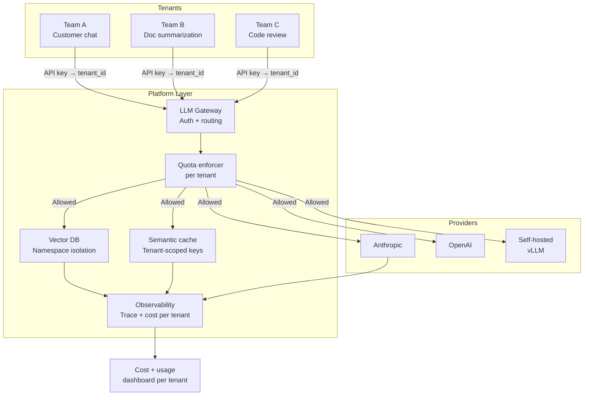

A platform team running AI workloads for ten product teams faces a problem that looks simple and isn't: everyone shares the same infrastructure, but every team has different usage patterns, different data, and different expectations. The team running a real-time customer chatbot and the team running nightly batch summarization jobs both need to share the same vector database, the same LLM gateway, and the same compute pool — but they can't share each other's data, can't be starved by each other's load spikes, and need separate cost reporting.

Multi-tenancy in AI infrastructure is harder than in traditional APIs because the resources involved — embedding models, vector search indices, and LLM context — are stateful and expensive in ways that a simple round-robin load balancer can't manage.



---

## Tenant Isolation

The non-negotiable requirement: Team A's data never appears in Team B's context. This is both a security requirement and a product requirement — tenants don't want to discover that their proprietary data trained someone else's retrieval index.

For vector databases, the right isolation level depends on your trust model:

**Namespace isolation** (same cluster, different namespace): good enough for internal teams at the same company. Qdrant, Weaviate, and Pinecone all support namespaces or collections per tenant. Query filters on a `tenant_id` metadata field are cheaper to operate but carry cross-tenant contamination risk if a filter is accidentally dropped.

**Cluster isolation** (separate cluster per tenant): required for external customers or when tenants are subject to different regulatory regimes. Significantly more expensive to operate.

For most internal platform use cases, namespace isolation with a guaranteed `tenant_id` filter at the platform layer is the right call:

```python
from qdrant_client import QdrantClient
from qdrant_client.models import Filter, FieldCondition, MatchValue

class TenantAwareVectorStore:
    def __init__(self, collection: str):
        self.client = QdrantClient(url="http://qdrant.internal:6333")
        self.collection = collection

    def search(
        self,
        query_vector: list[float],
        tenant_id: str,
        top_k: int = 10,
    ) -> list[dict]:
        # tenant_id filter is ALWAYS applied — never optional
        tenant_filter = Filter(
            must=[
                FieldCondition(
                    key="tenant_id",
                    match=MatchValue(value=tenant_id),
                )
            ]
        )

        results = self.client.search(
            collection_name=self.collection,
            query_vector=query_vector,
            query_filter=tenant_filter,
            limit=top_k,
        )
        return [
            {"id": r.id, "score": r.score, "payload": r.payload}
            for r in results
        ]

    def upsert(
        self,
        vectors: list[dict],
        tenant_id: str,
    ) -> None:
        # Ensure tenant_id is always written into the payload
        for v in vectors:
            v["payload"]["tenant_id"] = tenant_id

        self.client.upsert(
            collection_name=self.collection,
            points=vectors,
        )
```

The filter must be applied at the platform layer, not by the calling team's code. If teams apply the filter themselves, a bug in their code leaks data. The platform enforces it unconditionally.

---

## Quota Management Per Tenant

Quotas prevent one tenant from consuming all available capacity. The challenge is that quotas need to be fair without being rigid — a quota system that hard-blocks a real-time customer request because a batch job saturated the limit is worse than no quota at all.

The pattern that works: tiered quotas with burst allowances. Each tenant has a sustained rate limit and a burst allowance. The burst allowance lets them exceed the sustained limit for short periods (30-60 seconds) without hitting a hard wall. Batch workloads get a lower sustained limit than real-time workloads of the same tier.

```python
from dataclasses import dataclass
from enum import Enum
import time
import redis.asyncio as aioredis

class WorkloadType(Enum):
    REALTIME = "realtime"
    BATCH = "batch"

@dataclass
class TenantQuota:
    tenant_id: str
    tokens_per_minute: int
    burst_multiplier: float = 2.0   # Allow 2x sustained rate for up to 30s
    workload_type: WorkloadType = WorkloadType.REALTIME

class QuotaEnforcer:
    def __init__(self, redis_url: str):
        self.redis = aioredis.from_url(redis_url)

    async def check(
        self,
        tenant_id: str,
        tokens_requested: int,
        workload_type: WorkloadType = WorkloadType.REALTIME,
    ) -> None:
        quota = await self._get_quota(tenant_id)

        # Sustained window: 1 minute
        sustained_key = f"quota:{tenant_id}:{int(time.time() // 60)}"
        # Burst window: 10 seconds
        burst_key = f"quota_burst:{tenant_id}:{int(time.time() // 10)}"

        pipe = self.redis.pipeline()
        pipe.incrby(sustained_key, tokens_requested)
        pipe.expire(sustained_key, 120)
        pipe.incrby(burst_key, tokens_requested)
        pipe.expire(burst_key, 20)
        results = await pipe.execute()

        sustained_usage = results[0]
        burst_usage = results[2]

        # Batch jobs respect a stricter sustained limit
        effective_tpm = (
            quota.tokens_per_minute * 0.5
            if workload_type == WorkloadType.BATCH
            else quota.tokens_per_minute
        )

        if sustained_usage > effective_tpm:
            raise QuotaExceeded(
                tenant_id=tenant_id,
                quota_type="sustained",
                limit=effective_tpm,
                current=sustained_usage,
            )

        burst_limit = effective_tpm * quota.burst_multiplier / 6  # Per 10s
        if burst_usage > burst_limit:
            raise QuotaExceeded(
                tenant_id=tenant_id,
                quota_type="burst",
                limit=burst_limit,
                current=burst_usage,
            )

    async def _get_quota(self, tenant_id: str) -> TenantQuota:
        raw = await self.redis.hgetall(f"tenant_quota:{tenant_id}")
        if not raw:
            # Default quota for unknown tenants
            return TenantQuota(tenant_id=tenant_id, tokens_per_minute=10_000)
        return TenantQuota(
            tenant_id=tenant_id,
            tokens_per_minute=int(raw.get("tpm", 10_000)),
            burst_multiplier=float(raw.get("burst_multiplier", 2.0)),
        )
```

Pair quota enforcement with a rate-limit response that includes a `Retry-After` header and a human-readable error identifying which limit was hit. Teams that hit limits should be able to self-diagnose without opening a support ticket.

---

## Cost Attribution and Chargeback

Finance teams need per-tenant cost breakdowns. Platform teams need to know which tenants are driving infra costs. Both needs are served by the same cost attribution pipeline.

```python
import asyncio
from collections import defaultdict

async def generate_monthly_chargeback_report(
    year: int,
    month: int,
    cost_store,
) -> dict:
    records = await cost_store.query(year=year, month=month)

    by_tenant = defaultdict(lambda: {
        "input_tokens": 0,
        "output_tokens": 0,
        "cost_usd": 0.0,
        "by_model": defaultdict(float),
        "cache_savings_usd": 0.0,
    })

    for record in records:
        t = by_tenant[record["tenant_id"]]
        t["input_tokens"] += record["input_tokens"]
        t["output_tokens"] += record["output_tokens"]
        t["cost_usd"] += record["cost_usd"]
        t["by_model"][record["model"]] += record["cost_usd"]
        t["cache_savings_usd"] += record.get("cache_savings_usd", 0.0)

    return {
        "period": f"{year}-{month:02d}",
        "tenants": dict(by_tenant),
        "total_cost_usd": sum(t["cost_usd"] for t in by_tenant.values()),
    }
```

Include cache savings in the chargeback report. Teams whose usage patterns benefit most from caching effectively get a discount — making the cache's value visible encourages teams to structure their queries in cache-friendly ways.

---

## Audit Trails Per Tenant

Regulated industries and security-conscious enterprises need per-tenant audit trails. The audit data needs to be queryable by tenant without exposing one tenant's data to another.

The simplest architecture: write audit records to a partitioned store (S3 with prefix `tenant_id=T123/`, BigQuery partitioned on `tenant_id`, or Elasticsearch with index-level access control). Each tenant can be granted read access to their own partition without accessing others.

```yaml
# Example: S3 bucket policy for per-tenant audit log access
# Tenant teams get read access only to their own prefix

Version: "2012-10-17"
Statement:
  - Effect: Allow
    Principal:
      AWS: "arn:aws:iam::123456789:role/tenant-a-role"
    Action:
      - "s3:GetObject"
      - "s3:ListBucket"
    Resource:
      - "arn:aws:s3:::llm-audit-logs"
      - "arn:aws:s3:::llm-audit-logs/tenant_id=team-a/*"
    Condition:
      StringLike:
        "s3:prefix": "tenant_id=team-a/*"
```

For compliance use cases (SOC2, HIPAA), ensure audit records are immutable. S3 Object Lock in compliance mode prevents deletion or overwrite for the retention period, which satisfies most audit requirements.

---

## Example Platform Architecture

For a platform team serving 10-15 internal teams:

| Component | Choice | Notes |
|---|---|---|
| API gateway | FastAPI + nginx | OpenAI-compatible surface |
| Quota enforcement | Redis token bucket | Per-tenant, per-workload-type |
| Vector DB | Qdrant (shared cluster) | Namespace isolation per tenant |
| Semantic cache | Redis + sentence-transformers | Tenant-scoped cache keys |
| Audit logs | S3 + Athena | Partitioned by tenant_id |
| Cost dashboard | Grafana + PostgreSQL | Chargeback reports by month |
| Observability | OpenTelemetry + Grafana Tempo | Per-tenant trace filtering |

The cost to operate this for 10-15 teams is a 3-engineer-month initial build and roughly 0.5 FTE to maintain. The ROI appears quickly: you eliminate duplicated API key management, get consolidated cost visibility, and stop the occasional runaway batch job from taking down real-time workloads. At 15+ teams, the platform team model is almost always cheaper than each team independently managing their AI infrastructure.

---

*Day 6 of 7. Previous: [Building an Internal LLM Gateway](/posts/building-internal-llm-gateways/). Next: post 7 coming tomorrow.*
