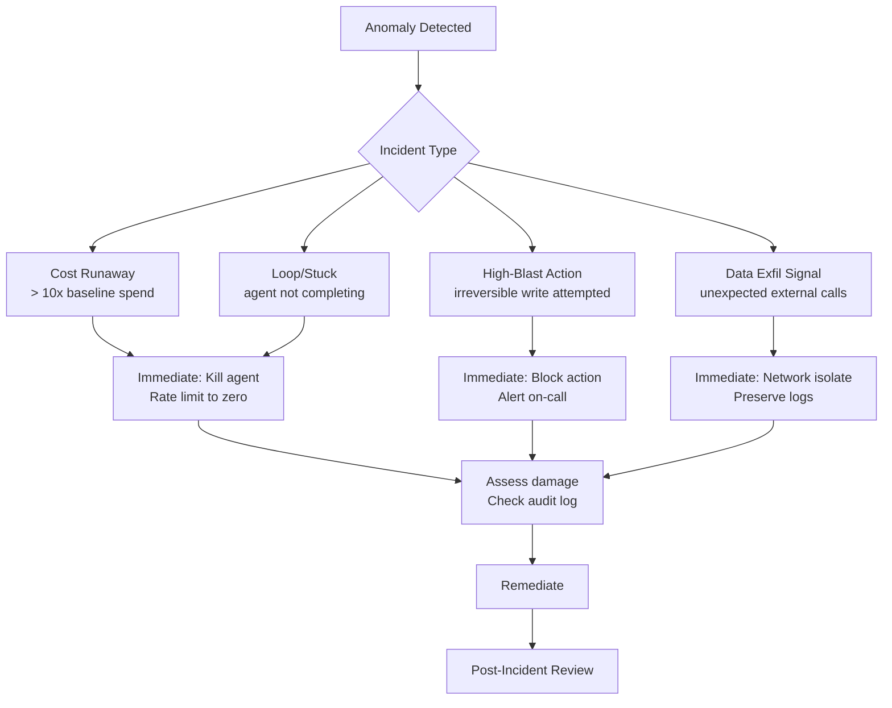

Traditional incidents have a clear signature: something is down, latency spikes, error rate climbs. AI incidents are messier. The system is technically up and responding. It is just doing the wrong thing — expensively, persistently, and sometimes irreversibly.

After running agentic systems in production, I have dealt with runaway cost spirals, agents stuck in infinite retry loops, and one memorable case where an agent was one tool call away from bulk-deleting production records before a circuit breaker caught it. Here is what I have learned about treating these as first-class incidents.



---

## What Counts as an AI Incident

Before you can respond, you need a shared definition. The categories I use:

**Cost runaway.** The agent is consuming tokens at 10x or more of its expected rate. This usually means it has entered a loop, is being fed unexpectedly large context, or is making tool calls that return massive payloads that re-enter the context window. A single runaway session can generate hundreds of dollars in API cost in minutes.

**Stuck agent.** The agent is neither completing nor failing cleanly. It is making tool calls, getting results, and not reaching a terminal state. Common cause: the goal condition is ambiguous and the agent keeps trying new approaches without converging.

**High-blast-radius action attempt.** The agent is about to take an irreversible action it was not explicitly authorized for: bulk deletes, external emails to lists, financial transactions above a threshold, infrastructure changes in production.

**Anomalous data access.** The agent is reading or querying data outside its expected scope. This is often the first signal of a prompt injection attack where the injected instruction redirected the agent's retrieval.

**External call anomaly.** The agent is making HTTP requests to domains it should not be calling. This is either a data exfiltration attempt via injection, or a bug in tool calling that is hitting unintended endpoints.

---

## Detection Patterns

You cannot respond to incidents you cannot detect. The minimum monitoring surface for an agentic system:

```python
from dataclasses import dataclass
from datetime import datetime, timezone
import logging

@dataclass
class AgentMetrics:
    session_id: str
    token_count_input: int
    token_count_output: int
    tool_calls: int
    elapsed_seconds: float
    unique_tool_names: set[str]
    external_domains_called: set[str]

def check_incident_signals(metrics: AgentMetrics, config: dict) -> list[str]:
    signals = []

    # Cost runaway: token burn rate
    tokens_per_minute = (metrics.token_count_input + metrics.token_count_output) / (metrics.elapsed_seconds / 60)
    if tokens_per_minute > config["token_rpm_threshold"]:
        signals.append(f"COST_RUNAWAY: {tokens_per_minute:.0f} tokens/min (threshold: {config['token_rpm_threshold']})")

    # Stuck agent: too many tool calls without completion
    if metrics.tool_calls > config["max_tool_calls_per_session"]:
        signals.append(f"LOOP_SUSPECT: {metrics.tool_calls} tool calls (threshold: {config['max_tool_calls_per_session']})")

    # Scope creep: unexpected tools being called
    unexpected_tools = metrics.unique_tool_names - set(config["allowed_tools"])
    if unexpected_tools:
        signals.append(f"UNEXPECTED_TOOLS: {unexpected_tools}")

    # Exfil signal: outbound to unknown domains
    unexpected_domains = metrics.external_domains_called - set(config["allowed_domains"])
    if unexpected_domains:
        signals.append(f"UNEXPECTED_DOMAINS: {unexpected_domains}")

    return signals
```

Run this check every 30 seconds during active agent sessions. Alert on the first signal, not after a threshold of signals.

---

## Kill Switch Implementation

You need a kill switch that works faster than a deployment cycle. The pattern I use is a Redis-backed flag that every agent checks before each LLM call:

```python
import redis
import logging

r = redis.Redis(host="localhost", port=6379, db=0)
logger = logging.getLogger("agent.killswitch")

def check_kill_switch(session_id: str, agent_type: str) -> bool:
    """Returns True if agent should halt."""
    # Global kill (all agents)
    if r.get("killswitch:global") == b"1":
        logger.warning(f"Global kill switch active — halting {session_id}")
        return True
    # Agent-type kill
    if r.get(f"killswitch:type:{agent_type}") == b"1":
        logger.warning(f"Type kill switch active for {agent_type} — halting {session_id}")
        return True
    # Session-specific kill
    if r.get(f"killswitch:session:{session_id}") == b"1":
        logger.warning(f"Session kill switch active — halting {session_id}")
        return True
    return False

# Activation — can be called from monitoring system, on-call CLI, or dashboard
def activate_kill_switch(scope: str, target: str = None, ttl_seconds: int = 3600):
    if scope == "global":
        r.setex("killswitch:global", ttl_seconds, "1")
    elif scope == "type":
        r.setex(f"killswitch:type:{target}", ttl_seconds, "1")
    elif scope == "session":
        r.setex(f"killswitch:session:{target}", ttl_seconds, "1")
```

The TTL matters. A kill switch with no expiry is a support ticket waiting to happen when someone activates it, goes to sleep, and the system is still dead at 9 AM the next day.

---

## Example Incident Timeline

Here is what a real cost-runaway incident looked like, compressed:

**T+0:** Agent starts processing a user request to "summarize all open support tickets."  
**T+2m:** Monitoring detects 4,200 tokens/min (threshold: 500). First alert fires.  
**T+3m:** On-call engineer checks dashboard. Agent has made 47 tool calls, retrieved 200+ tickets including ticket bodies with embedded HTML and attachments.  
**T+4m:** Session kill switch activated for the specific session_id.  
**T+4m30s:** Agent halts cleanly at next pre-call check.  
**T+6m:** Audit log reviewed. Total cost: $23 for a single session. Root cause identified: the ticket retrieval tool was returning full HTML bodies including base64-encoded attachments, causing context explosion.

Resolution: the ticket retrieval tool was updated to return summary fields only by default, with a separate `get_ticket_full_body` tool for when full content is needed. Tool parameter schemas were tightened.

---

## Post-Incident Review for AI Systems

The standard PIR template does not map well to AI incidents. The questions are different:

**Standard PIR:** What failed? Why? How do we prevent recurrence?

**AI incident PIR adds:**
- What was the agent's state at incident time? (Which step in its plan had it reached?)
- Was this a new input pattern or one we had seen before?
- Did any injected content play a role? (Check if anomalous instructions appear in retrieved tool results.)
- What was the human action that created the conditions? (Who set up the task that led here?)
- Did the blast radius controls work? If not, which one failed?
- What did the agent "believe" it was doing? (Reconstruct from the tool call sequence.)

The last question is the one that separates AI PIRs from everything else. Agents do not fail the way services fail — they take actions that made sense given their context. Understanding why an action made sense to the agent is how you find the actual root cause.

---

## Runbook Template

Keep this in your runbook, parameterized per agent type:

```
AGENT INCIDENT RUNBOOK — [AGENT_NAME]
======================================
Severity trigger: [cost threshold / blast action type / loop threshold]

IMMEDIATE (< 2 min):
1. Kill session: redis-cli SET killswitch:session:[SESSION_ID] 1 EX 3600
2. If unknown scope: redis-cli SET killswitch:type:[AGENT_TYPE] 1 EX 3600
3. Page secondary on-call if damage is suspected

ASSESS (2-10 min):
4. Pull audit log: SELECT * FROM agent_audit WHERE session_id = '[SESSION_ID]'
5. Check for external calls: grep UNEXPECTED_DOMAINS in monitoring logs
6. Estimate blast radius: review last 10 tool_calls in audit log

REMEDIATE:
7. If data written: identify records, assess rollback feasibility
8. If external comms sent: log recipients and content for notification decision
9. If cost only: document and file expense exception

POST-INCIDENT:
10. Schedule PIR within 48 hours
11. Add incident pattern as a detection rule
12. Update runbook with new signals observed
```

---

*Previous: [Multi-Tenant AI Infrastructure](/posts/multi-tenant-ai-infrastructure/)*
