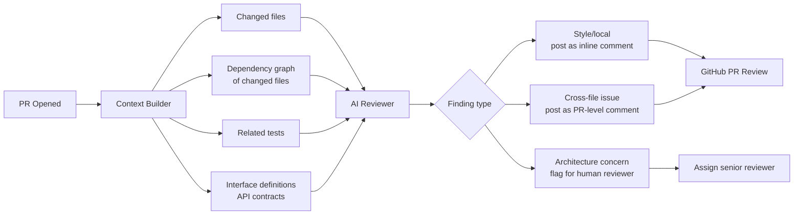

The demos for AI code review always show the same thing: paste a function, get feedback. It works well for that function. What it misses is everything else — the duplicate logic three files away, the interface contract this function silently violates, the pattern established in week 2 that this new code breaks.

At scale, the things that matter most in code review are cross-file concerns. Here is how to close that gap.



---

## Why Single-File Review Falls Short

When a human senior engineer reviews code, they are not just reading the diff. They are thinking about the module the code lives in, the interfaces it touches, the patterns established elsewhere in the codebase, the test coverage implied by the change. A context window primed with only the changed file has none of that.

The specific failure modes I see most often in naive AI code review setups:

**Missing the duplicate.** AI suggests a utility function. That utility function already exists in `utils/string_helpers.py`. The reviewer never sees that file, so it does not catch the duplication.

**Incorrect interface assumption.** The changed function returns a new field. The AI does not know that three callers in other files destructure the return value — so it does not flag that those callers will break silently (especially in Python where extra fields in dicts are just ignored).

**Pattern inconsistency.** The codebase uses a specific error-handling pattern: log, then raise a typed exception, then handle at the boundary. New AI-generated code uses a different pattern. The single-file reviewer has no basis to flag the inconsistency.

---

## Building Cross-File Context

The solution is not to dump the entire codebase into the context window (you will hit limits and the quality degrades). It is to be selective about which additional files matter for a given diff.

```python
import ast
import os
from pathlib import Path

def build_review_context(changed_files: list[str], repo_root: str) -> dict:
    context = {
        "changed_files": {},
        "imported_by": {},       # who imports the changed files
        "imports_from": {},      # what the changed files import
        "related_tests": [],
        "interface_definitions": {}
    }

    for filepath in changed_files:
        full_path = os.path.join(repo_root, filepath)
        with open(full_path) as f:
            content = f.read()
        context["changed_files"][filepath] = content

        # Parse imports to find what this file depends on
        try:
            tree = ast.parse(content)
            imports = []
            for node in ast.walk(tree):
                if isinstance(node, (ast.Import, ast.ImportFrom)):
                    imports.append(ast.dump(node))
            context["imports_from"][filepath] = imports
        except SyntaxError:
            pass

        # Find tests related to this file
        stem = Path(filepath).stem
        for test_pattern in [f"test_{stem}.py", f"{stem}_test.py", f"tests/{stem}.py"]:
            test_path = os.path.join(repo_root, test_pattern)
            if os.path.exists(test_path):
                with open(test_path) as f:
                    context["related_tests"].append({
                        "path": test_pattern,
                        "content": f.read()
                    })

    return context
```

For the "imported by" direction — which files import the changed files — you need a reverse dependency index. Build this once at PR time by grepping the repo for the module name. It is not elegant but it is fast enough for CI.

---

## PR-Level vs Commit-Level Review

These serve different purposes and should not be conflated.

**Commit-level review** is fast and tactical. Run it on every commit pushed to a PR branch. Good for: catching obvious bugs, style issues, security anti-patterns in the changed code. Context: just the diff, the file in context, and its direct imports.

**PR-level review** is holistic. Run it once when the PR is opened (or when marked ready for review). Good for: cross-file consistency, interface compatibility, test coverage assessment, architecture concerns. Context: the full context bundle described above.

Separating them reduces noise. Engineers hate AI review that fires a comment on every commit push for the same issue. Run the expensive, comprehensive review once; run the quick check on every push but only comment on new findings.

```python
def should_run_pr_level_review(pr_event: dict) -> bool:
    """Only run expensive review when PR is actually ready."""
    return (
        pr_event["action"] in ("opened", "ready_for_review", "synchronize")
        and not pr_event["pull_request"]["draft"]
    )
```

---

## Automated Review Bots: What to Expect

CodeRabbit, Graphite, and similar tools have gotten meaningfully better at cross-file context in the past year. They parse the entire repo, build an index, and retrieve relevant context for each diff. They work well for:

- Identifying duplicate logic across files
- Flagging missing test coverage for new code paths
- Calling out inconsistency with patterns they have seen in the same module

Where they still fall short:

- **Business logic correctness.** They do not know what your system is supposed to do. A function that correctly implements a wrong algorithm passes review.
- **Architectural fitness.** Whether a new abstraction belongs at this level, in this module, with this interface shape — that is a human judgment.
- **Context that lives outside the code.** ADRs, Jira tickets, Slack decisions, the conversation from last Tuesday's design meeting.

The practical upshot: use AI review to catch the mechanical stuff (bugs, security anti-patterns, test gaps, inconsistency). Reserve human review time for design, intent, and fitness.

---

## Integrating Without Annoying Engineers

This is the part most teams get wrong. AI code review that fires 15 comments on every PR, most of which are style nits, trains engineers to ignore the review entirely. Then when the AI catches something real, nobody sees it.

Rules I have found work:

**Severity triage before posting.** Every finding should be classified before it becomes a comment. Only post findings at `error` or `warning` severity automatically. Log `info` findings but do not post them unless a human asks.

**Deduplicate across commits.** If the AI raised a finding in commit 1 and the engineer did not fix it, do not re-raise it on commit 2. Mark it as a known open finding.

**Never block merge automatically.** AI review is an input to the human reviewer, not a gate. If you make merge dependent on AI approval, you will spend two weeks later removing that requirement after it blocks a hotfix at 2 AM.

**Separate threads per finding.** Do not aggregate all findings into one comment. Inline comments on the specific line, with a direct link to the relevant rule or pattern. Engineers can resolve the ones they agree with and push back on the ones they do not.

```yaml
# .coderabbit.yml example — tune the noise level
reviews:
  high_level_summary: true
  poem: false               # skip the poem, we're engineers
  review_status: true
  collapse_walkthrough: false
  auto_review:
    enabled: true
    drafts: false           # don't review drafts
    ignore_title_keywords:
      - "WIP"
      - "DO NOT MERGE"
path_filters:
  - "!**/*.lock"
  - "!**/migrations/**"    # skip auto-generated migration files
```

---

## What AI Review Does Not Replace

Human code review is not just quality control — it is knowledge transfer. When a senior engineer reviews a junior engineer's code, the comments are a teaching channel. AI review does not do that. It finds problems; it does not explain why the pattern matters, what the history was, how the team thinks about this class of problem.

The teams I have seen get the most from AI review treat it as a pre-filter: catch the mechanical issues before the human reviewer sees the PR, so the human reviewer can spend their time on the things only they can judge.

---

*Previous: [Agent Incident Response](/posts/agent-incident-response-playbooks/) — Next: [Testing Non-Deterministic Systems](/posts/testing-non-deterministic-ai-systems/)*
