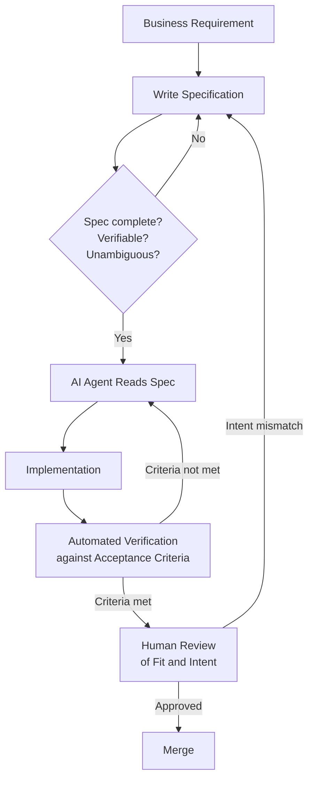

The most important shift that agentic AI brings to software engineering is not speed. It is proximity. The gap between "what should this do" and "working code" has collapsed to near zero — and that changes what engineering actually is.

When a capable AI agent can go from a clear description to a passing test suite in minutes, the bottleneck is no longer implementation. It is specification. The thing that determines the quality of the output is the quality of the input. Not the prompt. Not the Jira ticket. The spec.



This is what spec-driven development (SDD) is about. It is a discipline — not a tool, not a framework — for writing specifications that are good enough to be the primary input to agentic AI systems.

## What Makes a Spec Executable

Not all specifications are equal. A spec that works as documentation is not necessarily a spec that works as an AI input. For SDD to deliver, a spec needs three properties:

**Complete** — it covers the behaviour space the agent will operate in. Not every edge case, but the boundaries. What is in scope. What is explicitly out of scope. What the system does when inputs are malformed, when dependencies are unavailable, when the user does something unexpected.

**Verifiable** — every requirement has a testable acceptance criterion attached to it. If you cannot write an automated check for it, it is not a requirement — it is a hope. "The API should be fast" is a hope. "The P99 latency for `/search` must be under 200ms under 500 concurrent requests" is a requirement.

**Unambiguous** — there is one correct interpretation. This is the hardest property to achieve, and the one most engineers underestimate. Natural language is full of implicit context that humans fill in from shared understanding. AI agents do not share that understanding. "Users should be authenticated" — with JWT? OAuth? Session cookies? The spec must say.

## The SDD Lifecycle

The SDD lifecycle replaces the traditional requirements → design → implement → test → review sequence with something tighter:

1. **Requirement** — a business need, user story, or technical gap is identified
2. **Spec** — an engineer authors a structured spec with explicit behaviour, constraints, dependencies, and acceptance criteria
3. **AI Execution** — the agent reads the spec and produces an implementation
4. **Verification** — automated checks confirm the implementation satisfies the acceptance criteria in the spec
5. **Review** — a human checks fit and intent (does this do what we actually needed?) not implementation details
6. **Merge**

The critical difference from traditional BDD or requirements engineering: the spec is the **input** to the development process, not documentation produced after the fact. It is written before the agent touches the code. It is the artifact that persists, gets versioned, gets reviewed, and becomes the authoritative description of the feature.

## A Concrete Spec Template

Here is the template I use across projects. It maps directly to what most AI agents need to execute reliably.

````markdown
# Spec: [Feature Name]

## Behaviour

What the system does when this feature is invoked. Write in present tense.
Cover the happy path and the significant failure modes.

## Constraints

- Technology: which languages, frameworks, dependencies are in scope
- Performance: latency, throughput, memory budgets
- Security: auth requirements, input validation rules, data handling
- Compatibility: API contracts that must not break

## Dependencies

External systems, internal services, data sources this feature relies on.
Include expected interfaces and failure modes for each.

## Acceptance Criteria

- [ ] [Criterion 1] — testable, specific, binary pass/fail
- [ ] [Criterion 2]
- [ ] [Criterion 3]

## Out of Scope

Explicit list of what this spec does NOT cover. This prevents scope creep
during AI execution and makes review faster.
````

Notice the `Out of Scope` section. This is consistently the most underused part of spec writing and the most valuable. An agent that does not know what is out of scope will improvise, and improvisation at implementation speed produces scope creep at implementation speed.

## Why SDD Scales When Prompt-and-Iterate Does Not

The classic agentic workflow — write a prompt, review output, iterate — works fine for isolated tasks. It breaks down at scale for three reasons.

First, **prompt context is ephemeral**. When you close the session, the context is gone. The next engineer, the next sprint, the next AI tool has no access to the reasoning that produced the code. The spec survives.

Second, **prompts are not auditable**. In regulated environments, you need to demonstrate that a change was deliberate, reviewed, and correct. A prompt is not an audit trail. A versioned spec file in your repository is.

Third, **prompts are tool-specific**. A prompt that works well in Claude Code may not work in GitHub Copilot Workspace or AWS Kiro. A spec in your standard template works with any of them. It is a contract, not a conversation.

## The SDD Ecosystem

Several tools have built their architecture around this approach, and the rest of this series covers them in depth.

**AWS Kiro** structures the entire IDE around spec files — you write a spec, and the environment uses it to generate implementation, tests, and documentation. It ships with its own spec template format and hooks for verification.

**GitHub Speckit** brings SDD into the GitHub native workflow — specs live in Issues and pull the Copilot Workspace execution engine. The PR is linked back to the spec and compliance is checked as a branch protection rule.

**BMAD Method** takes a multi-agent approach — different AI personas (analyst, architect, developer, QA) each produce and consume structured documents, creating an end-to-end handoff chain with no unstructured prompting.

Each of these tools is an opinionated implementation of the same core idea: make the specification the thing, and let the AI work from it.

The engineers who are getting the most reliable output from agentic systems are not the ones with the best prompt skills. They are the ones who have learned to write good specs — and built a workflow where the spec is what gets reviewed, approved, and committed alongside the code.

That is the shift. The spec is not documentation. The spec is the engineering artefact.
