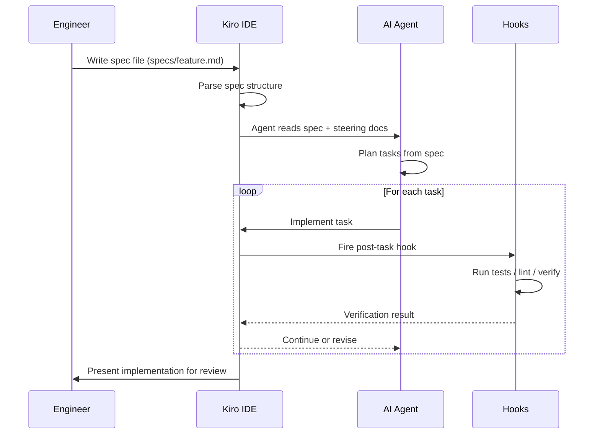

AWS released Kiro in mid-2026 and positioned it as an AI IDE. That framing undersells what it actually is. Kiro is not another chat-in-the-editor product. It is an environment built around the premise that the specification file — not the conversational prompt — is the primary unit of AI-assisted development.

If you have spent any time with Claude Code or Cursor, the first thing you will notice about Kiro is that there is no persistent chat pane dominating the interface. There is a spec pane. That is an architectural decision, not a UI preference.



## Core Concepts

Kiro is built on VS Code internals, so the editor feels familiar. The differentiation is in four concepts that have no direct equivalent in other AI IDEs.

### Spec Files

Spec files live in `specs/` at the project root. They are the primary artifact — not a side document, not a comment in a ticket, the file that drives the agent's work. Kiro's agent reads the spec before it does anything and uses it to plan and constrain its implementation.

Here is a concrete spec for an API rate limiting feature:

````markdown
# Spec: Rate Limiting for API Endpoints

## Overview
Add per-client rate limiting to all public API endpoints to prevent abuse
and protect downstream services. Limits are configurable per client tier.

## Requirements

### Functional
- MUST: Return HTTP 429 when a client exceeds their tier limit
- MUST: Include `X-RateLimit-Limit`, `X-RateLimit-Remaining`, and
  `X-RateLimit-Reset` headers on every API response
- MUST: Support three tiers — free (100 req/min), pro (1000 req/min),
  enterprise (10000 req/min)
- SHOULD: Use a sliding window algorithm rather than fixed buckets
- MUST NOT: Add more than 5ms P99 latency to any endpoint

### Non-Functional
- Limits must persist across application restarts (use Redis)
- Limit counters must be consistent across multiple application instances
- Configuration must be changeable without a deployment

## Design
Use `redis-py` with a Lua script for atomic sliding window checks.
Client tier is read from the JWT claims (`x-client-tier`).
Middleware applies to all routes under `/api/v1/`.

## Tasks
- [ ] Implement Redis sliding window counter with Lua script
- [ ] Write middleware that checks limit and sets response headers
- [ ] Register middleware in the FastAPI application
- [ ] Add tier configuration to environment variables
- [ ] Write integration tests against a Redis test container
- [ ] Update OpenAPI schema with rate limit header documentation
````

The Tasks section is important: Kiro uses it as the execution checklist. It checks off tasks as the agent completes them, and hooks can run after each one.

### Steering Docs

Steering docs are Kiro's equivalent of `CLAUDE.md` — repo-level context the agent receives on every task. They live at `.kiro/steering/` and can be split into multiple files by concern.

```markdown
# .kiro/steering/project.md

## Project: Payments API

Python 3.12, FastAPI, PostgreSQL 16, Redis 7. Deployed on AWS ECS.
All services are in `src/`. Tests are in `tests/` with pytest.
Use ruff for linting. Never use print() for debugging — use the logger.

## Conventions

- FastAPI dependency injection for database sessions and auth
- Pydantic v2 models for all request/response schemas
- Database migrations via Alembic — never modify tables directly
- All new endpoints need integration tests, not just unit tests

## Out of bounds for agents

Do not modify `src/auth/` — it is maintained by the security team.
Do not add new dependencies without approval — check DEPENDENCIES.md first.
```

The multi-file structure matters in practice. Split your steering docs by concern (project conventions, architecture, dependencies, security rules) and you can update them independently as the project evolves.

### Hooks

Kiro hooks are automation that fires at defined points in the agent loop — pre-task, post-task, on file-save. Think of them as CI checks that run inside the development loop rather than after a push.

```yaml
# .kiro/hooks/post-task.yml
name: verify-after-task
trigger: post_task

steps:
  - name: Run tests
    run: pytest tests/ -x -q --tb=short
    on_failure: block_continue

  - name: Lint
    run: ruff check src/
    on_failure: warn

  - name: Type check
    run: mypy src/ --ignore-missing-imports
    on_failure: warn
```

`block_continue` tells Kiro to stop the agent from proceeding to the next task if the step fails. `warn` lets the agent continue but surfaces the issue. This is the mechanism that makes Kiro's output more reliable than raw generation: the agent cannot move forward while tests are broken.

### Agents

Kiro ships with specialized agent roles — implementation, documentation, test generation, refactor. You can configure which agents are permitted to act on which spec types in `.kiro/config.yml`. In practice this matters most in enterprise deployments where you want different approvals for infrastructure specs versus feature specs.

## How It Compares to Claude Code and Cursor

The comparison that comes up constantly: Kiro vs Claude Code vs Cursor.

Claude Code is a REPL-style tool — you work iteratively, the context grows through conversation, and `CLAUDE.md` provides repo-level grounding. It is exceptionally flexible and the agent is capable. The spec discipline is something you impose yourself; Claude Code does not enforce it.

Cursor is chat-first. The editing experience is strong, the multi-file context is good, and the codebase indexing is mature. Like Claude Code, you can use it with spec discipline — but Cursor will not refuse to work without a spec, and its output quality tracks the quality of your prompting.

Kiro is spec-first at the architecture level. The IDE surfaces spec completeness, blocks execution until the spec structure is valid, and ties every piece of generated code back to a spec task. You get less flexibility in how you work. You get more consistency in what comes out.

## Enterprise Considerations

Kiro has a VPC deployment option — the agent inference runs in your network, not on shared infrastructure. This matters for teams with data residency requirements or who cannot send code to external APIs.

Spec files are version-controlled, auditable, and can be gated behind approval workflows. You can require a spec review and approval before the agent is permitted to execute — which gives you a defensible audit trail for any AI-generated change.

The integration with AWS is direct: Kiro has native awareness of CDK, SAM, and CloudFormation constructs, and the agent understands IAM patterns well enough to avoid generating roles with overly broad permissions.

## Honest Assessment

**Where Kiro genuinely shines**: regulated environments that need audit trails, teams that have struggled with prompt consistency, and AWS-native projects where the deep service integration pays off. The structured output is reliably better than conversational alternatives for features that are well-specced.

**Where it falls short**: Kiro is VS Code only, so teams on JetBrains IDEs are out. The AWS-centricity is a real constraint — if your stack is GCP or Azure, the infrastructure agent awareness does not translate. And spec authoring has overhead. Writing a good spec takes 20-40 minutes for a non-trivial feature. Teams that have been prompt-and-iterating will find this feels slow at first.

The deeper honest answer: Kiro's value is proportional to the quality of your specs. A bad spec in Kiro produces bad output faster and more confidently than a bad prompt in Claude Code. The tool enforces structure; it cannot enforce quality. That is still an engineering problem.

If you are going to use Kiro, invest the time to build good spec templates for your project types before you start. The spec library you build becomes a significant organizational asset.
