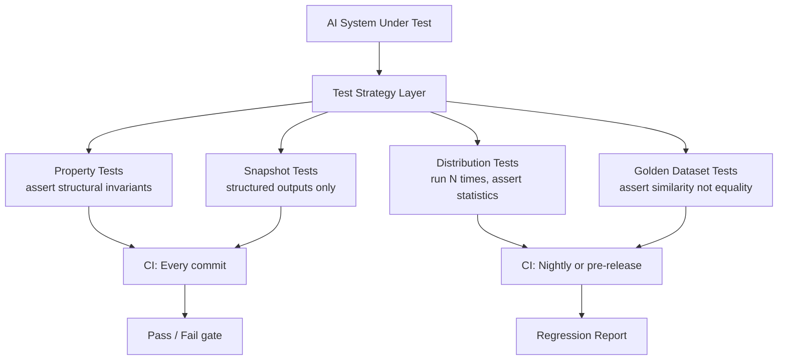

The first time I tried to write tests for an LLM-backed system, I wrote something like `assert result == expected_output`. It passed once. Then temperature varied the output slightly and it failed. Then I added fuzzy matching. Then the model was updated and the output structure changed entirely. The test suite became a maintenance nightmare that told me nothing useful.

Testing non-deterministic systems requires a different mental model. You are not testing that the output equals some expected value — you are testing that the output has the right properties, falls within the right distribution, and has not regressed relative to a known-good baseline.



---

## Why Unit Tests Are Not Enough

Unit tests assume referential transparency: same input, same output. LLMs violate this by design. Even at temperature 0, model updates, system prompt changes, and context variations can shift outputs. At temperature > 0 (where most production agents run), outputs vary on every call.

The problem compounds with agents. An agent's output depends on which tools it calls, what those tools return, and how it integrates the results — all of which have their own sources of variance. A conventional test suite will be either too strict (failing on valid variance) or too loose (missing real regressions).

What you actually need is a layered approach: fast structural tests that run on every commit, statistical distribution tests that run nightly, and semantic regression tests tied to a golden dataset.

---

## Property-Based Testing

Property-based tests assert invariants that must hold regardless of the specific output. These are your fastest and most reliable tests.

```python
import pytest
import json
from your_agent import summarize_document, classify_intent

class TestSummaryProperties:
    """Properties that must hold for every summary, regardless of content."""

    def test_summary_is_shorter_than_source(self, sample_documents):
        for doc in sample_documents:
            result = summarize_document(doc["text"])
            assert len(result["summary"]) < len(doc["text"]), \
                f"Summary longer than source for doc {doc['id']}"

    def test_summary_schema_valid(self, sample_documents):
        required_keys = {"summary", "key_points", "word_count"}
        for doc in sample_documents:
            result = summarize_document(doc["text"])
            assert required_keys.issubset(result.keys()), \
                f"Missing keys: {required_keys - result.keys()}"

    def test_summary_no_hallucinated_numbers(self, sample_documents):
        """Numbers in summary must appear in source document."""
        import re
        for doc in sample_documents:
            result = summarize_document(doc["text"])
            summary_numbers = set(re.findall(r'\b\d+\.?\d*\b', result["summary"]))
            source_numbers = set(re.findall(r'\b\d+\.?\d*\b', doc["text"]))
            hallucinated = summary_numbers - source_numbers
            assert not hallucinated, \
                f"Numbers in summary not in source: {hallucinated}"

class TestIntentClassification:
    VALID_INTENTS = {"support", "sales", "billing", "other"}

    def test_always_returns_valid_intent(self, sample_queries):
        for query in sample_queries:
            result = classify_intent(query)
            assert result["intent"] in self.VALID_INTENTS

    def test_confidence_in_range(self, sample_queries):
        for query in sample_queries:
            result = classify_intent(query)
            assert 0.0 <= result["confidence"] <= 1.0
```

These tests do not check _what_ the output is — they check _what shape it has_. They are fast, deterministic (in the sense that they pass or fail based on schema and logic, not content), and catch the failure modes that matter most.

---

## Distribution Testing

For behaviours that should hold statistically but not on every single call, run the function N times and assert aggregate properties:

```python
import statistics
from collections import Counter

def run_distribution_test(
    fn,
    inputs: list,
    n_runs: int = 50,
    min_pass_rate: float = 0.90
) -> dict:
    """
    Run fn on each input n_runs times and compute pass rate.
    Use for non-deterministic properties (e.g. factual accuracy).
    """
    results = []
    for inp in inputs:
        passes = 0
        for _ in range(n_runs):
            output = fn(inp["input"])
            passes += 1 if inp["check"](output) else 0
        results.append({
            "input_id": inp["id"],
            "pass_rate": passes / n_runs,
            "passed": (passes / n_runs) >= min_pass_rate
        })

    overall_pass_rate = statistics.mean(r["pass_rate"] for r in results)
    return {
        "pass_rate": overall_pass_rate,
        "passed": overall_pass_rate >= min_pass_rate,
        "per_input": results,
        "failures": [r for r in results if not r["passed"]]
    }

# Example usage
result = run_distribution_test(
    fn=extract_key_facts,
    inputs=[
        {
            "id": "doc_001",
            "input": "The contract was signed on March 15, 2024 for $2.4M.",
            "check": lambda r: "2024" in r["facts"] and "2.4M" in r["facts"]
        },
    ],
    n_runs=20,
    min_pass_rate=0.85
)
assert result["passed"], f"Distribution test failed: {result['failures']}"
```

The 50-run default is a balance between signal quality and CI cost. For LLM calls at $0.01 per call, 50 runs on 20 test cases is $10 — worth running nightly, not on every commit.

---

## Golden Dataset Testing with Embedding Similarity

For outputs where you have known-good examples, use embedding similarity instead of string equality:

```python
import numpy as np
from anthropic import Anthropic

client = Anthropic()

def embed(text: str) -> list[float]:
    # Using any embedding model — voyage-3, text-embedding-3-large, etc.
    response = client.messages.create(
        model="claude-opus-4-5",
        max_tokens=1,
        messages=[{"role": "user", "content": text}]
    )
    # In practice, call your embedding endpoint here
    # Placeholder for illustration:
    return []

def cosine_similarity(a: list[float], b: list[float]) -> float:
    a, b = np.array(a), np.array(b)
    return float(np.dot(a, b) / (np.linalg.norm(a) * np.linalg.norm(b)))

def test_against_golden_dataset(
    fn,
    golden_examples: list[dict],
    similarity_threshold: float = 0.85
):
    failures = []
    for example in golden_examples:
        actual_output = fn(example["input"])
        actual_embedding = embed(actual_output)
        golden_embedding = embed(example["expected_output"])

        similarity = cosine_similarity(actual_embedding, golden_embedding)
        if similarity < similarity_threshold:
            failures.append({
                "input": example["input"],
                "expected": example["expected_output"],
                "actual": actual_output,
                "similarity": similarity
            })

    assert not failures, \
        f"{len(failures)} golden examples below threshold {similarity_threshold}: {failures[0]}"
```

The threshold matters. I use 0.85 for summary-like tasks and 0.92 for structured extraction tasks. Calibrate this by running your golden set against the model before any changes and noting the natural similarity distribution.

---

## Snapshot Testing for Structured Outputs

When your AI system produces structured output (JSON, YAML, a typed object), snapshot testing makes sense — but with update workflows:

```python
import json
import os

SNAPSHOT_DIR = "tests/snapshots"

def assert_snapshot(test_id: str, actual: dict, update: bool = False):
    snapshot_path = os.path.join(SNAPSHOT_DIR, f"{test_id}.json")

    if update or not os.path.exists(snapshot_path):
        # Write or update snapshot
        with open(snapshot_path, "w") as f:
            json.dump(actual, f, indent=2)
        return  # Pass on first run / explicit update

    with open(snapshot_path) as f:
        expected = json.load(f)

    # Compare structure, not exact values for LLM-generated fields
    assert set(actual.keys()) == set(expected.keys()), \
        f"Schema changed: {set(actual.keys()) ^ set(expected.keys())}"

    # For numeric fields, assert within tolerance
    for key in actual:
        if isinstance(expected[key], (int, float)):
            assert abs(actual[key] - expected[key]) / max(expected[key], 1) < 0.1, \
                f"Numeric field {key} drifted: {expected[key]} -> {actual[key]}"
```

Run with `UPDATE_SNAPSHOTS=1` in CI when you intentionally upgrade the model or change the prompt. Otherwise, schema changes will surface as test failures rather than silent regressions.

---

## CI Pipeline Integration

How to wire this so it is actually useful:

```yaml
# .github/workflows/ai-tests.yml
name: AI System Tests
on:
  push:
    branches: [main, develop]
  schedule:
    - cron: '0 2 * * *'  # nightly at 2 AM

jobs:
  fast-tests:
    name: Property + Snapshot Tests
    runs-on: ubuntu-latest
    steps:
      - uses: actions/checkout@v4
      - run: pip install -r requirements.txt
      - run: pytest tests/test_properties.py tests/test_snapshots.py -v
        env:
          ANTHROPIC_API_KEY: ${{ secrets.ANTHROPIC_API_KEY }}

  distribution-tests:
    name: Distribution + Golden Dataset Tests
    runs-on: ubuntu-latest
    if: github.event_name == 'schedule' || contains(github.event.head_commit.message, '[full-eval]')
    steps:
      - uses: actions/checkout@v4
      - run: pip install -r requirements.txt
      - run: pytest tests/test_distribution.py tests/test_golden.py -v --tb=short
        env:
          ANTHROPIC_API_KEY: ${{ secrets.ANTHROPIC_API_KEY }}
```

The `[full-eval]` commit message trigger lets you run the expensive suite on demand without waiting for the nightly schedule.

---

*Previous: [AI Code Review at Scale](/posts/ai-code-review-at-scale/)*
