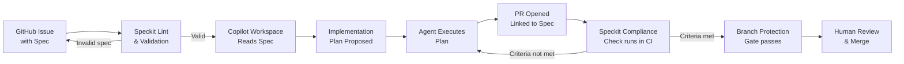

Most teams using GitHub Copilot are using it for autocomplete and chat. That is fine. But Copilot has a second mode — Copilot Workspace — that operates at a different level: you give it a task description and it proposes an implementation plan across your entire codebase, then executes it.

The problem with Workspace in its default form is the same problem with any unstructured AI input: garbage in, garbage out. When the "task description" is a vague issue title, the plan is vague. GitHub Speckit is the tooling that closes that gap — it gives Workspace a structured, machine-readable spec as its input instead of a freeform prompt.



## What Speckit Is

Speckit is GitHub's spec-driven development tooling. It is not a separate product — it is a set of conventions, a configuration file, and a CI action that together structure how Copilot Workspace consumes task definitions.

The core idea: instead of writing an issue like "add rate limiting to the API," you write a spec — a structured document with YAML front matter and a markdown body — and attach it to the issue. Speckit validates the spec structure, makes it available to Copilot Workspace as an executable input, and then checks the resulting PR against the acceptance criteria defined in the spec.

The flow is GitHub-native. Specs live in Issues or in `.github/specs/`. PRs are linked back to specs automatically. Compliance is a branch protection rule. Nothing leaves the GitHub ecosystem.

## The Speckit Spec Format

Speckit specs use YAML front matter for machine-readable metadata and a markdown body for human-readable behaviour description.

```yaml
---
speckit_version: "1.0"
feature: rate-limiting
priority: high
type: feature
acceptance_criteria:
  - HTTP 429 returned when client exceeds rate limit
  - X-RateLimit-Limit header present on all API responses
  - X-RateLimit-Remaining header present on all API responses
  - X-RateLimit-Reset header present on all API responses
  - Limits persist across application restarts
  - No more than 5ms added to P99 latency
agents:
  - copilot-workspace
---

# Behaviour

The API enforces per-client rate limits using a sliding window algorithm
backed by Redis. Clients are identified by their API key, extracted from
the `Authorization` header.

When a client's request count exceeds their tier limit within the current
window, the API returns 429 Too Many Requests with a `Retry-After` header
indicating when the next request will be accepted.

All responses — including successful ones — include the three rate limit
headers so clients can proactively manage their request cadence.

## Constraints

- Must use the existing Redis cluster (not a new deployment)
- Tier limits are loaded from environment variables at startup
- The middleware must work with the existing FastAPI middleware stack
- Do not modify the authentication layer

## Out of Scope

- Admin UI for managing per-client limits
- Custom limits per endpoint (flat per-client limit only)
- Rate limiting for internal service-to-service calls
```

The `acceptance_criteria` array is what Speckit's CI action validates against. Each criterion becomes a check that runs against the PR. The `agents` field controls which Copilot agents are permitted to act on this spec — relevant once you start restricting which agents can touch which parts of the codebase.

## Repository Configuration

The `.github/speckit.yml` file controls Speckit behaviour across the repository:

```yaml
# .github/speckit.yml
speckit_version: "1.0"

spec_locations:
  - .github/specs/
  - issues  # also accept specs in GitHub Issues

required_fields:
  - feature
  - priority
  - acceptance_criteria

templates:
  feature:
    path: .github/spec-templates/feature.md
  bugfix:
    path: .github/spec-templates/bugfix.md
  refactor:
    path: .github/spec-templates/refactor.md
  infra:
    path: .github/spec-templates/infra.md
    required_approvers:
      - "@platform-team"

agent_permissions:
  copilot-workspace:
    allowed_spec_types: [feature, bugfix]
    excluded_paths:
      - src/auth/**
      - infrastructure/prod/**
  copilot-agents:
    allowed_spec_types: [feature, bugfix, refactor, infra]
    require_approval_for: [infra]

compliance:
  block_merge_on_unmet_criteria: true
  require_spec_link: true
```

The `agent_permissions` section deserves attention. This is how you prevent agents from touching sensitive paths without a human in the loop — authentication code, production infrastructure, compliance-critical systems. You define the path exclusions once in config, and they apply to every spec execution.

The `infra` spec type with `required_approvers` means any spec of type `infra` will not proceed to agent execution until someone on `@platform-team` has reviewed and approved the spec itself. This gives you a review gate on the specification before a single line of infrastructure code is generated.

## Integration with Copilot Workspace

When Copilot Workspace picks up a spec-linked issue, it reads the Speckit front matter and body together. The structured acceptance criteria become explicit targets for the implementation plan — Workspace knows it needs to satisfy each criterion and surfaces them in its plan view before execution.

In practice this changes the plan quality noticeably. A spec with five concrete acceptance criteria produces a plan that has five verifiable outcomes. A freeform issue produces a plan that roughly approximates what the issue title said.

## Spec-Linked PRs and Compliance Checks

Every PR opened through Copilot Workspace against a spec-linked issue gets the spec metadata attached automatically. The PR sidebar shows the original spec, the acceptance criteria, and the compliance status of each criterion.

The Speckit CI action runs after the PR build:

```yaml
# .github/workflows/speckit-check.yml
name: Speckit Compliance

on:
  pull_request:
    types: [opened, synchronize]

jobs:
  compliance:
    runs-on: ubuntu-latest
    steps:
      - uses: actions/checkout@v4

      - name: Speckit Compliance Check
        uses: github/speckit-action@v1
        with:
          github-token: ${{ secrets.GITHUB_TOKEN }}
          spec-file: ${{ github.event.pull_request.spec_path }}
          fail-on-unmet: true
```

The action reads the acceptance criteria from the spec, runs the verification checks, and reports status on each criterion as a PR check. With `block_merge_on_unmet_criteria: true` in your Speckit config, unmet criteria block merge — the same as a failing CI check.

This is where Speckit earns its keep in an enterprise environment. The acceptance criteria are not aspirational notes in a comment — they are enforced gates on the merge path.

## Custom Spec Templates

The template system lets you define different spec structures for different work types. A bugfix spec looks different from a feature spec, and both look different from an infrastructure spec.

```markdown
# .github/spec-templates/bugfix.md
---
speckit_version: "1.0"
feature: [feature-name]
type: bugfix
priority: [critical|high|medium|low]
affected_versions: []
regression_risk: [high|medium|low]
acceptance_criteria:
  - [Original behaviour is restored]
  - [No regression in related functionality]
---

# Bug Description

## Current Behaviour
[What happens now]

## Expected Behaviour
[What should happen]

## Root Cause
[If known]

## Constraints
[What must not change]
```

Teams that build out a library of templates for their common work types see the most benefit. The template enforces completeness — engineers filling in a template are less likely to skip sections than engineers writing from scratch.

## Speckit vs Kiro

The clearest way to think about the difference: Kiro is IDE-native, Speckit is GitHub-native.

Kiro's spec lives in a file in your repo and drives an IDE-integrated agent. The development loop is local. Speckit's spec lives in GitHub Issues or `.github/specs/`, and the execution happens through Copilot Workspace — which is a GitHub product with its own cloud-hosted execution environment.

If your team lives in the GitHub UI — Issues, PRs, Projects — Speckit integrates with how you already work. The spec is just another artifact in the issue tracker, linked to the PR, visible in the project board. There is no new tool to learn.

If your team works primarily in an IDE and wants tighter local feedback loops (tests running after each agent task, immediate iteration), Kiro's model fits better.

The honest answer for most teams: start with Speckit if you are already on GitHub Copilot. The GitHub-native integration is a real advantage, and the branch protection integration gives you compliance gates with minimal setup. Move to Kiro if you need VPC-deployed inference or the per-task hook verification model.
