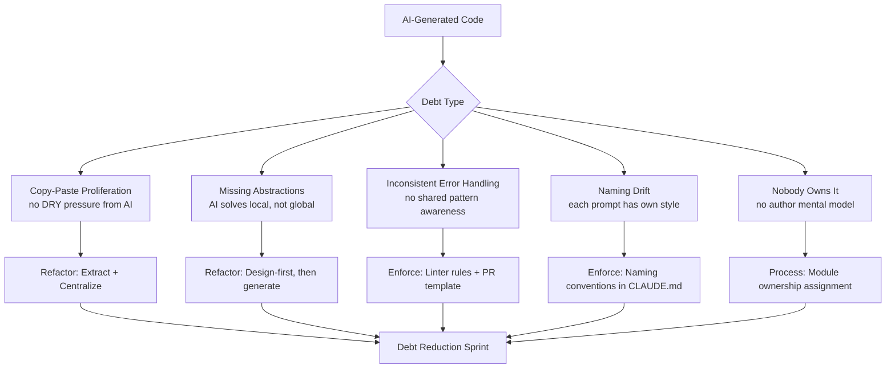

Six months into running an AI-first engineering team, I started noticing something: the codebase was growing fast, tests were passing, velocity felt good — but something was off about the shape of the code. The same logic kept appearing in five places. Error handling was inconsistent across modules written a week apart. Naming conventions drifted every time a new engineer prompted for code in their own style.

AI-generated technical debt is real, but it accumulates differently than hand-written debt. Here is what to look for and how to manage it.



---

## The Copy-Paste Problem

Human engineers feel friction when they write the same code twice. They know they wrote it before, they remember where, and they abstract it. AI does not have that friction. Every prompt is a blank slate. Ask it to validate an email in five different places across the codebase and you will get five slightly different implementations.

This is the most common form of AI-generated debt I see, and it is the easiest to measure:

```python
# A simple near-duplicate detector using AST fingerprinting
import ast
import hashlib
from pathlib import Path
from collections import defaultdict

def fingerprint_function(func_node: ast.FunctionDef) -> str:
    """Fingerprint a function by its structure, ignoring variable names."""
    # Normalize variable names to placeholders
    class Normalizer(ast.NodeTransformer):
        def __init__(self):
            self.var_map = {}
            self.counter = 0
        def visit_Name(self, node):
            if node.id not in self.var_map:
                self.var_map[node.id] = f"var_{self.counter}"
                self.counter += 1
            return ast.Name(id=self.var_map[node.id], ctx=node.ctx)

    normalized = Normalizer().visit(func_node)
    return hashlib.md5(ast.dump(normalized).encode()).hexdigest()

def find_duplicates(repo_path: str) -> dict[str, list[str]]:
    fingerprints = defaultdict(list)

    for py_file in Path(repo_path).rglob("*.py"):
        try:
            tree = ast.parse(py_file.read_text())
        except SyntaxError:
            continue

        for node in ast.walk(tree):
            if isinstance(node, ast.FunctionDef) and len(node.body) > 3:
                fp = fingerprint_function(node)
                fingerprints[fp].append(f"{py_file}::{node.name}")

    return {fp: locs for fp, locs in fingerprints.items() if len(locs) > 1}
```

Run this on your codebase. If you have been using AI heavily for six months, you will find more duplicates than you expect.

---

## Missing Abstractions

AI code generation optimises for solving the immediate problem. It does not ask "should this be a shared module?" because it has no visibility into the broader codebase unless you explicitly provide it. The result is a codebase where each module is internally coherent but there is no coherence across modules.

The pattern I see: three features all need to talk to the same external API. Each was generated independently. Each has its own retry logic, its own error handling, its own response parsing. None shares a client. When the API changes its authentication scheme, you have three places to update instead of one.

The fix requires human judgment — AI cannot see the abstraction boundary without being shown the full picture. But AI can help execute the refactor once a human identifies it:

```
Prompt pattern that works:
"I have these three files that all make calls to [API]. 
I want to extract a shared client module. 
Here are all three files: [paste them].
Propose the interface for the shared client, then implement it. 
After, show me the diff to update each caller."
```

The key is providing all three files in the same prompt. AI cannot do this without the cross-file context.

---

## Inconsistent Error Handling

Error handling is the clearest signal of fragmented authorship. In a hand-written codebase with a senior engineer involved, there is usually a house style: specific exception types, where errors are caught vs propagated, how they are logged, what gets surfaced to the user.

AI-generated code will follow whatever pattern was implied in the surrounding context of each prompt. Prompt it in a context with `try/except Exception as e: print(e)` and it will generate that. Prompt it against a clean module with typed exceptions and it will generate that.

The result in practice: `Exception` catches mixed with typed catches, `logging.error` next to `print(f"Error: {e}")`, some functions returning `None` on error and others raising.

Enforce a house style with linting rules and document them where AI can see them:

```python
# In your CLAUDE.md or equivalent context file:
# Error Handling Standard:
# - Always raise typed exceptions from domain/exceptions.py
# - Never catch bare Exception — catch the most specific type
# - Log with logger.exception() to capture stack trace
# - Surface user-facing errors via UserFacingError (message is safe to display)
# - Internal errors propagate to the boundary handler in api/middleware.py

# domain/exceptions.py — the canonical list
class DomainError(Exception):
    """Base for all domain exceptions."""
    pass

class ValidationError(DomainError):
    def __init__(self, field: str, message: str):
        self.field = field
        super().__init__(f"Validation failed for {field}: {message}")

class ExternalServiceError(DomainError):
    def __init__(self, service: str, status_code: int, detail: str):
        self.service = service
        self.status_code = status_code
        super().__init__(f"{service} returned {status_code}: {detail}")
```

Once this file exists and is referenced in your AI context instructions, generated code will use it. Retroactively fixing the existing inconsistency is a separate sprint.

---

## Naming Drift

Each engineer on the team has a slightly different natural language style. When they prompt AI for code, the AI reflects that style. One engineer generates functions like `get_user_data()`. Another generates `fetch_user_information()`. A third generates `retrieve_user_record()`. All three do the same thing.

Naming drift compounds over time because search becomes unreliable. You grep for `user_data` and miss the functions named `user_information`. The cognitive load of reading code increases because you cannot form reliable expectations about naming.

The fix: a naming conventions file that is explicitly included in AI context:

```
# naming-conventions.md (referenced in .claude/CLAUDE.md)
## Naming Conventions

### Functions
- Data retrieval: get_* (not fetch_, retrieve_, load_)
- Data persistence: save_* or update_* (not persist_, write_, store_)
- Data deletion: delete_* (not remove_, destroy_, clear_)
- Validation: validate_* returning bool or raising ValidationError
- Transformation: to_* or as_* (e.g. to_dict(), as_json())

### Variables
- Collections: plural noun (users, records, items)
- Booleans: is_*, has_*, can_* (is_active, has_permission)
- IDs: *_id suffix (user_id, record_id)
- Counts: *_count (retry_count, item_count)

### Modules
- Domain logic: noun (user, order, invoice)
- Utilities: *_utils (string_utils, date_utils)
- External clients: *_client (stripe_client, sendgrid_client)
```

Include this file in every AI context. Generated code will follow it.

---

## The "Nobody Owns This" Problem

Hand-written code has an implicit owner — the engineer who wrote it knows why it is shaped the way it is. AI-generated code has no owner. Nobody has the mental model of why a module exists, what trade-offs were made, or what should and should not go in it. When it needs to change, whoever touches it is flying blind.

This is not a code problem — it is a process problem. The mitigation:

**Assign module ownership explicitly.** Every module in the codebase has a named engineer (or team) responsible for it. That person reviews all PRs touching the module. They write the module-level docstring explaining its scope and constraints.

**Write ADRs for significant AI-generated decisions.** If an AI agent generated a significant design (a database schema, an API contract, a core algorithm), document the decision in an ADR. What was the problem? What alternatives were considered? Why this shape? Without this, the codebase becomes archaeology.

**Run regular "ownership audits."** Once a quarter, walk the module list and confirm every module has a named owner. Unowned modules are where debt quietly accumulates until it becomes a production incident.

---

## Measuring AI-Generated Debt

You cannot manage what you do not measure. Metrics I track:

```python
# debt_metrics.py — run weekly via CI
import subprocess

def count_duplicates() -> int:
    dupes = find_duplicates(".")
    return sum(len(v) - 1 for v in dupes.values())

def count_bare_exception_catches() -> int:
    result = subprocess.run(
        ["rg", "--count-matches", "except Exception", "--type", "py"],
        capture_output=True, text=True
    )
    return sum(int(line.split(":")[1]) for line in result.stdout.strip().split("\n") if ":" in line)

def count_unowned_modules() -> int:
    # Check for modules without a CODEOWNERS entry
    with open(".github/CODEOWNERS") as f:
        owned_paths = set(line.split()[0] for line in f if line.strip() and not line.startswith("#"))
    unowned = 0
    for py_file in Path(".").rglob("*.py"):
        if not any(str(py_file).startswith(p.lstrip("/")) for p in owned_paths):
            unowned += 1
    return unowned

def report():
    print(f"Duplicate functions: {count_duplicates()}")
    print(f"Bare exception catches: {count_bare_exception_catches()}")
    print(f"Unowned modules: {count_unowned_modules()}")
```

Track these as time-series metrics. Increasing duplicate count is the clearest early signal that the team needs a refactoring sprint.

---

*Previous: [Testing Non-Deterministic Systems](/posts/testing-non-deterministic-ai-systems/) — Next: [Prompt Injection Defences In Depth](/posts/prompt-injection-defences-in-depth/)*
