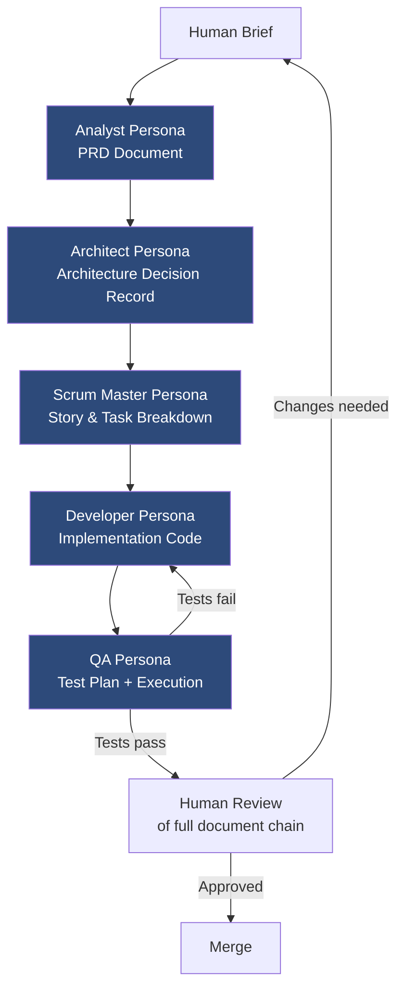

The standard agentic AI workflow is a single generalist assistant that does everything: understands requirements, designs the architecture, writes the code, writes the tests, and documents the result. This works well for small, contained tasks. It breaks down on anything complex.

The problem is not the model's capability — it is the context problem. When one agent holds analyst intent, architectural constraints, implementation details, and test strategy simultaneously, something always gets compressed. Usually it is the architectural constraints. The agent writes code that solves the stated problem while violating unstated conventions the team has internalized over years.

BMAD (github.com/bmad-project) is an open-source methodology that addresses this by replacing the generalist with a set of specialized personas, each responsible for a specific phase of development and a specific structured output.



## The Core Philosophy

BMAD's fundamental insight is that different phases of software development require different expertise, different tools, and different failure modes. An analyst needs to understand business requirements and translate them into functional specs. An architect needs to reason about non-functional requirements, scalability, and system boundaries. A developer needs to know the codebase conventions, the existing patterns, and which shortcuts are acceptable. A QA engineer needs to think adversarially.

When you try to get a single AI agent to do all of this in one pass, you get output that is superficially competent across all dimensions and genuinely excellent at none.

BMAD forces a separation of concerns that mirrors how good engineering teams actually work — with handoffs, reviews, and specialized accountability.

## The Document System

Every BMAD persona produces a structured document and consumes the documents produced by earlier personas. This is the handoff chain.

**Product Requirements Document (PRD)** — produced by the Analyst persona. Contains the business problem, user personas, functional requirements, non-functional requirements, and explicit out-of-scope items. The PRD is the input to the Architect.

**Architecture Decision Record (ADR)** — produced by the Architect persona, working from the PRD. Documents the system design, technology choices and their rationale, component boundaries, data models, and integration contracts. The ADR is the input to the Scrum Master.

**Story/Task file** — produced by the SM persona, working from the PRD and ADR together. Breaks the architecture into sized, ordered, implementable stories. Each story has acceptance criteria and references the relevant ADR decisions.

**Implementation code** — produced by the Developer persona, working from a single story plus the ADR for context. The Developer persona is explicitly constrained to the story in front of it — it does not re-architect, does not expand scope.

**Test plan and execution results** — produced by the QA persona, working from the story's acceptance criteria and the implementation code.

## Defining Personas

Personas are defined as system prompts, typically stored as files in a `.bmad/` directory in your repository. Here is a simplified Architect persona:

```markdown
# .bmad/personas/architect.md

You are a senior software architect reviewing a PRD and producing an
Architecture Decision Record (ADR).

## Your responsibilities
- Design the system to satisfy all functional requirements in the PRD
- Make explicit technology choices and document the rationale for each
- Define component boundaries and interfaces
- Identify non-functional requirement trade-offs explicitly
- Flag any requirements that are technically infeasible or ambiguous

## Your constraints
- Do not make technology choices that contradict the existing stack
  defined in the project's TECH_STACK.md
- Do not introduce new infrastructure components without documenting
  the operational implications
- Security requirements take precedence over performance optimizations

## Output format
Produce a single ADR file following the template at .bmad/templates/adr.md.
Do not produce implementation code. Do not produce stories or tasks.
If you identify gaps in the PRD that block architectural decisions, list
them explicitly in an "Unresolved Questions" section rather than assuming.

## Handoff
The ADR you produce will be read by the Scrum Master persona to produce
a story breakdown. Write it with that reader in mind.
```

The `Do not produce implementation code` and `Do not produce stories or tasks` constraints are not decoration. They are what prevents an architect agent from doing the developer's job and producing an ADR that is really just commented-out code. Each persona needs explicit scope boundaries.

## BMAD with Claude Code

Claude Code is well-suited to BMAD because it already has the `CLAUDE.md` mechanism for injecting context. The practical implementation: create a separate CLAUDE.md for each persona and switch contexts when you switch phases.

```
.bmad/
  personas/
    analyst.md
    architect.md
    sm.md
    developer.md
    qa.md
  templates/
    prd.md
    adr.md
    story.md
    test-plan.md
  outputs/
    prd-feature-x.md
    adr-feature-x.md
    stories-feature-x.md
```

When working in the Analyst phase, you point Claude Code at `analyst.md` as the context file and work from the PRD template. When you move to architecture, you switch to `architect.md` and pass the completed PRD as input. The outputs accumulate in `outputs/` and become an auditable chain of reasoning for the feature.

In practice with Claude Code, I run each persona in a separate session to keep context clean. The documents are the handoff mechanism, not the session — which means the Developer persona never has the Analyst's reasoning in its context window diluting its focus on implementation.

```bash
# Analyst phase
claude --context .bmad/personas/analyst.md \
       --input "brief: Add rate limiting to the API" \
       --template .bmad/templates/prd.md \
       --output .bmad/outputs/prd-rate-limiting.md

# Architect phase (reads the completed PRD)
claude --context .bmad/personas/architect.md \
       --input .bmad/outputs/prd-rate-limiting.md \
       --template .bmad/templates/adr.md \
       --output .bmad/outputs/adr-rate-limiting.md
```

This is a simplified illustration — the actual invocation depends on your Claude Code setup — but the pattern is: each persona call is isolated, takes structured input, and produces structured output.

## Strengths

**Structured handoffs** — the document chain means every decision is traceable. When the QA persona finds a gap in test coverage, you can trace it back to the story, back to the ADR, back to the PRD. You know where the specification was incomplete.

**Domain-specific optimization** — a Developer persona can be tuned with deep knowledge of your codebase conventions, import patterns, error handling approach. That context does not contaminate the Architect persona, which needs to reason about system design without implementation bias.

**Tool-agnostic** — BMAD is a methodology. The personas work with Claude Code, Cursor, Kiro, or any other AI tool that accepts system prompts and processes structured documents. You are not locked in to a particular IDE or AI provider.

**Audit trail** — the document chain is a complete record of what was decided and why. This is significant in regulated environments. An auditor can follow the chain from business requirement to test execution results.

## Honest Weaknesses

BMAD has real overhead. For a feature that would take a good engineer two hours to implement, the full BMAD cycle — PRD, ADR, story breakdown, implementation, QA — takes longer end-to-end the first time you run it. You are doing more work upfront.

The persona context management is genuinely complex for teams that have not worked this way before. Knowing when to switch personas, when to send a document back for revision, when the ADR is actually ready for the Developer — this is a skill that takes time to develop.

Not all teams need the full structure. A two-person startup shipping a prototype does not need a PRD, an ADR, a story breakdown, and a test plan for every feature. They need to ship fast and learn. BMAD is overkill for that context.

## When BMAD Makes Sense

BMAD pays off when you have at least two of these: a complex product with multiple interconnected systems, a team of three or more engineers where shared understanding of decisions matters, compliance requirements that need audit trails, or a history of scope creep and architectural drift in AI-generated code.

In enterprise environments where AI-generated code goes into production systems — not prototypes, not internal tools, production — the document chain that BMAD produces is worth the overhead. When something breaks at 2am, the ADR tells you what decision led to the architecture that failed. That is not nothing.

The practical entry point: do not implement the full five-persona workflow immediately. Start with just the Analyst and Developer personas — write a PRD, then use it as the Developer persona's input. That alone is a meaningful improvement over prompt-and-iterate. Add personas as you see value in the additional structure.
