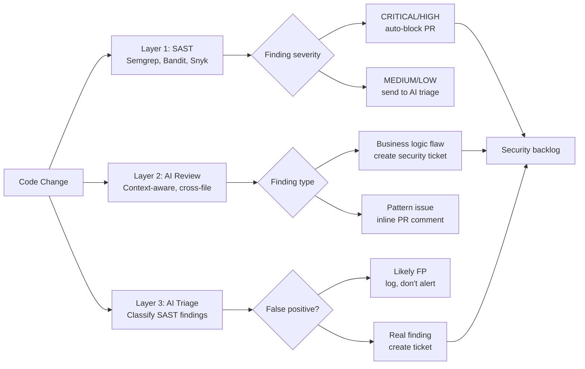

SAST tools are good at what they do: pattern matching against known vulnerability signatures, data flow analysis for injection paths, dependency vulnerability lookups. Run Semgrep, Bandit, Snyk, and you catch a lot. But you do not catch the SQL injection that happens three function calls deep through a custom ORM abstraction that your tool has not modelled. You do not catch the authentication bypass that requires understanding the intended business logic. You do not catch the IDOR that only exists when two features interact in a way nobody anticipated.

These are the vulnerabilities that matter most in production, and they require context that SAST tools do not have.



---

## Where SAST Falls Short

Let me be specific about the gaps, because "SAST misses context" is too vague to act on.

**Abstraction layers.** Your application has a `UserRepository` that wraps database calls. SAST tools model common ORMs (SQLAlchemy, Hibernate) but not your custom wrapper. If the wrapper is vulnerable, SAST may not trace the taint flow through it. AI, given the full repository context including the wrapper implementation, can see the path.

**Business logic flaws.** SAST tools do not know what your application is supposed to do. Consider a price calculation endpoint that accepts a `discount_percentage` parameter. There is no SQL injection, no XSS, no known CVE pattern. But if the endpoint does not validate that the caller is authorised to apply discounts at all, you have an authorisation bypass. SAST will not flag it. AI, given context about your authorisation model, might.

**Cross-feature interactions.** Feature A establishes that a user is "verified." Feature B grants expanded permissions to "verified" users. The verification logic in Feature A has a race condition that allows bypassing it. Neither feature has a vulnerability in isolation — the vulnerability is in the interaction.

**Context-dependent injection.** A parameter is properly parameterised in 47 places. In one place it is concatenated into a query because someone was in a hurry. SAST might catch this, but if the concatenation path is behind enough abstraction layers, it might not.

---

## AI-Assisted Code Review for Security

The most practical entry point is adding a security-focused AI review pass to your PR process. Not a general code review — a review with a specific security mandate and the right context.

```python
from anthropic import Anthropic

client = Anthropic()

SECURITY_REVIEW_SYSTEM_PROMPT = """You are a security engineer reviewing code changes for vulnerabilities.
Focus on:
1. Injection vulnerabilities (SQL, command, template, LDAP) including through abstraction layers
2. Authentication and authorisation bypasses
3. Insecure direct object references (IDOR)
4. Business logic flaws that could be exploited
5. Sensitive data exposure (logging, error messages, API responses)
6. Missing input validation that could cause unexpected behaviour in security-relevant paths

For each finding:
- State the vulnerability class
- Show the specific code location and line
- Explain the exploitability (how would an attacker trigger this?)
- Assess severity (CRITICAL / HIGH / MEDIUM / LOW / INFO)
- Suggest a concrete fix

Do not report style issues, performance problems, or general code quality concerns.
Only report security findings. If you find nothing, say so explicitly."""

def security_review_pr(
    changed_files: dict[str, str],
    supporting_context: dict[str, str],  # auth models, data models, etc.
    pr_description: str
) -> dict:
    # Build context
    changed_block = "\n\n".join([
        f"=== {path} ===\n{content}"
        for path, content in changed_files.items()
    ])
    context_block = "\n\n".join([
        f"=== CONTEXT: {path} ===\n{content}"
        for path, content in supporting_context.items()
    ])

    response = client.messages.create(
        model="claude-opus-4-5",
        max_tokens=4096,
        system=SECURITY_REVIEW_SYSTEM_PROMPT,
        messages=[{
            "role": "user",
            "content": (
                f"PR Description:\n{pr_description}\n\n"
                f"Supporting context (read-only, not changed):\n{context_block}\n\n"
                f"Changed files:\n{changed_block}"
            )
        }]
    )

    return {
        "raw_review": response.content[0].text,
        "model": response.model,
        "input_tokens": response.usage.input_tokens,
    }
```

The `supporting_context` parameter is the key differentiator from a naive single-file review. For each changed file, include:
- The authentication/authorisation module (so the AI understands the access control model)
- The data models (so it can reason about what data is accessible)
- Any shared utilities the changed file calls (so it can follow the call chain)

---

## Building a Custom Security Agent

For ongoing scanning rather than PR-level reviews, a persistent security agent can monitor changes continuously:

```python
from anthropic import Anthropic
import subprocess
import json

client = Anthropic()

def get_git_diff(base_branch: str = "main") -> str:
    result = subprocess.run(
        ["git", "diff", f"origin/{base_branch}...HEAD", "--unified=5"],
        capture_output=True, text=True
    )
    return result.stdout

def run_sast_tools() -> list[dict]:
    """Run Semgrep and return structured findings."""
    result = subprocess.run(
        ["semgrep", "--config", "auto", "--json", "--quiet", "."],
        capture_output=True, text=True
    )
    if result.returncode not in (0, 1):
        return []
    try:
        data = json.loads(result.stdout)
        return data.get("results", [])
    except json.JSONDecodeError:
        return []

def security_agent_scan(branch_diff: str, sast_findings: list[dict]) -> str:
    tools = [
        {
            "name": "read_file",
            "description": "Read a file from the repository for additional context",
            "input_schema": {
                "type": "object",
                "properties": {
                    "path": {"type": "string", "description": "File path relative to repo root"}
                },
                "required": ["path"]
            }
        }
    ]

    sast_summary = json.dumps(sast_findings[:10], indent=2) if sast_findings else "No SAST findings."

    messages = [{
        "role": "user",
        "content": (
            f"Review this diff for security vulnerabilities. "
            f"You have access to read any file in the repository for additional context.\n\n"
            f"SAST findings (may contain false positives):\n{sast_summary}\n\n"
            f"Git diff:\n{branch_diff[:8000]}"  # Token budget constraint
        )
    }]

    # Agentic loop with tool use
    while True:
        response = client.messages.create(
            model="claude-opus-4-5",
            max_tokens=4096,
            system=SECURITY_REVIEW_SYSTEM_PROMPT,
            tools=tools,
            messages=messages
        )

        if response.stop_reason == "end_turn":
            # Extract final text response
            for block in response.content:
                if hasattr(block, "text"):
                    return block.text
            return ""

        if response.stop_reason == "tool_use":
            messages.append({"role": "assistant", "content": response.content})
            tool_results = []
            for block in response.content:
                if block.type == "tool_use" and block.name == "read_file":
                    try:
                        with open(block.input["path"]) as f:
                            file_content = f.read()[:4000]
                    except (FileNotFoundError, PermissionError) as e:
                        file_content = f"Error reading file: {e}"
                    tool_results.append({
                        "type": "tool_result",
                        "tool_use_id": block.id,
                        "content": file_content
                    })
            messages.append({"role": "user", "content": tool_results})
```

The agent can follow call chains across files — it reads the files it needs context for, rather than requiring you to anticipate which files are relevant.

---

## SAST Finding Triage Automation

The volume problem with SAST is real. Semgrep on a mature codebase produces hundreds of findings. Most are false positives or known/accepted risks. Security engineers drown in triage. AI can help classify findings before a human sees them:

```python
def triage_sast_finding(finding: dict, codebase_context: str) -> dict:
    """Classify a SAST finding as true positive, false positive, or needs-review."""

    response = client.messages.create(
        model="claude-haiku-4-5",  # Fast + cheap for high-volume triage
        max_tokens=512,
        system=(
            "You are a security engineer triaging SAST findings. "
            "Classify each finding as: TRUE_POSITIVE, FALSE_POSITIVE, or NEEDS_REVIEW. "
            "Return JSON with keys: classification, confidence (0-1), reasoning (max 2 sentences)."
        ),
        messages=[{
            "role": "user",
            "content": (
                f"SAST Finding:\n{json.dumps(finding, indent=2)}\n\n"
                f"Relevant code context:\n{codebase_context}"
            )
        }]
    )

    try:
        # Extract JSON from response
        text = response.content[0].text
        start = text.find("{")
        end = text.rfind("}") + 1
        result = json.loads(text[start:end])
        result["original_finding"] = finding
        return result
    except (json.JSONDecodeError, IndexError):
        return {
            "classification": "NEEDS_REVIEW",
            "confidence": 0.0,
            "reasoning": "Triage parse error — manual review required",
            "original_finding": finding
        }
```

Using `claude-haiku-4-5` for triage keeps cost manageable at volume. At $0.0008 per 1K input tokens, triaging 200 findings with 2K tokens each costs under $0.40. The output is a prioritised queue where security engineers start with the findings AI classified as TRUE_POSITIVE with high confidence.

---

## What to Run in CI vs On-Demand

CI runs on every PR push. On-demand runs when you want deeper analysis.

**CI (fast, every PR):**
- SAST tools (Semgrep, Bandit) with a tight rule subset — 2 minutes max
- AI triage of SAST findings — auto-suppress likely false positives
- Secret detection (Gitleaks, TruffleHog)
- Dependency vulnerability check (Snyk, pip-audit)

**On-demand (deeper, before major releases or for high-risk PRs):**
- Full AI security review with cross-file context
- DAST against a staging environment
- Threat model review for new features
- Dependency review for new third-party packages

```yaml
# .github/workflows/security.yml
name: Security Scanning
on:
  pull_request:
    branches: [main]

jobs:
  sast:
    runs-on: ubuntu-latest
    steps:
      - uses: actions/checkout@v4
      - name: Run Semgrep
        run: semgrep --config p/security-audit --json > semgrep.json || true
      - name: AI triage
        run: python scripts/triage_sast.py semgrep.json
        env:
          ANTHROPIC_API_KEY: ${{ secrets.ANTHROPIC_API_KEY }}
      - name: Secret detection
        run: gitleaks detect --source . --exit-code 1
```

The `|| true` after Semgrep prevents the CI step from failing on findings — the AI triage step decides what to surface. This keeps the developer experience clean while still catching real issues.

---

## Honest Assessment

AI-assisted security scanning is genuinely useful for the categories of vulnerabilities that SAST misses: business logic, cross-feature interactions, context-dependent paths. It is not a replacement for SAST, for human security review on high-risk changes, or for penetration testing.

The current limitation: AI security review works best when you give it specific, focused context. Dumping an entire large codebase and asking "find all vulnerabilities" produces worse results than a targeted review of changed files with relevant supporting context. The pattern that works is surgical, not comprehensive.

---

*Previous: [Prompt Injection Defences In Depth](/posts/prompt-injection-defences-in-depth/)*
