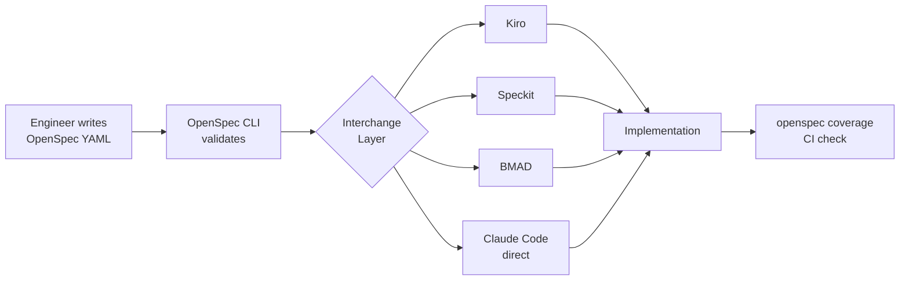

Every SDD tool has a different spec format. Kiro has its own steering files. Speckit has its YAML schema. BMAD has structured story documents. If you move between tools, or want to give a team freedom to use the agent they prefer, you're back to translating specs by hand. OpenSpec is the attempt to fix that — a common format that any compliant tool can parse and execute.

Think of it the same way you think about OpenAPI for REST. OpenAPI doesn't care whether you're using FastAPI, Express, or Spring Boot. It describes the contract. OpenSpec describes the development contract between a human specifier and an AI executor. The tool that implements it is interchangeable.



## What an OpenSpec Document Looks Like

The format is YAML, with a defined schema version, a unique ID, and four main sections: behaviour, constraints, acceptance criteria, and dependencies.

```yaml
openspec: "1.0"
id: rate-limiting-api
title: "Rate Limiting for Public API"
domain: backend
behaviour:
  - id: B1
    description: "Apply 100 req/min limit per API key"
    verifiable: true
  - id: B2
    description: "Return remaining quota in response headers"
    verifiable: true
constraints:
  - id: C1
    description: "Redis-backed counters, survive restarts"
    hard: true
  - id: C2
    description: "Counter increment must be atomic"
    hard: true
acceptance_criteria:
  - id: AC1
    links_to: B1
    test: "101st request in same minute returns 429"
  - id: AC2
    links_to: B2
    test: "X-RateLimit-Remaining header decrements from 100 to 0"
  - id: AC3
    links_to: C1
    test: "Counters persist after Redis restart with AOF enabled"
dependencies:
  - existing: "src/cache.py:get_redis_client"
  - existing: "src/middleware/auth.py:extract_api_key"
```

Every field has a purpose. `verifiable: true` on a behaviour means it must have at least one AC linked to it — this is machine-checkable. `hard: true` on a constraint means it's non-negotiable; an AI executor should surface a violation rather than work around it. `links_to` on acceptance criteria creates a traceable chain from test to requirement.

## The Problem This Solves

Without a shared format, spec quality is tribal knowledge. Some engineers write three-paragraph specs, others write fifty-line docs, and there's no automated way to tell which is complete. OpenSpec makes spec quality a computable property.

Run `openspec validate` and you get structured errors:

```bash
$ openspec validate specs/rate-limiting.yaml

✓ Schema valid
✓ All behaviours have acceptance criteria
✗ B2 has no verifiable test — description is "should feel responsive"
✗ C1 linked to AC3 but AC3 test does not reference persistence

2 errors, 0 warnings
```

That's a pre-flight check before any AI touches the spec. You can block CI if validation fails, which forces spec quality upstream.

`openspec diff` compares two versions of a spec and shows what changed semantically, not just textually:

```bash
$ openspec diff specs/rate-limiting-v1.yaml specs/rate-limiting-v2.yaml

Modified:
  B1: limit changed from 60 req/min to 100 req/min
  AC1: test updated to match new limit

Added:
  B2: Return remaining quota in response headers
  AC2: Header decrement test
```

This matters for code review. When a spec changes, the diff tells reviewers exactly which acceptance criteria are affected — not just which lines changed.

## Spec Coverage in CI

The most powerful OpenSpec tool is `openspec coverage`. It scans your test directory, looks for references to AC IDs, and reports which acceptance criteria have no associated test.

```bash
$ openspec coverage specs/rate-limiting.yaml tests/

Coverage report for: rate-limiting-api
  AC1 ✓  tests/test_rate_limiting.py:45
  AC2 ✓  tests/test_rate_limiting.py:67
  AC3 ✗  No test references AC3

Coverage: 66.7% (2/3 acceptance criteria covered)
```

The convention is simple: put `# OpenSpec: AC3` as a comment in your test, and the tool picks it up. No dependency injection, no magic — just a string match.

Here's a Python implementation of the core coverage check if you want to build your own:

```python
import yaml
import re
from pathlib import Path
from dataclasses import dataclass

@dataclass
class AcceptanceCriterion:
    id: str
    test: str
    links_to: str

def load_openspec(spec_path: str) -> list[AcceptanceCriterion]:
    with open(spec_path) as f:
        spec = yaml.safe_load(f)
    return [
        AcceptanceCriterion(
            id=ac["id"],
            test=ac["test"],
            links_to=ac["links_to"]
        )
        for ac in spec.get("acceptance_criteria", [])
    ]

def find_test_references(test_dir: str, criteria: list[AcceptanceCriterion]) -> set[str]:
    covered = set()
    pattern = re.compile(r"OpenSpec:\s*(\w+)")
    for test_file in Path(test_dir).rglob("*.py"):
        content = test_file.read_text()
        for match in pattern.finditer(content):
            covered.add(match.group(1))
    return covered

def check_spec_coverage(spec_path: str, test_dir: str) -> list[AcceptanceCriterion]:
    criteria = load_openspec(spec_path)
    covered_ids = find_test_references(test_dir, criteria)
    uncovered = [ac for ac in criteria if ac.id not in covered_ids]
    return uncovered

if __name__ == "__main__":
    uncovered = check_spec_coverage("specs/rate-limiting.yaml", "tests/")
    if uncovered:
        print(f"Missing coverage for: {[ac.id for ac in uncovered]}")
        exit(1)
    print("All acceptance criteria covered.")
```

Wire this into CI and spec compliance becomes a hard gate, not a suggestion.

## How OpenSpec Maps to Existing Tools

The format is designed so that tool adapters can translate it in either direction. Here's what an OpenSpec-to-Kiro adapter produces from the rate limiting spec above:

```markdown
# Spec: Rate Limiting for Public API

## Requirements
- Apply 100 req/min limit per API key
- Return remaining quota in response headers

## Constraints
- Redis-backed counters, survive restarts (HARD)
- Counter increment must be atomic (HARD)

## Acceptance Criteria
- AC1: 101st request in same minute returns 429
- AC2: X-RateLimit-Remaining header decrements from 100 to 0
- AC3: Counters persist after Redis restart with AOF enabled

## Existing Dependencies
- src/cache.py:get_redis_client
- src/middleware/auth.py:extract_api_key
```

A Speckit adapter would produce a YAML block matching Speckit's own schema. A BMAD adapter would produce a structured story document. The OpenSpec file is the source of truth; tool-specific formats are derived artifacts.

## Where OpenSpec Sits Right Now

It is community-driven and GitHub-hosted. There is no commercial entity behind it. The CLI tooling exists, the schema is versioned, and a growing number of teams using SDD have adopted it as their internal standard rather than coupling to a specific tool's format.

The practical case for adoption is not ideological. It's operational. If your organization uses Claude Code in one team, Copilot Workspace in another, and Kiro in a third, you need a way to write specs that work across all three without manual translation. OpenSpec is the format that makes that possible today.

> **Note**: The `openspec` CLI and schema spec are available at `github.com/openspec-org/openspec`. The tooling is young — expect the schema to evolve — but the versioning strategy means existing documents do not break on minor updates.
{: .prompt-info }

The validation and coverage tooling alone are worth adopting even if you only ever use one SDD tool. Catching incomplete specs before AI execution cuts revision cycles more reliably than any prompt engineering trick.

---

*Series: [Spec-Driven Development Concepts](/posts/spec-driven-development-concepts/) · [AWS Kiro](/posts/aws-kiro-spec-driven-ai-ide/) · [GitHub Speckit](/posts/github-speckit-copilot-spec-workflows/) · [BMAD Method](/posts/bmad-method-structured-ai-development/)*
