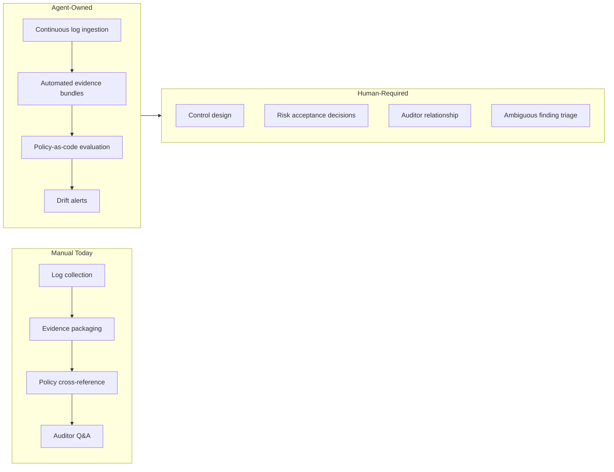

Manual compliance work is grinding. A SOC 2 audit cycle can consume weeks of engineering time: pulling access logs, generating screenshots, writing control narratives, cross-referencing policy docs with actual system behaviour. Most of that work is mechanical. AI agents are genuinely good at mechanical work.

But compliance is also a domain where false confidence kills you. An agent that tells you you're compliant when you're not is worse than no agent at all. This post is about getting the automation right — covering what AI can own, what it can assist with, and what must stay with humans.



## What Manual Compliance Actually Looks Like

If you haven't done a SOC 2 Type II audit, the scale of evidence collection surprises most engineers. You're not producing a single snapshot — you're proving continuous operation of controls over a 6-12 month period.

Typical artefacts for a single control: 50+ log entries showing who accessed a system and when, screenshots of access review meetings, Jira tickets demonstrating change management approval, and a written narrative explaining how the evidence maps to the control objective. Multiply that across 80+ common criteria controls.

The bottleneck is never that the evidence doesn't exist. It exists in CloudTrail, in GitHub, in your ITSM tool, in your SSO provider. The bottleneck is extracting, formatting, and contextualising it in a way an auditor can evaluate. That's exactly the kind of structured data retrieval and formatting work agents excel at.

## What AI Agents Can Own

**Continuous evidence collection.** Rather than a sprint before the audit, an agent can ingest compliance-relevant events continuously. For AWS environments this means tailing CloudTrail, Config, and GuardDuty. For GitHub it means tracking PR review enforcement, branch protection status, and deployment approvals.

```python
# Minimal example: agent-driven evidence collector
class EvidenceCollector:
    def collect_access_reviews(self, period_start, period_end):
        events = self.okta_client.get_user_access_events(
            start=period_start,
            end=period_end
        )
        return self.format_evidence_bundle(
            control="CC6.1",
            events=events,
            narrative_template="access_review_narrative.md"
        )
```

**Policy-as-code evaluation.** You can express a surprising number of compliance controls as machine-checkable rules. S3 buckets must have public access blocked. MFA must be enabled on all IAM users. Production database access requires approval. Agents can run these checks continuously and produce evidence of ongoing compliance rather than a point-in-time snapshot.

**Automated audit trail packaging.** When the auditor asks for evidence of your change management controls for the last quarter, an agent should be able to assemble the bundle in minutes, not days. This means maintaining indexed, structured logs with compliance metadata attached at ingest time.

**Drift detection and alerting.** A configuration that was compliant last week may not be compliant today. Agents can compare current infrastructure state against your approved baseline and alert on drift before it becomes an audit finding.

## What Still Requires Human Judgment

**Control design.** Deciding which controls are in scope, how to interpret ambiguous criteria, and what compensating controls are acceptable requires domain knowledge and accountability that you cannot safely delegate to an agent.

**Risk acceptance decisions.** When a control isn't met, someone with authority needs to decide: remediate immediately, accept the risk, or implement a compensating control. That decision carries legal weight. An agent can surface the finding; a person must own the decision.

**Ambiguous finding triage.** Agents are good at detecting when a rule fires. They're bad at the "is this actually a problem?" evaluation. A failed MFA check on a service account used only by automated processes may be fine or may be critical — context that requires human review.

**Auditor relationship management.** Auditors ask follow-up questions. They probe the intent behind controls, not just their technical implementation. That requires someone who can explain design decisions, not just produce evidence.

## SOC 2 and ISO 27001 Specific Patterns

For SOC 2, the biggest automation wins are in the CC6 (Logical and Physical Access), CC7 (System Operations), and CC8 (Change Management) criteria families. These have the highest evidence volume and the most structured data sources.

For ISO 27001, Annex A controls around access control (A.9), cryptography (A.10), and operations security (A.12) are similarly automatable. The statement of applicability and risk treatment plan are still manual artefacts — they represent decisions, not data.

One pattern worth establishing early: tag every infrastructure resource with compliance metadata at provisioning time. When your Terraform module creates an RDS instance, it should tag it with the controls it's relevant to. This makes evidence collection trivially easy when the audit arrives.

## The False Compliance Assurance Risk

This is the failure mode you have to design against. An agent that reports everything green gives your team confidence. If that confidence is unearned — because the agent missed a control gap, misunderstood a policy, or evaluated against an outdated baseline — you've made your compliance posture worse, not better.

Mitigations that matter:

- **Red-team your agent's findings.** Periodically introduce known violations and verify the agent catches them.
- **Maintain human review cadence.** Automation handles evidence collection; humans review the coverage map quarterly.
- **Version your policy rules.** When regulations change, you need to know which evidence was collected under which version of your rules.
- **Never let an agent sign off on a finding.** Agents surface; humans close.

The goal isn't to remove humans from compliance. It's to make the human work high-judgment rather than mechanical. If your compliance team is spending 80% of their time pulling log files, that's time they can't spend on the decisions that actually require them.

---

**Previous:** [AI-Assisted Security Scanning](/posts/ai-assisted-security-scanning/) | **Next:** [The AI Platform Engineering Team](/posts/the-ai-platform-engineering-team/)
