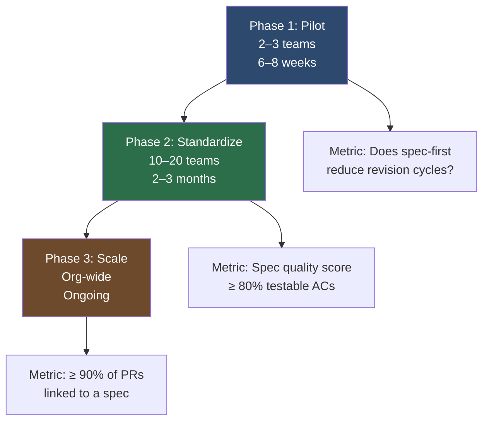

Most enterprise SDD rollouts fail for the same reason most enterprise tooling rollouts fail: they're treated as tooling changes. Install Kiro. Train the team. Done. Except it's not done, because SDD is a workflow change. It changes when engineers write, what they write, who reviews it, and what "ready for implementation" means. Tooling is maybe 20% of the problem.

The teams that get SDD to stick follow a consistent pattern: pilot with high-agency teams, standardize on a format, then automate compliance. Three phases, in that order, with different work required at each stage.



## Phase 1: Pilot (Weeks 1–8)

Pick two or three teams. They should already be using AI coding tools — you don't want to introduce AI and SDD simultaneously. Let them define their own spec format and tooling. The goal is not consistency yet. The goal is to measure whether writing specs before prompting actually changes outcomes.

What you're measuring:

- **Revision rate**: how many times does the agent-generated implementation need to be sent back because it missed something in the requirements? Pre-SDD baseline is usually 2–4 cycles. Good spec-first teams get to 0–1.
- **Cycle time**: wall clock from "work started" to "PR approved". This includes spec writing time. If spec writing takes two hours and saves four hours of revision, the cycle time is still shorter.
- **Spec completeness**: track how often engineers need to go back to the spec author during implementation because something was ambiguous. This is a leading indicator of spec quality.

Don't mandate format during pilot. One team might do their specs in Notion. Another might use Markdown. That's fine. You're learning what information actually matters before you encode it in a schema.

One thing pilots consistently reveal: engineers who've been burned by heavyweight requirements processes resist SDD because they associate structured specs with JIRA epics that take three weeks to write. The framing that works is "a spec is one to two pages written in twenty minutes, not a requirements document." Keep the pilot teams writing short specs and shipping. Length is not quality.

## Phase 2: Standardize (Months 2–4)

Once pilot data confirms the value proposition, two things need to happen: a canonical spec format, and a spec review culture.

**Canonical format**: pick one. OpenSpec YAML works well because it's machine-parseable and tool-agnostic. A Markdown template works too if your tooling doesn't need to parse it programmatically. What matters is that the format is documented and enforced.

Build a spec template library. Store it in a shared repository that any team can pull from:

```
spec-templates/
├── api-endpoint.md       # template for new REST endpoints
├── data-pipeline.md      # template for data processing jobs
├── ui-feature.md         # template for frontend features
├── integration.md        # template for 3rd-party integrations
└── README.md             # how to use templates
```

Each template should include a quality checklist inline. Engineers fill in the template and check off items before sending the spec for review:

```markdown
## Spec Readiness Checklist

- [ ] All behaviour requirements listed (not implementation details)
- [ ] Edge cases explicitly covered (empty input, rate limits, auth failure)
- [ ] Each acceptance criterion is testable (has a specific expected output)
- [ ] Hard constraints identified separately from soft preferences
- [ ] Existing code dependencies named with file paths
- [ ] Out-of-scope section present
```

**Spec Champions**: designate one per team. This is not a full-time role — it's two to three hours a week. Their job is to review specs before AI execution, maintain the team's spec template, and surface patterns that should be added to the org's shared template library. Spec Champions are also your feedback loop back to the governance layer.

**Spec Review Board**: a lightweight body, not a committee. Three to five people from different domains who meet biweekly to review new template requests, approve changes to the canonical format, and handle escalations where the spec quality bar is disputed. The Board's main output is the spec template library. Keep it fast — decisions in one meeting, not three.

## Phase 3: Scale (Month 4 Onward)

At scale, compliance needs to be automated. Humans cannot review spec quality across fifty or one hundred teams. Automated gates do two things: enforce that specs exist and enforce that specs meet the quality bar.

Enforce existence with a CI check that verifies every PR above a size threshold references a spec file:

```python
import subprocess
import sys

def check_pr_spec_link(pr_body: str, spec_dir: str = "specs/") -> bool:
    """Verify PR description references a spec file."""
    import re
    import os
    
    pattern = re.compile(r'specs/[\w-]+\.(?:yaml|md)')
    matches = pattern.findall(pr_body)
    
    if not matches:
        print("ERROR: PR must reference a spec file (e.g., specs/my-feature.yaml)")
        return False
    
    for spec_ref in matches:
        if not os.path.exists(spec_ref):
            print(f"ERROR: Referenced spec not found: {spec_ref}")
            return False
    
    return True
```

Enforce quality with `openspec validate` on every spec that's added or modified:

```yaml
# .github/workflows/spec-quality.yml
name: Spec Quality Gate
on:
  pull_request:
    paths:
      - 'specs/**'

jobs:
  validate-specs:
    runs-on: ubuntu-latest
    steps:
      - uses: actions/checkout@v4
      - name: Install OpenSpec CLI
        run: pip install openspec-cli
      - name: Validate changed specs
        run: |
          git diff --name-only origin/main...HEAD -- 'specs/*.yaml' | \
          xargs -I{} openspec validate {}
      - name: Check spec coverage
        run: |
          for spec in $(git diff --name-only origin/main...HEAD -- 'specs/*.yaml'); do
            openspec coverage "$spec" tests/ --min-coverage 80
          done
```

**Measurement at scale**: build a spec health dashboard with four metrics.

| Metric | Definition | Target |
|--------|-----------|--------|
| Spec coverage | % of PRs (above threshold) linked to a spec | ≥ 90% |
| Spec quality score | % of acceptance criteria that are testable | ≥ 80% |
| Revision rate | avg AI implementation cycles before PR approval | ≤ 1.5 |
| Cycle time delta | spec-first PRs vs. prompt-iterate PRs | spec-first ≤ 80% of baseline |

Track these per team and surface outliers. Teams with low spec quality scores need Champion support, not more tooling. Teams with high revision rates despite spec coverage have a spec quality problem, not an AI problem.

## The Failure Modes

Three patterns kill SDD at scale.

**Spec theatre**: specs written after the code to satisfy a process gate. The tell is specs that are oddly implementation-specific ("the function shall be named `apply_rate_limit`") or specs submitted in the same PR as the implementation. Add a temporal check: spec files must exist on the main branch before the implementation PR is opened.

**Over-specification**: specs that describe HOW to build something rather than WHAT to build. This defeats the purpose. Specs should describe the problem; AI should determine the solution. If your spec says "use a sliding window algorithm backed by a sorted set in Redis," you're writing implementation instructions, not a specification. Engineers who do this are often compensating for distrust of the AI executor — address the trust issue directly rather than letting them over-constrain the spec.

**No review culture**: specs treated as overhead, rubber-stamped by Spec Champions without reading. This usually happens when Champions are too junior or have too many specs to review. Keep the Champion-to-team ratio at one per team, not one per department.

## The Change Management Reality

The engineers who push back hardest on SDD are often your best engineers. They've watched "process improvements" come and go. They've written requirements documents that no one read. They are correct to be skeptical of new heavyweight process.

The argument that lands is not "this makes AI better." It's "this makes your intent durable." Right now, if you leave the team, your understanding of a feature exists in Slack threads and your head. A spec externalizes that understanding in a form that survives your departure, enables new engineers to ramp up, and gives AI tools enough context to actually implement what you meant rather than what you said. That's a different pitch than "process compliance."

Start with the engineers who are already frustrated by AI tools producing wrong outputs. They're the most motivated to try a different approach.

---

*Series: [Spec-Driven Development Concepts](/posts/spec-driven-development-concepts/) · [AWS Kiro](/posts/aws-kiro-spec-driven-ai-ide/) · [GitHub Speckit](/posts/github-speckit-copilot-spec-workflows/) · [BMAD Method](/posts/bmad-method-structured-ai-development/) · [OpenSpec Framework](/posts/openspec-framework-executable-specs/)*
