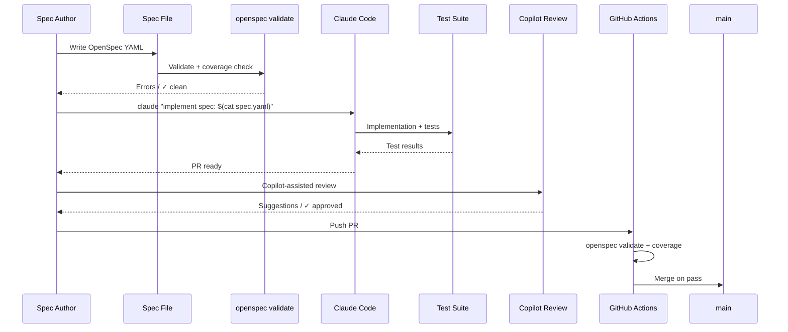

You don't need Kiro or Speckit to do spec-driven development. Both Claude Code and GitHub Copilot work as spec executors when you structure the workflow correctly. The tools are interchangeable. The spec is the discipline that makes them interchangeable.

The premise is simple: if your spec is complete enough to fully describe expected behaviour, any capable AI coding tool should be able to implement it. If you're locked into a specific tool to get good results, your spec has gaps that only that tool's context system is filling in. OpenSpec compliance plus a well-structured repo context is the baseline — the tool is execution detail.



## Claude Code as Spec Executor

The combination of `AGENTS.md` plus a spec file is how you give Claude Code the two layers of context it needs: repo-level understanding and task-level requirements.

`AGENTS.md` covers the repo layer: architecture, conventions, what already exists, where things belong. The spec file covers the task layer: what to build, what behaviour is required, what the acceptance criteria are. Neither substitutes for the other.

The key addition to `AGENTS.md` for SDD is an explicit section on how Claude should handle spec files:

```markdown
# AGENTS.md — Context for AI coding agents

## Architecture
- API layer: src/api/ (FastAPI routers)
- Business logic: src/services/ (pure functions, no I/O)
- Data access: src/repositories/ (SQLAlchemy models + queries)
- Tests: tests/ (pytest, unit + integration separated)

## Code Conventions
- Type hints on all function signatures
- Docstrings on public functions (Google format)
- No business logic in routers — delegate to services

## When Given a Spec File
1. Read the entire spec before writing any code
2. Implement ALL behaviour requirements — do not skip edge cases
3. Write a test for each acceptance criterion, referencing it with # OpenSpec: <AC_ID>
4. Flag any constraint violations or ambiguities as inline comments before implementing
5. Do not add functionality not described in the spec
6. Existing dependencies listed in the spec are the canonical interfaces — do not reimplement them
```

That last instruction matters. Without it, Claude Code will sometimes reimplement a utility function it finds in its context window rather than calling the existing one. The spec's `dependencies` section names the exact functions to call; `AGENTS.md` tells Claude to treat those names as authoritative.

Invoke Claude Code against a spec file directly:

```bash
# Single command spec execution
claude "Implement the following spec. Follow AGENTS.md conventions exactly.
$(cat specs/rate-limiting.yaml)"

# Or pass spec as a file if your shell handles it
claude --spec specs/rate-limiting.yaml
```

After implementation, run a verification pass — a second Claude Code invocation that checks the implementation against the spec rather than generating new code:

```bash
claude "Review the implementation against this spec and report:
1. Which acceptance criteria are covered by tests (look for # OpenSpec: AC*)
2. Which behaviours are NOT implemented
3. Which constraints may be violated
Spec: $(cat specs/rate-limiting.yaml)
Implementation: $(git diff main...HEAD)"
```

This is not the same as asking Claude to review its own code for quality. You're asking it to verify logical completeness against a checklist. That task has a ground truth — the spec — so the verification is reliable.

Here is a Python wrapper that runs both passes and surfaces the gap report:

```python
import subprocess
import sys

def run_spec_driven_session(spec_path: str, verify: bool = True) -> int:
    """Run Claude Code against a spec, optionally verify compliance."""
    with open(spec_path) as f:
        spec_content = f.read()

    # Implementation pass
    impl_prompt = f"Implement the following spec. Follow AGENTS.md conventions.\n\n{spec_content}"
    result = subprocess.run(
        ["claude", impl_prompt],
        capture_output=True, text=True
    )
    if result.returncode != 0:
        print(f"Implementation failed: {result.stderr}")
        return 1

    if not verify:
        return 0

    # Verification pass
    diff = subprocess.run(
        ["git", "diff", "main...HEAD"],
        capture_output=True, text=True
    ).stdout

    verify_prompt = (
        "Review the implementation against this spec. Report uncovered ACs and constraint violations.\n\n"
        f"Spec:\n{spec_content}\n\nImplementation diff:\n{diff}"
    )
    verify_result = subprocess.run(
        ["claude", verify_prompt],
        capture_output=True, text=True
    )
    print(verify_result.stdout)
    return 0

if __name__ == "__main__":
    sys.exit(run_spec_driven_session(sys.argv[1]))
```

## GitHub Copilot as Spec Executor

Copilot's context model is different from Claude Code's. Instead of an explicit `AGENTS.md` file, Copilot reads `.github/copilot-instructions.md` for repo-level context. Set this up first:

```markdown
<!-- .github/copilot-instructions.md -->
# Repository Context for GitHub Copilot

## Architecture
- FastAPI backend, PostgreSQL, Redis
- Services in src/services/ handle all business logic
- Repositories in src/repositories/ own all database access
- Routers in src/api/ are thin — delegate to services

## When implementing from a spec:
- Write tests for each numbered acceptance criterion
- Comment tests with the AC ID: # OpenSpec: AC1
- Do not add endpoints or functions not described in the spec
- Hard constraints in the spec are non-negotiable — flag violations, do not work around them

## Testing conventions
- Use pytest with fixtures in tests/conftest.py
- Integration tests use TestClient, unit tests mock repositories
- Test file naming: tests/test_<module_name>.py
```

For Copilot Chat, paste the spec directly into the chat window and use a consistent prompt structure:

```
Implement the following OpenSpec specification. Follow .github/copilot-instructions.md conventions.
Write tests for each acceptance criterion and mark them with # OpenSpec: <AC_ID>.

<paste spec YAML here>
```

Copilot Workspace integrates more cleanly for spec-driven PRs. The workflow: create a GitHub Issue linked to the spec file, open Workspace from the Issue, and Workspace generates an implementation plan that you can edit before execution. Workspace picks up the Issue body as context, so paste the spec content into the Issue description.

The key difference from Claude Code: Copilot Workspace is better at multi-file changes where the plan needs to be reviewed before execution. Claude Code is faster for single-feature implementations where you want output immediately and will review it after. Use Workspace when the spec touches four or more files. Use Claude Code for more contained changes.

## Combining Both

The pattern that gets the most first-pass acceptance rate: Claude Code for initial implementation, Copilot for review and inline refinement.

Claude Code tends to get the structure right but sometimes misses edge cases in the test coverage. Copilot inline suggestions during code review are good at catching missing cases because they're context-aware at the cursor level. The combination is not about preference — it's about using each tool where its context model is strongest.

## The Production SDD Pipeline

Put it together into a CI pipeline that enforces the full spec-to-ship cycle:

```yaml
# .github/workflows/sdd-pipeline.yml
name: Spec-Driven CI

on:
  pull_request:
    branches: [main]

env:
  FEATURE: ${{ github.event.pull_request.head.ref }}

jobs:
  spec-driven-ci:
    runs-on: ubuntu-latest
    steps:
      - uses: actions/checkout@v4

      - name: Install dependencies
        run: |
          pip install openspec-cli pytest

      - name: Check spec exists
        run: |
          SPEC_REF=$(grep -oP 'specs/[\w-]+\.yaml' <<< "${{ github.event.pull_request.body }}" | head -1)
          if [ -z "$SPEC_REF" ]; then
            echo "ERROR: PR must reference a spec file in description"
            exit 1
          fi
          echo "SPEC_FILE=$SPEC_REF" >> $GITHUB_ENV

      - name: Validate spec
        run: openspec validate ${{ env.SPEC_FILE }}

      - name: Run tests
        run: pytest tests/ -v --tb=short

      - name: Check spec coverage
        run: |
          openspec coverage ${{ env.SPEC_FILE }} tests/ --min-coverage 90
```

The pipeline has three gates that correspond to the three questions any SDD implementation must answer: Is the spec valid? Do the tests pass? Does the test suite cover the acceptance criteria?

## What to Measure

First-pass acceptance rate is the metric that matters most. It answers: when Claude Code or Copilot implements a spec, how often does the implementation satisfy all acceptance criteria without a second implementation pass? Teams at early SDD maturity see 40–60%. Teams with solid spec discipline get to 80–90%.

Track it by parsing your CI logs. Every time `openspec coverage` reports 100% on the first run of a new PR, that's a first-pass success. Every time it requires a revision cycle before coverage passes, that's a failure. This number tells you more about your spec quality than any survey will.

Cycle time comparison is the second metric. Run it on a six-week window after Phase 1 adoption and compare spec-first PRs to prompt-iterate PRs of similar complexity. The gap is usually 25–40% faster for spec-first, after accounting for spec writing time.

## The Core Insight

SDD with Claude Code and Copilot is not a different tool. It's a different workflow. The spec is the discipline. The AI tools are interchangeable executors. That's what makes it scale — you can change the AI tool without changing the process, and you can onboard engineers to the process without training them on a specific tool's quirks. The spec is the stable artifact. Everything else is implementation.

---

*Series: [Spec-Driven Development Concepts](/posts/spec-driven-development-concepts/) · [AWS Kiro](/posts/aws-kiro-spec-driven-ai-ide/) · [GitHub Speckit](/posts/github-speckit-copilot-spec-workflows/) · [BMAD Method](/posts/bmad-method-structured-ai-development/) · [OpenSpec Framework](/posts/openspec-framework-executable-specs/) · [Enterprise SDD](/posts/sdd-enterprise-adoption-patterns/)*
