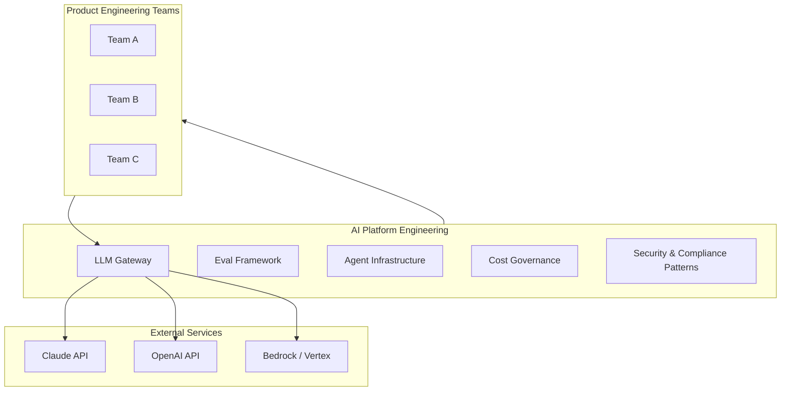

A year ago, "AI platform team" wasn't a job posting you'd see in enterprise engineering orgs. Today, companies that are serious about AI adoption are creating them. The alternative — every product team reinventing their own LLM integration, eval framework, and cost controls — produces a mess that gets expensive fast.

This isn't the same as an ML platform team. The skills overlap but the focus is different. ML platform teams own model training infrastructure, feature stores, and experiment tracking. AI platform engineering teams own the infrastructure layer that sits between your engineers and the LLMs they're consuming as services: the gateway, the evaluation harness, the agent orchestration layer, the cost and security controls.

## What the Team Owns

**LLM Gateway.** A centralised proxy layer that sits in front of all LLM API calls across the organisation. This sounds like overhead until you're trying to rotate a leaked API key across 40 microservices, or explain to finance why your LLM spend doubled in three days. The gateway handles authentication, rate limiting, request logging, cost attribution by team and feature, and failover between providers. You can start with something like LiteLLM or build your own, but you need it.

**Eval Framework.** The shared infrastructure for testing AI features before they ship. This includes datasets, metric definitions, benchmark suites, and CI integration. Without this, every team runs their own ad-hoc evaluations — or none at all. The AI platform team doesn't run evals for product teams; they build the rails that make it easy for product teams to run their own.

**Agent Infrastructure.** Orchestration layers, tool registries, state management, retry logic, and observability for multi-step agents. If your organisation is running more than two or three agents in production, you want shared infrastructure here. The alternative is every team building their own brittle orchestration and nobody being able to debug anyone else's agents.

**Cost Governance.** LLM costs scale non-linearly with usage and are easy to accidentally 10x. The platform team owns the dashboards, budget alerts, token optimisation patterns, and the process for reviewing expensive features before they go to production. They should also own the negotiation of enterprise contracts with LLM providers.

**Security Patterns.** Prompt injection mitigations, PII detection before data leaves your perimeter, audit logging of AI interactions, and data residency controls. Security teams know security; they usually don't know LLM-specific attack surfaces. The AI platform team bridges that gap.

## How It Relates to Existing Teams

This team doesn't replace platform engineering or SRE — it extends them into AI territory. Practically, you'll want at least one person who's done platform/infra work and understands how to build reliable shared services, and at least one who understands LLM behaviour deeply enough to design eval frameworks and recognise failure modes.

The relationship with security is collaborative. The AI platform team designs the patterns; security reviews and approves them. Neither team should be in the other's critical path for product shipping.

Product engineering teams should experience the AI platform team as a force multiplier, not a gate. If teams are coming to the AI platform team for approval on every AI feature, something is wrong with the model. The goal is self-service infrastructure with guardrails built in.

## Team Size and Skills

At an org with 100-500 engineers actively building AI features, a 4-6 person AI platform team is reasonable. Smaller is possible if you're buying rather than building. The skill profile you want:

- 1-2 engineers with strong distributed systems / platform engineering backgrounds
- 1 engineer focused on LLM evaluation methodology and dataset curation
- 1 engineer who bridges security and AI (rare, hard to hire, worth it)
- 1 person who can own the stakeholder relationships with finance, security, and legal

Early on, one person often covers multiple roles. That's fine temporarily. The goal is to get dedicated headcount before the shared needs become a political football between product teams.

## Build vs Buy

You don't need to build everything. LLM gateways (LiteLLM, Portkey, MLflow AI Gateway), eval frameworks (LangSmith, Braintrust, Ragas), and agent observability tools (LangFuse, Arize) have gotten good enough to use as foundations.

What you typically do need to build: the integration with your specific auth system, the cost attribution that maps to your internal team structure, and the eval datasets that reflect your actual use cases. Nobody can sell you your data.

The platform team should be opinionated about what to buy and have a clear process for evaluating new tools. Left to their own devices, product teams will adopt whatever they found in a blog post, and you'll end up with six different eval frameworks that can't be compared.

## Metrics for the Team's Success

The platform team is an internal service. Measure it like one:

- **Adoption rate**: what percentage of LLM API calls go through the gateway? This tells you whether product teams trust the platform enough to use it.
- **Time to first eval**: how long does it take a new team to get their first eval pipeline running? Under a day is achievable.
- **Incident rate reduction**: month-over-month reduction in AI-related production incidents (prompt injection, cost spikes, model availability issues).
- **Cost per feature**: average LLM cost per shipped AI feature, tracked over time to see whether optimisation work is paying off.
- **Developer satisfaction**: quarterly survey of product engineering teams on platform quality and self-service capability.

What not to measure: internal team velocity metrics, story points, or lines of infrastructure code shipped. The platform team's output is the product teams' capability, not their own throughput.

---

**Previous:** [Compliance Automation with AI Agents](/posts/compliance-automation-with-ai-agents/) | **Next:** [Measuring AI Engineering Productivity](/posts/measuring-ai-engineering-productivity/)
