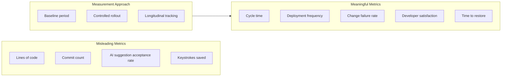

Every engineering leadership team wants to know whether their AI tooling investment is paying off. Most of them are measuring the wrong things. Lines of code is the most common mistake. Commit count, code acceptance rate, and AI suggestion frequency are close seconds. These are all supply-side metrics: they tell you how much the tools are being used, not whether the usage is producing value.

Productive engineers ship working software that solves real problems reliably. That doesn't change because they have AI assistance. What changes is the rate at which they can do it and how much cognitive load they carry doing it.

## What Not to Measure

**Lines of code.** More code is not better software. AI tools make it easy to generate more code than you need, which creates maintenance burden, increases attack surface, and inflates the codebase without adding proportional value. If your metric rewards line count, you'll incentivise exactly the wrong behaviour.

**AI suggestion acceptance rate.** Copilot and Claude Code both provide acceptance rate metrics. They're useful for understanding tool usage patterns, but they don't correlate with productivity or quality. A developer who accepts 10% of suggestions and picks the right 10% may be producing better software than one who accepts 70% indiscriminately.

**Commit count.** AI tools often lead to more frequent commits as developers work in shorter cycles. That's not necessarily better — it may just reflect different workflow habits. Commit count without context on what those commits contain tells you almost nothing.

**Velocity points.** Story points are an estimation and planning tool. Using them to measure productivity assumes your estimates are consistent over time, which they rarely are, and that all stories represent equal work, which they don't.

## SPACE Applied to AI-Augmented Teams

The SPACE framework (Satisfaction, Performance, Activity, Communication, Efficiency) gives a better structure for thinking about engineering productivity. Here's how to apply it when AI tools are in the mix.

**Satisfaction.** Developer satisfaction surveys remain the most reliable leading indicator of productivity. Ask specifically: does your AI tooling feel like it helps you do better work, or does it feel like overhead? Are you spending less time on tasks you find tedious? Do you have more energy for hard problems? These questions surface signal that usage metrics miss.

**Performance.** Measure outcomes: defect rates in AI-assisted code vs baseline, customer-reported incidents from AI-authored features, security vulnerability rates in code with heavy AI assistance. This is the most important dimension and the hardest to attribute cleanly.

**Activity.** Code review throughput is worth tracking — AI tools genuinely help people review PRs faster. Deployment frequency is worth tracking. Build these cohort-compared: developers using AI tools vs those not yet rolled out to.

**Communication and Efficiency.** How much time is spent on context-switching, waiting for reviews, or debugging ambiguous failures? AI tools can help or hurt here depending on how they're integrated into the workflow.

## The Metrics That Move the Needle

**Cycle time** (commit to production) is the most useful single metric. It captures everything: how fast code gets written, reviewed, tested, and shipped. If AI tools are genuinely improving productivity, cycle time should trend down. If it's staying flat while acceptance rates climb, the tools are being used but not producing faster delivery.

**Deployment frequency** tracks how often your team is shipping changes. Teams using AI tools often increase deployment frequency within the first quarter, but the effect can plateau. Track it monthly over 12+ months.

**Change failure rate** is where misleading productivity claims usually collapse. If AI-assisted code fails in production at higher rates, the time savings are illusory — you're trading development speed for incident response time. Measure this rigorously. It's the canary for code quality degradation.

**Time to restore** captures how long it takes to recover when something breaks. This one often doesn't change much with AI tooling, which is informative — AI assistance helps you write code faster but doesn't necessarily make your incident response processes faster.

**Developer satisfaction** over time, not as a one-off. Survey at baseline, then quarterly. Look for changes in specific dimensions: enjoyment of work, sense of growth, energy levels, confidence in the code you're shipping.

## How to Run a Proper Productivity Measurement Study

The biggest mistake is measuring AI-using teams against non-AI-using teams after the fact. Confounds everywhere — the teams who adopted early may be different in ways that affect productivity independent of the tooling.

A better approach:

**Establish a baseline first.** Before rolling out AI tools broadly, capture your current cycle time, deployment frequency, change failure rate, and satisfaction scores. Four to six weeks of baseline data is enough.

**Use a staged rollout.** Roll out tools to one or two teams first, keep others as controls for an explicit measurement period (eight to twelve weeks minimum). This gives you a same-period comparison that controls for seasonal effects and business changes.

**Control for task type.** AI tools have uneven effects across task types. Green-field feature development, test writing, and documentation see the biggest gains. Complex debugging, architectural decisions, and legacy system refactors often see little change. If your comparison period involves teams working on very different tasks, the results won't be comparable.

**Track longitudinally.** Productivity effects from AI tools change over time. There's often an initial dip as teams learn workflows, followed by gains, potentially followed by a plateau. A four-week measurement window will capture one of those phases and not the others. Twelve months gives you a complete picture.

**Be honest about attribution.** You can rarely prove that a productivity gain came from AI tools specifically. Teams improve for lots of reasons. What you can do is detect correlations, survey developers on perceived causality, and build a case that's directionally confident rather than falsely precise.

The goal isn't to prove ROI with a number your CFO can put in a deck. It's to understand whether the tools are helping your specific teams on your specific work so you can make better decisions about where to invest and where to pull back.

---

**Previous:** [The AI Platform Engineering Team](/posts/the-ai-platform-engineering-team/) | **Next:** [The Engineering Manager's Guide to AI Agent Deployment](/posts/engineering-manager-guide-to-ai-agent-deployment/)
