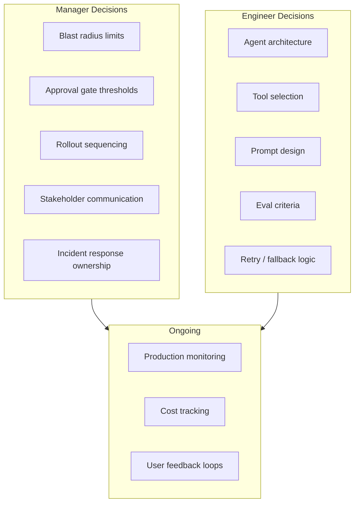

Most of the writing about AI agents is aimed at engineers building them. This post is for the manager whose team is about to deploy one — or already has, and is wondering what they're supposed to be doing about it.

The hard truth is that AI agent deployment has a class of decisions that are explicitly management decisions, not engineering decisions. Engineers can tell you what the agent can do and how it does it. They can't decide how much blast radius is acceptable, when a human approval gate is required, or how to communicate agent limitations to a VP who's expecting magic. Those are yours.



## The Decisions That Are Yours

**Blast radius.** Before your agent touches a production system, you need an explicit agreement on the worst case: what's the most damage it can do if it behaves unexpectedly? This isn't FUD — it's the same question you'd ask before any automated system got write access to production. For agents the question is more acute because they make chains of decisions, and early errors compound.

Define your blast radius limits before deployment, not after. "The agent can read any internal system but can only write to the dev environment until it's been in production for 30 days without incidents" is a policy decision. Your engineers can implement it, but you have to make it.

**Approval gates.** Which actions require human review before the agent proceeds? This is a matrix, not a binary. Low-stakes, high-frequency actions (reading logs, running read-only queries) need no approval. High-stakes or irreversible actions (sending external communications, deleting data, making API calls to external services) need a human in the loop. You define the thresholds. Your engineers build the gates.

```
Action matrix (example):
- Read internal data:    Autonomous
- Write dev/staging:     Autonomous
- Write production:      EM approval required
- External API calls:    Reviewed per-integration
- User-facing output:    Spot-check sampling
- Irreversible actions:  Always require approval
```

**Rollout sequencing.** Which users, systems, or data types get agent access first? Starting with internal-only, low-stakes workflows makes sense. Rolling out to customer-facing workflows before you have a full observability picture is a choice with real consequences. You're the one who sets the sequence and the gates between stages.

## Setting Stakeholder Expectations

This is where most enterprise AI agent deployments get into trouble. Agents are genuinely impressive in demos. They complete tasks end-to-end, handle variations gracefully, and give the impression that the hard problems are solved.

Production is different. Agents fail on edge cases your demo didn't hit. They behave unexpectedly when input data looks different than training. They're inconsistent across runs in ways that are hard to explain to non-technical stakeholders who expected deterministic software.

Specific things to communicate before deployment:

- **The agent is not reliable in the way a traditional API is reliable.** It will occasionally produce wrong outputs. The rate of wrong outputs, and what "wrong" means in your context, should be defined and shared before launch.
- **Accuracy is a distribution, not a number.** If your eval shows the agent is 94% accurate on your test set, that number will change on live data. Share a range, not a point.
- **There is no magic fix for failure modes.** When an agent fails in production, the remediation is usually a combination of prompt engineering, eval dataset expansion, and architectural changes. It takes time. Set that expectation before the first failure, not after.
- **Costs are usage-sensitive and can spike.** If your stakeholders are expecting a fixed operating cost, you need to disabuse them of that now.

## What to Monitor

Your engineers will build the technical observability. What you need to be reviewing regularly:

- **Weekly: error rate and classification.** Not just "did it fail" but "what kind of failures." Hallucinations, tool call failures, context window overflows, and latency timeouts are different problems with different remediation paths.
- **Weekly: cost per task.** Agents' costs drift upward as prompt complexity grows. Catch this early.
- **Monthly: user feedback patterns.** If you have a feedback mechanism (thumbs up/down, correction workflow), review the aggregate monthly. Patterns in corrections tell you what the agent is consistently getting wrong.
- **On every significant input distribution change.** If your upstream data changes — new format, new data source, new user population — treat it as a potential agent behaviour change and watch your metrics for 2-3 weeks.

## Handling the First Production Incident

You will have one. An agent will take an action it shouldn't, produce a wrong output that got acted on, or behave in a way that surprises a user or downstream system. How you handle the first one sets the cultural precedent for all subsequent ones.

**First 30 minutes:** Understand the blast radius of what happened. Contain it if possible. If the agent has write access and something's wrong, disable the write access first and ask questions second.

**First few hours:** Get a timeline. What triggered the agent? What did it do? What was the actual vs expected outcome? Who was affected? This is a standard incident timeline, and your engineers should know how to build one.

**Communication:** Be specific and honest. "The agent incorrectly classified X as Y and took action Z" is more useful than "there was an AI issue." Non-technical stakeholders don't need the full technical root cause, but they do need to understand what happened and what you're doing about it.

**Post-incident:** Run a blameless post-mortem. The root cause is almost never human error — it's a gap in eval coverage, an unexpected input distribution, or a missing approval gate. The output should be concrete changes: new eval cases added, a new gate implemented, a blast radius reduction. If the post-mortem produces only "better prompts," dig deeper.

## Communicating Agent Capabilities to Non-Technical Stakeholders

The frame I use: an AI agent is more like a competent but junior contractor than software. It can do a lot, it needs supervision on ambiguous tasks, it benefits from clear instructions, and it will occasionally need correction. It's not a black box that either works or doesn't — it's a system with a range of outputs that improves as you give it better feedback.

This frame works because it sets realistic expectations without being dismissive of the capability. It also makes "we had an incident and we're correcting it" feel normal rather than catastrophic.

What non-technical stakeholders need to know: what the agent can do reliably, what requires oversight, what it can't do, and how to give feedback when something's wrong. That's the briefing every stakeholder should get before your agent touches their workflow.

---

**Previous:** [Measuring AI Engineering Productivity](/posts/measuring-ai-engineering-productivity/) | **Next:** [Knowledge Management in AI-First Teams](/posts/knowledge-management-in-ai-first-teams/)
