The knowledge half-life in AI engineering is brutal. Tools you mastered six months ago have been superseded. APIs you built workflows around changed their behaviour. The model that worked for your use case got deprecated, or a new one landed that's significantly better but requires a different prompting approach. The mental model you had for what agents can do reliably is already out of date.

This isn't new — technology has always moved fast. But the rate of change in AI tooling specifically, and the breadth of change (models, APIs, frameworks, legal landscape, organisational expectations, security guidance), is meaningfully higher than most engineering domains right now. If you try to stay current on everything, you burn out. If you don't stay current enough, you're making architecture decisions based on stale assumptions.

The answer is intentional curation, not firehose consumption.

```mermaid
flowchart LR
    subgraph Sources["Raw Signal"]
        S1[Model release notes]
        S2[API changelogs]
        S3[Research papers]
        S4[Community discussions]
        S5[Vendor announcements]
    end
    subgraph Filter["Curation Layer"]
        F1[AI-summarised digests]
        F2[Team signal sharing]
        F3[Weekly sync]
    end
    subgraph Action["Team Knowledge"]
        A1[Internal wiki]
        A2[Decision log]
        A3[Eval dataset updates]
        A4[Skill updates]
    end
    Sources --> Filter
    Filter --> Action
```



## The Knowledge Half-Life Problem

There are different kinds of knowledge with different decay rates, and not all of them need the same refresh cadence.

**Fast-decaying (months):** specific model behaviour quirks, optimal prompt patterns for a given model version, pricing structures, API rate limits, tool-specific syntax. These change with every major model update.

**Medium-decay (one to two years):** framework and library APIs, evaluation methodologies, deployment patterns for specific cloud providers. Mostly stable but worth reviewing annually.

**Slow-decay (three-plus years):** fundamental concepts — what context windows are and why they matter, how attention mechanisms work at a conceptual level, evaluation design principles, the tradeoffs between retrieval and fine-tuning approaches. Investing deeply here is durable.

Most engineers are either spending too much time on fast-decaying knowledge or ignoring it until it bites them. The goal is a team strategy that keeps the fast-decaying layer current with minimal individual effort, and reserves deep learning time for the slow-decay layer where it compounds.

## Curated Learning vs Firehose

The firehose approach — subscribing to every newsletter, following every AI researcher on social media, watching every conference talk — doesn't work. The volume is too high and the signal-to-noise ratio is low. You end up with tab debt, half-read papers, and the vague feeling that something important is passing you by.

Curated learning means making explicit choices about what to track deeply and what to ignore:

**Track deeply:** the tools your team is actively using in production. Every API change, model update, and deprecation notice for Claude, your eval framework, your orchestration layer, and your cloud provider's AI services. These have direct operational impact.

**Track shallowly:** adjacent tools, research trends, industry news. One weekly digest is enough. AI News or a well-curated newsletter handles the filtering.

**Ignore actively:** hype cycles, demo videos of tools you're not using, and social media debates about model quality. These have negative returns on your time.

The useful heuristic: if a development in the AI space would require you to change something in production within six months, you need to know about it. If it wouldn't, it can wait for your quarterly review or you can skip it entirely.

## Team Knowledge Sharing Patterns

Individual learning doesn't help the team unless it flows back. A few patterns that work at different scales:

**Weekly AI engineering sync (30 minutes).** Not a status meeting — a knowledge transfer meeting. One rotation each week: what changed in the tools we use, what we learned from production this week, and one new technique or pattern worth trying. This works for teams of four to ten. Larger teams need a different model.

**Internal wiki with a narrow scope.** The mistake is building a wiki that's supposed to capture everything. It captures nothing useful because nobody maintains it. Scope it specifically: our approved tools and why, our eval results and what they mean, our known failure modes and mitigations, our decision log. Three to five living documents that people actually read is better than fifty pages of stale notes.

**Lunch-and-learn with low commitment.** Bi-weekly, optional, no slides required. One person shares something they found interesting or useful — a new technique, a surprising eval result, a war story from a production incident. Fifteen to twenty minutes. The optional nature keeps it from feeling like a chore. If nobody has something to share on a given week, you cancel it.

**Decision log.** Every significant architectural decision about AI tooling gets a short document: the options considered, the decision made, the reasoning, and the date. When the context changes and you need to revisit, you have a starting point. When a new engineer joins, they can understand why you're doing what you're doing.

## Using AI to Stay Current

There's an obvious meta-irony here: using AI tools to manage the pace of AI tooling changes. It works, with caveats.

**Automated changelog digests.** Set up an agent or workflow to summarise release notes from your critical dependencies weekly. Claude is good at this — give it the raw release notes and ask for a summary filtered to things relevant to your specific use case. The output is rarely perfect but it saves the time of reading the full notes yourself.

```python
# Minimal example: feed release notes to an LLM for relevance filtering
def summarise_release_notes(notes: str, context: str) -> str:
    prompt = f"""
    Our team uses this stack: {context}
    
    Here are the release notes:
    {notes}
    
    Summarise only the changes that directly affect our usage.
    Flag any breaking changes or deprecations.
    Skip marketing content.
    """
    return llm_client.complete(prompt)
```

**AI-assisted paper summaries.** For research papers, AI summaries are genuinely useful for deciding whether to read the full paper. Ask for the practical implications, not the abstract. You'll still need to read the papers that matter in full, but you can filter the reading list efficiently.

**Caveats:** AI-summarised technical content can miss nuance and occasionally confidently misdescribe behaviour. Always validate anything operationally important against the primary source. The AI summary is a triage tool, not a substitute for reading the actual documentation.

## What to Invest in Learning vs What to Skip

The framework I use: depth of investment should scale with durability of the knowledge.

Deep learning (courses, books, implementation from scratch): foundational concepts — attention mechanisms, evaluation methodology, retrieval-augmented generation fundamentals, probabilistic thinking about model outputs. These pay off for years.

Moderate investment (documentation reading, short tutorials, hands-on experimentation): specific tools and frameworks you're actively using. You need to understand them well enough to debug production issues, not just copy-paste from examples.

Shallow engagement (newsletter, quick scan): new tools and models you're not currently using. Keep a peripheral awareness in case something becomes relevant, but don't let it eat your time.

Skip entirely: hype-driven content that doesn't point to something you'd actually change. Most "AI will replace X" discourse. Benchmarks without operational context.

The goal isn't to know everything — it's to maintain a map of what you don't know, so you know where to look when you need to go deeper.

---

**Previous:** [The Engineering Manager's Guide to AI Agent Deployment](/posts/engineering-manager-guide-to-ai-agent-deployment/) | **Next:** [Hiring for AI-Native Engineering Skills in 2026](/posts/hiring-for-ai-native-engineering-skills/)
