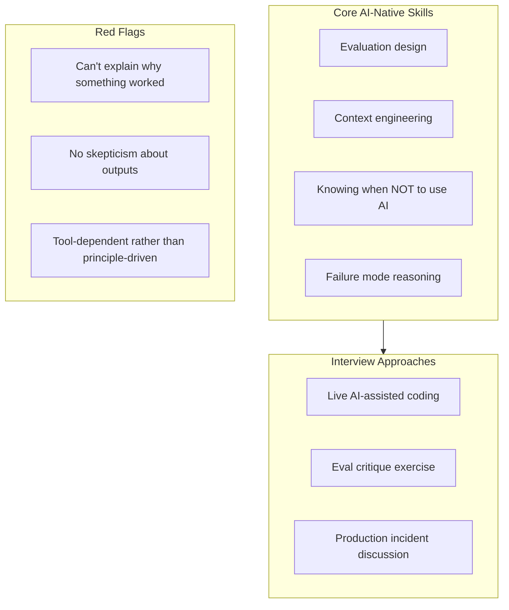

The job posting landscape for AI engineering roles is a mess. Half the postings list specific tools — "must have experience with LangChain" or "Claude Code experience preferred" — and the other half are so generic they could be from 2019. Neither approach gets you good signal on whether a candidate will actually be productive working with AI systems.

The skills that make an engineer effective with AI tools are not primarily about knowing which tools exist. They're about judgment: knowing when to use AI assistance and when not to, understanding why a model output might be wrong, designing evaluations that catch failures before production, and writing context that makes AI tools useful rather than just fast.

These are learnable but they're not universal. This is what to look for.

## The Skills That Actually Matter

**Evaluation design.** Can this person design a test suite for an AI feature? This is table stakes for production AI engineering and it's harder than it sounds. Good candidates can explain what they'd test, how they'd construct a dataset, what a false positive vs false negative looks like in their specific use case, and how they'd know if the eval is covering the important failure modes. Bad candidates describe running the feature a few times and seeing if it looks right.

**Context engineering.** Not "prompt engineering" in the five-prompts-for-amazing-results sense — the ability to understand what context a model needs to solve a problem reliably, how to structure that context so it's used correctly, and how to identify when context quality is causing failures. This is the difference between someone who can make a demo work and someone who can build a production system.

**Knowing when not to use AI.** This is genuinely rare and genuinely valuable. Experienced candidates have strong opinions about task categories where AI assistance creates more risk than it saves time — safety-critical logic, cryptographic implementations, contexts where the cost of a subtle error is high and detection is hard. Candidates without this have usually only worked on demos.

**Failure mode reasoning.** Given an AI-assisted feature, what are the ways it could fail in production? Hallucination, inconsistency across runs, context window limits, prompt injection, distribution shift, over-reliance on AI output in downstream processes. Candidates who can reason through failure modes without being prompted are significantly safer to deploy.

**Debugging AI behaviour.** When something behaves unexpectedly, how do they approach it? This requires a mental model of how LLMs work at a level that supports debugging — understanding that context order matters, that instruction following degrades past certain context lengths, that temperature affects output variance. It's not about knowing every detail; it's about having a useful model for generating hypotheses.

## Interview Approaches That Work

**Live AI-assisted coding task.** Give them a real engineering task and explicitly tell them they can use AI tools — Copilot, Claude Code, whatever they prefer. Watch how they interact with the tool: do they verify outputs, do they notice when the suggestion doesn't match the task, do they know what parts of the problem to hand to the AI and what to reason through themselves? This reveals more about AI fluency than any quiz.

Brief them that you're evaluating their judgment about when and how to use the tool, not just whether they complete the task. You want to see them reject suggestions, iterate on context, and explain their choices.

**Evaluation critique exercise.** Show them an eval setup — a prompt, a dataset, and a set of results. Ask them what's wrong with it or what it's missing. This is harder to fake than "tell me about your experience with AI." It tests whether they can reason about coverage, false positives, distribution, and what the eval is actually measuring.

A good response will identify specific gaps: "This doesn't test behaviour when the input is ambiguous," or "The dataset is too clean — it doesn't have any examples with the formatting variations you'd see in production." A poor response will generalise: "You should probably add more examples."

**Production incident discussion.** If they claim to have shipped AI features, ask about a time something failed in production. What happened, how did they identify the root cause, what did they change? Candidates who have actually shipped know that production failures happen and can talk about them specifically. Candidates who haven't will either have no story or will describe a situation that clearly never touched users.

## Red Flags

**Can't explain why something worked.** If they solved a problem with AI assistance but can't articulate why the solution is correct or what could cause it to fail, they're a debugging risk. In a system without AI assistance this is manageable; in an AI-assisted system where outputs vary, it's a significant problem.

**No skepticism about outputs.** Candidates who describe AI tools as "basically always right" or "you just need to prompt it correctly" haven't encountered enough production failures. This isn't about being anti-AI — it's about having a realistic model of what the tools can and can't do.

**Tool-specific rather than principle-driven.** If they can only talk about specific tools and can't generalise — "I know LangChain but I haven't used any other frameworks" — they'll struggle when the tool landscape shifts (which it will). Look for candidates who understand the principles behind the tools, not just the APIs.

**Acceptance-rate tunnel vision.** If their measure of AI tool success is high suggestion acceptance rate, or if they're proud of how much of their code comes from AI without having thought critically about what that means for quality and maintainability, proceed carefully.

## How to Assess AI Literacy Without Gatekeeping on Specific Tools

The risk with AI skill assessment is overcorrecting toward tool-specific questions that disadvantage good engineers who happen to not have used your specific stack. AI tool fluency transfers reasonably well — someone who has deeply used Copilot can typically get up to speed with Claude Code quickly. Someone who has designed good evals with LangSmith can design good evals with Braintrust.

The questions to ask are about concepts and judgment, not tools:

- "Walk me through how you'd design an eval for a feature that summarises customer feedback. What would you include in the dataset, and how would you decide if the model is doing a good job?"
- "Tell me about a time an AI-assisted feature behaved unexpectedly in production. What was the root cause?"
- "What types of code do you prefer to write yourself, without AI assistance? Why?"

These questions work regardless of which specific tools someone has used. They test whether the candidate has developed a useful mental model of AI systems, not whether they've memorised the right API signatures.

## Updating Job Descriptions

Most current AI engineering job descriptions are either too broad ("experience with ML and LLMs") or too specific ("3+ years with LangChain"). Neither attracts the right candidates.

More effective signals to include: "We expect engineers to design evals for AI features before they ship," "AI-assisted coding is standard on our team and we value judgment over throughput," and "You'll be expected to explain your architectural decisions around AI integration."

These descriptions attract candidates who have thought seriously about the craft, and they're honest about what the job actually involves. The engineers who read "eval design" in a job posting and get excited are the ones you want to interview.

---

**Previous:** [Knowledge Management in AI-First Teams](/posts/knowledge-management-in-ai-first-teams/)
