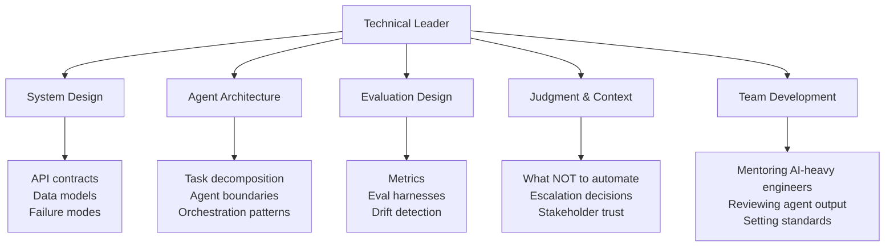

Six months ago a principal engineer on my team spent most of her week writing code. Today she spends most of it reviewing agent decisions, designing evaluation frameworks, and having harder architectural conversations than she used to. The code still gets written — just not primarily by her hands. That shift is real and it deserves an honest look.



## What Actually Changed in the Day-to-Day

Implementation velocity went up, which means the bottleneck moved. The constraint is no longer "how fast can engineers type" — it's "how quickly can the team design the right thing, validate the output, and catch the mistakes." Technical leaders feel this acutely because those three activities require them directly.

Architectural review used to happen once per sprint, maybe twice. Now it happens continuously because agents generate more candidates, faster. A senior engineer needs to review three agent-produced approaches in the time it used to take to discuss one hand-written one. The review burden increased even though the implementation burden decreased.

The other change: agents make confident mistakes at scale. A human engineer who misunderstands a requirement produces one wrong module. An agent in a loop can produce thirty wrong modules before anyone notices. Technical leaders are now in the business of designing trip-wires — checkpoints, evals, and review gates that catch failures before they propagate.

## What Stayed Exactly the Same

Judgment. Context. Relationships.

Agents do not know that the "simple refactor" someone filed a ticket for is actually politically loaded because two teams disagree about service ownership. They do not know that the architecture decision three PRs ago was a deliberate short-term compromise with a specific payoff date. They do not know which engineer needs a stretch assignment and which one is burned out and needs the agent to do the hard bits.

Technical leadership has always been 30% coding and 70% everything else. The 70% is untouched. If anything it became more important because the 30% is now cheaper to delegate.

Also unchanged: system design. Agents are genuinely bad at the blank-page problem. They excel at elaborating from a clear spec but struggle to decide what the spec should say. Deciding what to build, which constraints matter, what the failure mode looks like at 10x load — that work stays human.

## Agent Architecture as a Technical Domain

"Agent architecture" is now a real technical speciality, and technical leaders who treat it seriously have an advantage over those who ignore it.

The questions in this domain are concrete: How do you decompose a complex task into agent sub-tasks without losing the context that crosses boundaries? How do you handle the case where a sub-agent fails partway through a multi-step operation? What information does the orchestrator need to know vs delegate? When do you use a single long-running agent vs spawn ephemeral workers?

These are not theoretical questions. They have the same stakes as API design or database schema decisions — get them wrong and you pay for it for years.

A useful exercise: draw your agent topology the same way you'd draw a service topology. Boxes, arrows, failure modes annotated. If you cannot draw it, you do not understand it well enough to ship it.

```yaml
# Example: task decomposition checklist for agent architecture review
agent_review_checklist:
  state_boundaries:
    - "What state crosses agent boundaries?"
    - "Can a failed sub-agent leave shared state corrupted?"
    - "Is there a rollback path?"
  context_retention:
    - "Does each agent have enough context to make good decisions?"
    - "What context is redundantly passed vs. looked up?"
  failure_modes:
    - "What happens if the LLM returns a malformed tool call?"
    - "Is there a timeout and a fallback?"
    - "Does the orchestrator detect agent loops?"
  cost:
    - "What is the token cost per task?"
    - "Are there cheaper models for sub-tasks that don't need reasoning?"
```

## Mentoring Engineers Who Use AI Heavily

The failure mode I see most often: junior engineers who use agents to ship code they cannot explain. They merged the PR, the tests pass, but ask them how the code works and there is a five-second pause. That is a problem.

The fix is not "write more code by hand." The fix is owning the code the agent wrote. When I review a PR from a junior engineer who used an agent heavily, I ask them to walk me through two things: what the agent got wrong on the first try and why, and what they would change if they had to write this from scratch. If they cannot answer either, we do not merge until they can.

Mentoring in this environment also means helping engineers build taste about when to trust agent output and when to be skeptical. That taste is hard-earned and not automatically transmitted. Make it explicit. Run post-mortems on agent failures. Track what categories of mistakes agents make on your codebase specifically.

## Evolving the Tech Lead Role

The staff/principal role used to be defined by a combination of deep technical skill and the ability to influence without authority. Both still apply, but the skill mix inside "deep technical skill" has shifted.

Today the technical leader who adds the most value can:

- Design evaluation harnesses — know what "correct" looks like for agent output and how to measure it at scale
- Decompose complex systems into agent-friendly tasks without losing coherence
- Identify the work that should stay human — not because agents can't do it, but because the cost of an agent mistake there is too high
- Read agent traces and identify reasoning failures, not just output failures

What this is not: the person who is most prolific at using agents to ship features. That bar has lowered and most engineers will clear it. The bar that matters is the one above it: designing the systems in which agents and humans both operate well.

---

The engineers I see struggling in this shift are the ones who resisted it and the ones who outsourced their judgment to it. Neither extreme works. The ones doing well are treating agent capabilities as a new tool in a toolkit that still requires a skilled hand to use.
