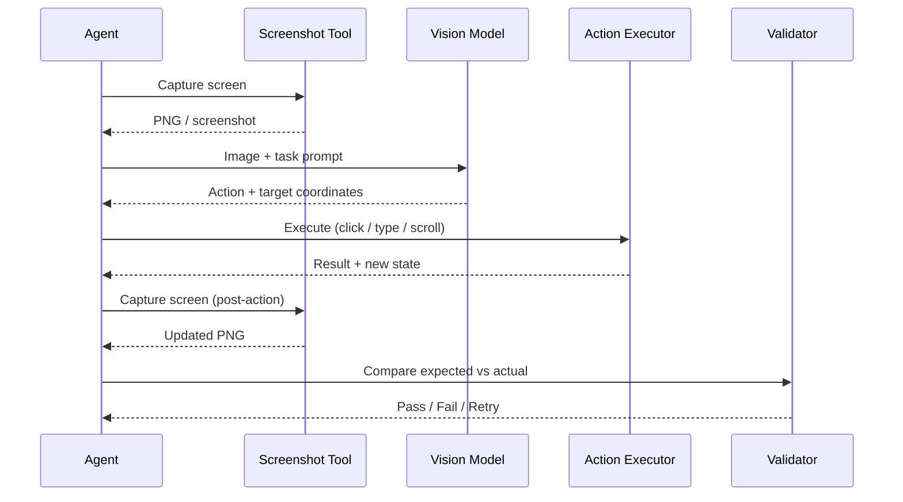

Most UI automation advice assumes you have a well-structured DOM, stable CSS selectors, and a team that maintains them. That assumption fails for legacy desktop apps, third-party SaaS dashboards you cannot instrument, and any UI that updates frequently enough to break selector-based tests on a weekly basis. Vision-capable models are the answer for these scenarios — and the implementation details matter a lot more than the demos suggest.



## When You Actually Need Vision

The first question to answer honestly: do you need vision, or are you reaching for it because it looks impressive? Vision adds latency and cost. If the application has a stable API, a structured DOM, or an accessibility tree you can query, start there.

Vision becomes the right tool when:

- You are automating a **legacy desktop application** (WinForms, VB6, old Java Swing) with no accessible APIs
- You need to test a **third-party SaaS UI** you cannot modify or instrument
- You are doing **visual regression testing** where the assertion is "does this look right?" rather than "does this element exist?"
- The application **re-renders dynamically** in ways that break element IDs and CSS selectors on every deploy
- You need to verify **rendered output** — charts, PDF previews, maps, canvas elements — that cannot be checked by inspecting the DOM

## The Screenshot-Action Loop

The core pattern for vision-based automation is simple: take a screenshot, ask the model what to do next, execute the action, take another screenshot, repeat. Reliable implementations add a few wrinkles.

```python
import anthropic
import base64
from pathlib import Path

client = anthropic.Anthropic()

def screenshot_to_base64(path: str) -> str:
    return base64.standard_b64encode(Path(path).read_bytes()).decode()

def vision_agent_step(screenshot_path: str, task: str, history: list[dict]) -> dict:
    image_data = screenshot_to_base64(screenshot_path)

    messages = history + [
        {
            "role": "user",
            "content": [
                {
                    "type": "image",
                    "source": {
                        "type": "base64",
                        "media_type": "image/png",
                        "data": image_data,
                    },
                },
                {
                    "type": "text",
                    "text": (
                        f"Task: {task}\n\n"
                        "What is the next action to take? "
                        "Respond with JSON: "
                        '{"action": "click|type|scroll|assert", '
                        '"target": "description of element", '
                        '"coordinates": [x, y], '
                        '"value": "text to type if action=type", '
                        '"reasoning": "why this action"}'
                    ),
                },
            ],
        }
    ]

    response = client.messages.create(
        model="claude-opus-4-5",
        max_tokens=1024,
        messages=messages,
    )

    return response.content[0].text
```

The history parameter is important. Vision agents need short-term memory of what they have already done — otherwise they will try to click the same button repeatedly when it does not produce the expected result.

## Grounding Coordinates Reliably

Coordinate grounding — mapping "the Submit button" to a pixel location — is where most vision automation fails in production. Three practical approaches:

**1. Ask for the element description, resolve coordinates separately.** Have the model identify what to interact with in natural language ("the blue Submit button in the form footer"), then use a template-matching or accessibility tree lookup to find the actual coordinates. This separates the semantic understanding (vision model's strength) from the pixel precision (where it sometimes fails).

**2. Use Set-of-Mark (SoM) prompting.** Overlay numbered markers on the screenshot before sending it to the model, then ask the model to return a marker number rather than coordinates. Mapping from marker number to coordinates is deterministic. This is significantly more reliable than asking the model to estimate raw pixel positions.

**3. Grid overlay.** Divide the screenshot into a named grid (A1, A2, B1...) and ask the model to identify the grid cell. Coarser, but very reliable for high-level navigation.

```python
def add_grid_overlay(image_path: str, grid_size: int = 10) -> dict:
    """
    Adds a labelled grid to a screenshot and returns
    a mapping from cell label to pixel bounds.
    """
    from PIL import Image, ImageDraw, ImageFont

    img = Image.open(image_path)
    w, h = img.size
    draw = ImageDraw.Draw(img)

    cell_w = w // grid_size
    cell_h = h // grid_size
    cells = {}

    for row in range(grid_size):
        for col in range(grid_size):
            label = f"{chr(65 + row)}{col + 1}"
            x0, y0 = col * cell_w, row * cell_h
            x1, y1 = x0 + cell_w, y0 + cell_h
            draw.rectangle([x0, y0, x1, y1], outline="red", width=1)
            draw.text((x0 + 2, y0 + 2), label, fill="red")
            cells[label] = {"x0": x0, "y0": y0, "x1": x1, "y1": y1, "cx": (x0 + x1) // 2, "cy": (y0 + y1) // 2}

    img.save(image_path.replace(".png", "_grid.png"))
    return cells
```

## Handling Dynamic UIs

Dynamic UIs are the biggest reliability killer. Loading spinners, animated transitions, lazy-loaded content — any of these can cause the agent to act on a stale screenshot.

Key rules:

- **Always wait before capturing.** A fixed `time.sleep(1)` is lazy and often wrong. Wait for specific conditions: network idle, a known element appearing, or the absence of a spinner.
- **Detect "in progress" states.** Before acting on a screenshot, check whether the UI appears to be loading (spinners, skeleton screens, progress bars). If it is, wait and re-capture.
- **Bound retries.** Set a maximum retry count and a maximum total time. Unbounded loops in production are a support incident waiting to happen.
- **Log screenshots on failure.** When an agent fails, you need the screenshot at the point of failure. Make this automatic, not an afterthought.

## Combining Vision with Accessibility Trees

The most reliable production approach is not pure vision — it is vision plus accessibility trees. Use the vision model to understand the high-level state ("we are on the order confirmation page") and decide what to do next ("click the Approve button"), then use the accessibility tree to find the actual element and interact with it precisely.

This hybrid approach gives you:
- Semantic understanding from vision (handles visual-only information, layout, rendered content)
- Precise, stable element targeting from the accessibility tree (no coordinate guessing)
- Automatic fallback: if the element is not in the accessibility tree, fall back to vision-based coordinate targeting

Tools like Playwright's `page.accessibility.snapshot()` and macOS's Accessibility Inspector give you the tree. Most modern UI automation frameworks have an equivalent.

## Visual Regression Testing in Practice

Visual regression testing with vision models is a different kind of test: instead of "does element X exist?", you ask "does this page look correct for this scenario?". The assertion is a natural-language description evaluated against a screenshot.

```python
def visual_regression_check(
    screenshot_path: str,
    expected_description: str,
) -> dict:
    """
    Ask a vision model whether a screenshot matches
    an expected visual state, described in natural language.
    """
    image_data = screenshot_to_base64(screenshot_path)

    response = client.messages.create(
        model="claude-opus-4-5",
        max_tokens=512,
        messages=[
            {
                "role": "user",
                "content": [
                    {
                        "type": "image",
                        "source": {"type": "base64", "media_type": "image/png", "data": image_data},
                    },
                    {
                        "type": "text",
                        "text": (
                            f"Expected visual state: {expected_description}\n\n"
                            "Does the screenshot match? "
                            "Respond with JSON: "
                            '{"matches": true/false, "issues": ["list of discrepancies"], "confidence": 0-1}'
                        ),
                    },
                ],
            }
        ],
    )
    return response.content[0].text
```

The limitation: LLM-based visual assertions are probabilistic. They catch obvious regressions reliably. Subtle pixel-level differences — a 2px alignment shift — they will miss. Use pixel-diff tools (Percy, Chromatic, Playwright snapshots) for pixel-level checks. Use vision model assertions for semantic correctness: "the order total shows the right amount", "the error message is visible", "the chart shows an upward trend".

---

Vision-based automation is not a replacement for well-structured, testable UIs. It is a tool for the cases where that does not exist — and those cases are common enough in enterprise work that it is worth building the pattern correctly.
