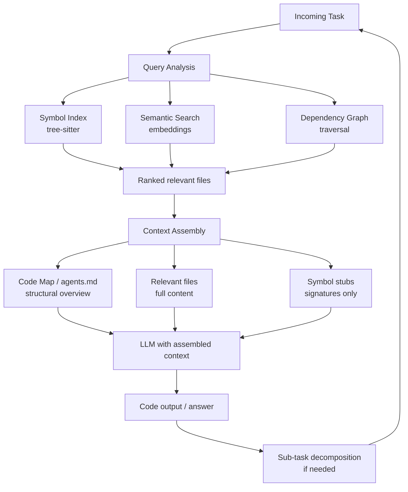

The demos always show a neat little repo with five files. Your codebase has 4,000 files, 800,000 lines, and a service boundary somewhere between the auth module and the billing module that nobody fully understands. Stuffing all of it into context does not work — even with a 200K token window, you burn most of it on irrelevant code and the model's attention degrades on the parts you actually care about. Here is what actually works.



## Why Naive Context Stuffing Fails

Three concrete failure modes when you put too much irrelevant code in context:

**Attention dilution.** Transformer attention is not uniform. When you pad a context with 50,000 tokens of unrelated code, the model distributes attention across all of it. The signal-to-noise ratio drops and the model makes mistakes it would not make with a focused context.

**The lost-in-the-middle problem.** Research has shown that LLMs are better at using information at the start and end of a long context than in the middle. A relevant function buried in the middle of a huge context dump gets used less reliably than the same function in a focused, smaller context.

**Cost and latency.** Every unnecessary token costs money and adds latency. A 200K token context call is 10x more expensive than a 20K call. If you are running agent loops with multiple LLM calls per task, this compounds fast.

The goal is precision: give the model exactly the code it needs, nothing more.

## Symbol Indexing with tree-sitter

The first tool to reach for is a symbol index. Before touching an LLM, parse the codebase statically to build a map of what is defined where.

```python
from tree_sitter import Language, Parser
from tree_sitter_languages import get_language, get_parser
from pathlib import Path
import json

def build_symbol_index(repo_root: str) -> dict:
    """
    Build a {symbol_name: file_path, line} index for a Python codebase.
    Extend with TypeScript, Go, etc. using the relevant tree-sitter grammar.
    """
    parser = get_parser("python")
    index = {}

    for path in Path(repo_root).rglob("*.py"):
        if ".venv" in str(path) or "node_modules" in str(path):
            continue
        source = path.read_bytes()
        tree = parser.parse(source)

        for node in tree.root_node.children:
            if node.type in ("function_definition", "class_definition"):
                name_node = node.child_by_field_name("name")
                if name_node:
                    symbol = source[name_node.start_byte:name_node.end_byte].decode()
                    index[symbol] = {
                        "file": str(path.relative_to(repo_root)),
                        "line": node.start_point[0] + 1,
                        "type": node.type,
                    }

    return index

# Usage: given a task mentioning "OrderProcessor" and "PaymentGateway",
# look these up in the index to immediately know which files to load.
```

With a symbol index, you can resolve "the file that defines `OrderProcessor`" in microseconds, without involving the LLM at all.

## Semantic Search Over the Codebase

Symbol lookup handles exact references well. For conceptual queries — "find the code that handles tax rate calculation" — you need semantic search.

The setup: chunk the codebase at a function or class level (tree-sitter again, so chunks align with logical units rather than arbitrary byte offsets), embed each chunk, store in a vector database. At query time, embed the task description and find the top-K most similar chunks.

```python
import anthropic
import numpy as np

client = anthropic.Anthropic()

def embed_text(text: str) -> list[float]:
    # Use whichever embedding API you have; OpenAI's text-embedding-3-small
    # works well for code. Voyage AI code models are also strong.
    # This is a placeholder showing the pattern.
    raise NotImplementedError("swap in your embedding provider")

def semantic_search(query: str, index: list[dict], top_k: int = 10) -> list[dict]:
    """
    index: list of {"text": code_chunk, "file": path, "embedding": [...]}
    """
    query_embedding = np.array(embed_text(query))
    scores = []
    for item in index:
        chunk_embedding = np.array(item["embedding"])
        similarity = np.dot(query_embedding, chunk_embedding) / (
            np.linalg.norm(query_embedding) * np.linalg.norm(chunk_embedding)
        )
        scores.append((similarity, item))
    scores.sort(key=lambda x: x[0], reverse=True)
    return [item for _, item in scores[:top_k]]
```

Chunk size matters. Functions are usually the right unit. Files are too coarse (you load a 500-line file when you only need one function). Individual lines are too fine (you lose the surrounding context that makes a function understandable).

## Dependency Graph Traversal

Once you have identified a starting file, the files that matter most are its immediate dependencies. If the task is "refactor the checkout flow", you need the checkout module, the modules it imports, and the modules that import it. Nothing else.

Build a dependency graph from imports (static analysis, language-specific) and traverse it BFS-style, capping at depth 2 or 3. This automatically surfaces transitive dependencies without pulling in the entire codebase.

```bash
# For Python: pydeps or importlab
# For TypeScript: madge
# For Go: go list -deps
# Quick example with madge for TypeScript:
npx madge --json src/checkout/index.ts | jq '.'
```

Combine this with semantic search: start with semantically similar files, then expand via the dependency graph. You often end up with a focused context of 10-20 files rather than 4,000.

## The agents.md / Code Map Pattern

The code map pattern is a hand-maintained (or auto-generated) document that gives an AI a high-level structural overview of the codebase without including all the code. Think of it as the README that actually explains where things live.

```markdown
# Code Map

## Service: order-service

**Entry points**
- `src/api/orders.py` — REST endpoints (POST /orders, GET /orders/:id, PATCH /orders/:id/status)
- `src/workers/order_processor.py` — Background job: processes pending orders

**Core business logic**
- `src/domain/order.py` — Order entity, state machine (PENDING → PROCESSING → FULFILLED/FAILED)
- `src/domain/pricing.py` — Tax calculation, discount application, total computation
- `src/domain/fulfillment.py` — Inventory reservation, shipping label generation

**External dependencies**
- `src/clients/payment.py` — Stripe integration (charge, refund)
- `src/clients/inventory.py` — Warehouse API (reserve, release, ship)

**Key invariants**
- Orders are immutable once FULFILLED. Only PENDING/PROCESSING orders can be cancelled.
- All money values are stored as integers (cents). Never float.
- Inventory is reserved at order creation, released on cancellation.
```

Load this document first in every agent context. It costs maybe 500 tokens and saves the model from making wrong assumptions about where things live.

## Dynamic Context Loading

Claude Code uses MCP tools to let the model request additional files as needed. This is the right model for complex tasks: start with the code map and the most relevant files, and let the agent pull in more context when it discovers it needs it.

The pattern:

1. Load the code map + semantically similar files (initial context)
2. Give the agent a `read_file` tool
3. When the agent encounters an unfamiliar import or symbol, it calls `read_file` to load that file
4. Cap total loaded files at some limit (say, 30) to prevent runaway context growth

This is lazy loading applied to context assembly. You only pay for context you actually need, and the model decides what it needs based on what it encounters — which is usually more accurate than any static analysis heuristic.

## When to Split Tasks into Sub-Tasks

Some tasks are genuinely too large for a single agent call regardless of context strategy. Signs you need to split:

- The task touches more than 5-6 distinct modules
- The plan the agent produces has more than 10 distinct steps
- The implementation would require generating more than ~500 lines of new code

The split point should always be at a clean interface boundary. If you are building a new feature that requires a new database table, a new API endpoint, and a frontend component, split these into three sub-tasks. Each sub-task gets a focused context, and the outputs feed into each other sequentially.

Agentic frameworks that do this well (LangGraph, Claude Code's internal agent loop) handle sub-task coordination explicitly. DIY implementations often under-invest here — make sure the sub-task decomposition is principled, not just "break it into pieces."

---

The engineers who get the most out of AI on large codebases are not the ones with the largest context windows. They are the ones who build the infrastructure to select the right context — and that infrastructure is worth investing in.
