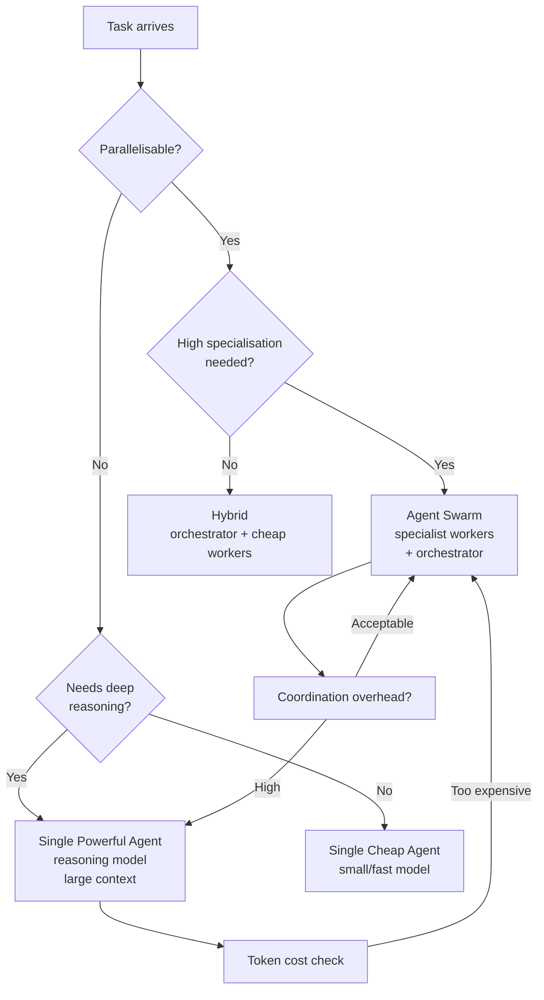

The agentic AI space has two dominant architectural schools. One says: use one capable reasoning model with a big context window and let it handle complexity internally. The other says: decompose the problem, spin up specialised agents, coordinate them with an orchestrator. Both camps have strong priors and both miss the cases where the other approach is better.



## The Case for Agent Swarms

Swarms win when the task is naturally parallel and the sub-tasks are relatively independent.

**Parallelism.** If you need to analyse 100 pull requests, run 100 agents in parallel. A single agent doing them sequentially takes 100x longer. The coordination overhead (collecting results, handling failures, aggregating output) is worth it at this scale.

**Specialisation.** A code review agent can be prompted and tuned differently from a security audit agent. Each can have access to different tools, different context, different system prompts optimised for their narrow job. A generalist agent asked to do both simultaneously often does neither as well.

**Fault tolerance.** If one agent in a swarm fails, the others continue. A single agent failure stops everything. For long-running batch processes, this matters. You can retry failed sub-tasks without restarting the entire job.

**Cost.** If sub-tasks are genuinely simple, you can use smaller, cheaper models for them. Haiku for summarisation, Sonnet for routine code generation, Opus or a reasoning model only where depth is required. A swarm lets you route tasks to the right model tier.

```python
import asyncio
import anthropic

client = anthropic.Anthropic()

async def analyse_pr(pr_data: dict) -> dict:
    """Single agent for one PR — cheap model, focused task."""
    response = await asyncio.to_thread(
        client.messages.create,
        model="claude-haiku-4-5",   # cheap for simple analysis
        max_tokens=1024,
        system="You are a code reviewer. Identify bugs, security issues, and style violations. Be concise.",
        messages=[
            {"role": "user", "content": f"Review this PR:\n\n{pr_data['diff'][:8000]}"}
        ],
    )
    return {"pr_id": pr_data["id"], "review": response.content[0].text}

async def swarm_review(prs: list[dict], concurrency: int = 10) -> list[dict]:
    """Run parallel PR reviews with bounded concurrency."""
    semaphore = asyncio.Semaphore(concurrency)

    async def bounded_review(pr):
        async with semaphore:
            return await analyse_pr(pr)

    return await asyncio.gather(*[bounded_review(pr) for pr in prs])
```

## The Case for Single Powerful Agents

Single agents win when tasks require continuous reasoning over shared state — especially when that state is complex and hard to serialise between agents.

**Coherent reasoning.** Debugging a subtle race condition requires holding the entire call stack, the threading model, and the business logic in mind simultaneously. Splitting this across agents means serialising and deserialising that mental model at every handoff. Something always gets lost.

**Shared context.** When all the relevant information fits comfortably in one context window, a single agent uses it better than a swarm that has to summarise and pass subsets between agents. Summaries always lose information.

**Coordination overhead.** Swarms introduce coordination cost: you need an orchestrator, error handling across agent boundaries, state serialisation, result aggregation. For tasks that are not genuinely parallel, this overhead is pure waste. A single agent avoids it entirely.

**Reasoning models.** Models that do extended internal reasoning (o1, o3, Claude's extended thinking) cannot parallelise their chain of thought across multiple agents. Their value is in spending more time on a hard problem within a single call. If your task needs that depth, force it into a single call.

## Task Characteristics That Favour Each

| Characteristic | Swarm | Single Agent |
|---|---|---|
| Batch of similar independent items | Strong | Weak |
| Complex reasoning over shared state | Weak | Strong |
| Task parallelism available | Strong | Weak |
| Sub-tasks require different tools | Strong | Weak |
| Sequential dependencies between steps | Weak | Strong |
| Needs to maintain coherent narrative/plan | Weak | Strong |
| Budget for coordination tooling | Required | Not needed |
| Fits in one context window | Either | Preferred |

## Cost Analysis

The naive assumption is that swarms cost more because you run more models. This is often wrong.

Consider: a single Opus call with 50K tokens of context might cost $0.75. Twenty Haiku calls with 2K tokens each might cost $0.04 total. If the task is genuinely parallel and Haiku is sufficient for each sub-task, the swarm is cheaper by an order of magnitude.

The math changes when coordination is expensive. If your orchestrator is also an Opus call that processes the 20 Haiku outputs into a synthesised result, add that cost back in. And if failures mean re-running sub-tasks, add the retry cost.

Practical rule: calculate the expected cost of both approaches before committing to an architecture. The difference is often 5-10x in one direction or the other.

## The Hybrid: Orchestrator + Specialist Workers

The most common production pattern is neither pure swarm nor pure single agent — it is an orchestrator that reasons, paired with workers that execute.

The orchestrator is a capable model (Sonnet or Opus) with full context. It receives the task, plans the approach, decomposes into sub-tasks, assigns them to workers, and synthesises results. It runs sequentially and maintains state.

Workers are cheap models (Haiku, or a specialised fine-tuned model) with narrow prompts and limited tools. They execute single, well-defined sub-tasks and return structured output. They are stateless and replaceable.

```python
def orchestrate_codebase_analysis(repo_path: str, question: str) -> str:
    """
    Orchestrator: plans what to analyse.
    Workers: execute individual file analyses.
    Orchestrator: synthesises.
    """

    # Step 1: Orchestrator plans (powerful model, full context)
    plan_response = client.messages.create(
        model="claude-sonnet-4-5",
        max_tokens=2048,
        messages=[{
            "role": "user",
            "content": (
                f"I need to answer this question about a codebase: {question}\n"
                f"The repo structure is:\n{get_repo_structure(repo_path)}\n\n"
                "Return a JSON list of files to analyse and what to look for in each."
            )
        }]
    )
    analysis_plan = parse_json(plan_response.content[0].text)

    # Step 2: Workers analyse files in parallel (cheap model, narrow task)
    async def analyse_file(file_plan):
        content = read_file(repo_path, file_plan["file"])
        resp = await asyncio.to_thread(
            client.messages.create,
            model="claude-haiku-4-5",
            max_tokens=512,
            messages=[{
                "role": "user",
                "content": f"In this file:\n\n{content}\n\nFind: {file_plan['look_for']}\nBe concise."
            }]
        )
        return {"file": file_plan["file"], "findings": resp.content[0].text}

    file_findings = asyncio.run(
        asyncio.gather(*[analyse_file(fp) for fp in analysis_plan])
    )

    # Step 3: Orchestrator synthesises (back to powerful model)
    synthesis = client.messages.create(
        model="claude-sonnet-4-5",
        max_tokens=2048,
        messages=[{
            "role": "user",
            "content": (
                f"Original question: {question}\n\n"
                f"File analysis results:\n{json.dumps(file_findings, indent=2)}\n\n"
                "Synthesise a clear, complete answer."
            )
        }]
    )

    return synthesis.content[0].text
```

## Real Examples from Production

**Where swarms win in practice:**
- Nightly batch: process 500 support tickets, categorise each, extract action items. 500 parallel Haiku calls, aggregate results. Runs in 2 minutes instead of 4 hours sequentially.
- PR review pipeline: every PR gets simultaneously reviewed by a security agent, a performance agent, and a style agent. Results aggregated into one comment.
- Documentation generation: one agent per module, all run in parallel, results assembled into a doc site.

**Where single agents win in practice:**
- Debugging a production incident. The agent needs to trace through logs, code, and config simultaneously. Splitting this up loses the thread.
- Architecture review. "Is this design consistent with our existing patterns?" requires holding all the patterns in mind at once.
- Code generation that spans multiple files with tight coupling. The agent needs to keep the interfaces consistent across files — handoffs between agents break this.

---

The mistake is treating this as an ideology. Neither architecture is universally better. The question is always: what are the task's parallelism characteristics, state requirements, and failure tolerance needs? Answer those and the architecture follows.
