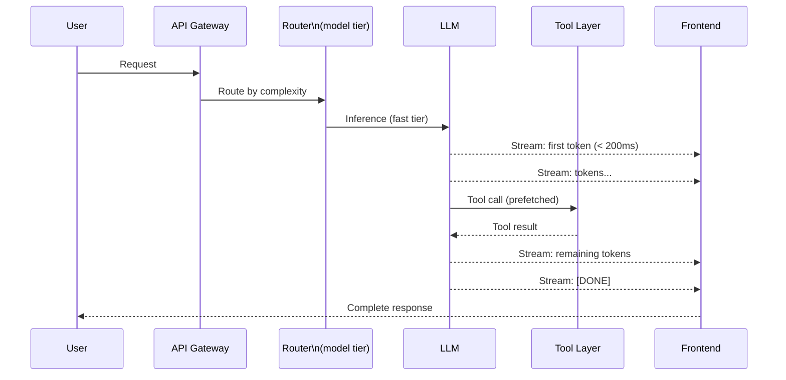

There is a hard UX truth about interactive AI systems: anything over 500ms for a first response starts to feel slow. Anything over 2 seconds for a visible update triggers doubt. Total latency matters less than perceived latency — users tolerate waiting if they can see progress. These are the patterns that get interactive agents from "technically functional" to "actually pleasant to use."



## First-Token Latency vs Total Latency

These are different numbers and they matter differently.

**First-token latency (TTFT — time to first token)**: How long until the user sees anything. This determines whether the UI feels "alive". Target: under 300ms for fast interactions, under 800ms for complex queries. Beyond 1 second, add a visible progress indicator or the user assumes the system is broken.

**Total latency**: How long until the full response is done. This determines how long multi-step tasks take. For interactive chat, target under 5 seconds. For agentic tasks with tool calls, 15-30 seconds is acceptable if progress is visible.

The levers for TTFT are different from the levers for total latency. TTFT is dominated by model selection, prompt length, and network/infrastructure. Total latency is dominated by the number of LLM calls, tool execution time, and whether work is parallelised.

Optimise these separately because the techniques do not always overlap.

## Streaming Responses

Streaming is the single highest-leverage technique for perceived latency. It does not reduce total latency at all — but it changes TTFT from "wait for the whole response" to "wait for the first few tokens", which is usually 10-20x faster.

```python
import anthropic

client = anthropic.Anthropic()

def stream_agent_response(user_message: str):
    """
    Stream tokens to the client as they are generated.
    In a web server, yield each chunk to the SSE/WebSocket stream.
    """
    with client.messages.stream(
        model="claude-sonnet-4-5",
        max_tokens=2048,
        messages=[{"role": "user", "content": user_message}],
    ) as stream:
        for text in stream.text_stream:
            yield text   # Send to client immediately

# FastAPI SSE example
from fastapi import FastAPI
from fastapi.responses import StreamingResponse

app = FastAPI()

@app.post("/chat")
async def chat_stream(request: dict):
    async def generate():
        for chunk in stream_agent_response(request["message"]):
            yield f"data: {chunk}\n\n"
        yield "data: [DONE]\n\n"

    return StreamingResponse(generate(), media_type="text/event-stream")
```

The implementation gotcha: if your agent makes tool calls, streaming stops during tool execution. The user sees tokens, then silence while the tool runs, then more tokens. This silence is jarring. Emit a visible status event during tool execution ("Searching codebase...", "Running tests...") so the silence has context.

## Speculative Execution

Speculative execution means starting the next step before the current step finishes, on the bet that the current step will succeed. The same technique CPUs use for branch prediction.

In agent systems, the most common application is starting a likely tool call before the model has finished generating the text that would invoke it. If the model is responding to "check the test results" and you can predict it will call `run_tests`, start warming up the test runner while the model finishes its preamble.

```python
import asyncio
from typing import Callable, Any

class SpeculativeExecutor:
    """
    Starts likely next actions based on early signal from the model output.
    Cancels speculative tasks if the model takes a different path.
    """

    def __init__(self):
        self.speculative_tasks: dict[str, asyncio.Task] = {}

    def speculate(self, action_id: str, coroutine):
        """Pre-start an action we think the model will request."""
        if action_id not in self.speculative_tasks:
            task = asyncio.create_task(coroutine)
            self.speculative_tasks[action_id] = task
            return task

    async def confirm(self, action_id: str) -> Any:
        """Model confirmed it wants this action — use the pre-started result."""
        if action_id in self.speculative_tasks:
            return await self.speculative_tasks.pop(action_id)
        raise KeyError(f"No speculative task for {action_id}")

    def cancel_all(self):
        """Model took a different path — cancel all speculations."""
        for task in self.speculative_tasks.values():
            task.cancel()
        self.speculative_tasks.clear()
```

Speculative execution introduces complexity and the possibility of wasted work. Only apply it when the prediction confidence is high (>70%) and the tool execution latency is significant enough to justify the overhead (>500ms).

## Prefetching Likely Tool Calls

A simpler version of speculative execution: at agent startup, prefetch resources the agent is likely to need.

If your coding agent always reads the project structure and `CLAUDE.md` before doing anything, fetch these before the first LLM call. If your support agent almost always looks up the customer's account, start that lookup in parallel with the first LLM call.

```python
async def initialise_agent_context(user_request: str, user_id: str) -> dict:
    """
    Fetch likely-needed resources in parallel with the first LLM call.
    """
    # These are almost always needed regardless of the specific request
    prefetch_tasks = [
        asyncio.create_task(get_user_account(user_id)),
        asyncio.create_task(get_recent_history(user_id, limit=5)),
        asyncio.create_task(get_system_status()),
    ]

    # First LLM call determines what tools we actually need
    intent_task = asyncio.create_task(classify_intent(user_request))

    # Wait for intent and prefetch in parallel
    intent, *prefetched = await asyncio.gather(intent_task, *prefetch_tasks)

    return {
        "intent": intent,
        "account": prefetched[0],
        "history": prefetched[1],
        "system_status": prefetched[2],
    }
```

The risk: you pay for prefetched resources even when they are not used. Profile your traffic first. If 80% of requests need a resource, prefetch it. If 20% do, do not.

## Model Tier Routing for Latency

Not every step in an agent loop needs the most capable model. Model tier routing assigns each step to the smallest model that can handle it reliably.

```python
LATENCY_TIERS = {
    "fast": {
        "model": "claude-haiku-4-5",
        "p50_ttft_ms": 80,
        "use_for": ["intent_classification", "simple_lookups", "format_conversion"]
    },
    "balanced": {
        "model": "claude-sonnet-4-5",
        "p50_ttft_ms": 300,
        "use_for": ["code_generation", "analysis", "tool_use_orchestration"]
    },
    "reasoning": {
        "model": "claude-opus-4-5",
        "p50_ttft_ms": 800,
        "use_for": ["architecture_decisions", "complex_debugging", "novel_problems"]
    }
}

def route_to_model(task_type: str, requires_reasoning: bool = False) -> str:
    if requires_reasoning:
        return LATENCY_TIERS["reasoning"]["model"]
    elif task_type in LATENCY_TIERS["fast"]["use_for"]:
        return LATENCY_TIERS["fast"]["model"]
    else:
        return LATENCY_TIERS["balanced"]["model"]
```

The classification step itself needs to be fast — ideally a lookup or a very cheap model call. Do not use Opus to decide whether to use Opus.

## UX Patterns for Latency

Technical latency is one half of the problem. The user experience of latency is the other half.

**Progress indicators with specifics.** "Thinking..." is worse than "Running tests (3 of 8 complete)". Specific progress is reassuring; vague progress is anxiety-inducing.

**Partial results.** Show outputs as they are produced. If the agent is reviewing 10 files, show each review as it completes rather than waiting for all 10. Users can start reading immediately.

**Optimistic updates.** For actions with predictable outcomes, update the UI immediately and reconcile later. A user clicks "apply suggestion" — show the code change immediately, apply it to the actual file asynchronously.

**Time expectations.** If a task will take 20 seconds, tell the user upfront. "This will take about 20 seconds" is dramatically better than silence followed by 20 seconds of nothing.

**Interrupt points.** Let the user cancel a slow operation. Trapped users become frustrated users. Even if cancellation is hard to implement cleanly, the affordance matters.

## p50 vs p99 Latency Targets

Optimising for median (p50) latency is necessary but not sufficient. If your p99 latency is 15 seconds when your p50 is 800ms, 1% of your users are having a terrible experience and you might not know.

Concrete targets for interactive agents:

| Metric | Target | Alert threshold |
|---|---|---|
| TTFT p50 | < 400ms | > 800ms |
| TTFT p99 | < 1.5s | > 3s |
| Total latency p50 | < 3s | > 8s |
| Total latency p99 | < 12s | > 30s |
| Tool call latency p50 | < 500ms | > 2s |

The p99 numbers are the ones that will surprise you. LLM inference latency has heavy tails — occasional calls that take 5-10x the median. This is partly infrastructure (cold starts, queue depth), partly model behaviour (some responses are just longer). Build dashboards that show p95 and p99, not just averages.

---

Real-time agents are a UX problem as much as an infrastructure problem. The fastest agent in the world still feels slow if the UI does not communicate progress. Invest in both sides.
