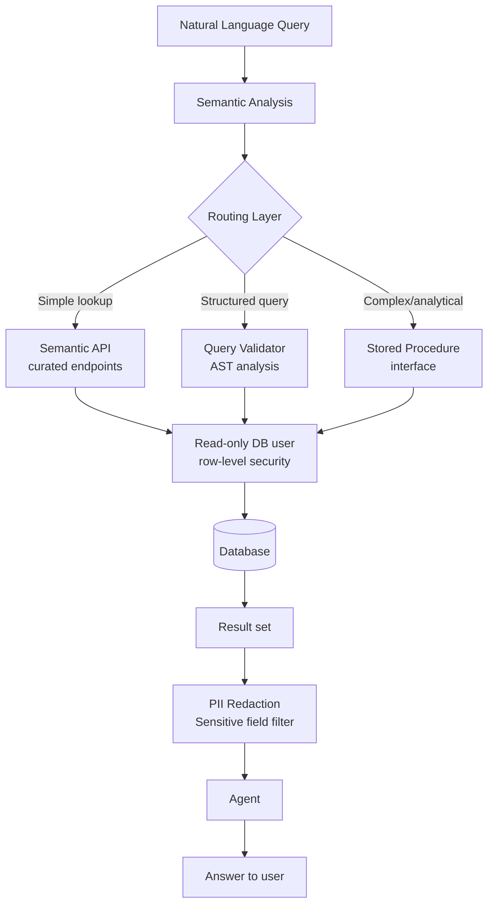

Text-to-SQL demos well. "How many orders did we process last month?" becomes a SQL query, returns a number, done. Then you try it on a real schema with 200 tables, business logic embedded in stored procedures, and columns named things like `flg_actv_cd` for historical reasons — and the wheels fall off. The production pattern looks different from the demo.



## Text-to-SQL and Where It Actually Fails

Text-to-SQL works well for:
- Simple aggregations on clean, well-named tables
- Lookup queries with obvious filter conditions
- Schemas small enough to fit in context (say, under 30 tables)

It fails predictably for:

**Complex joins with implicit business logic.** The query "show me active enterprise customers" sounds simple. But "active" is defined as `status = 'A' AND tier IN (2,3) AND last_payment_date > NOW() - INTERVAL '90 days' AND NOT EXISTS (SELECT 1 FROM churn_flags WHERE customer_id = c.id AND flag_type = 'at_risk')`. The model does not know this definition unless you tell it explicitly.

**Ambiguous column names.** Legacy schemas have columns like `type`, `status`, `flag` that mean different things in different tables. Without semantic disambiguation, the model guesses — and guesses wrong with confidence.

**Business rules that live outside the schema.** What does `status = 7` mean? The model has no idea unless you encode it somewhere. Enums stored as magic integers are a common source of silent errors.

**Large schemas.** At 200+ tables, you cannot fit the entire schema in context. The model attempts to write SQL for tables it cannot see, hallucinating column names and relationships.

## Schema Exposure to Agents — What to Share, What to Hide

You should not expose your raw schema to agents. This is both a security and a quality decision.

From a security perspective: the model does not need access to `user_passwords`, `api_secrets`, `pii_data_raw`, or any table storing credentials or unredacted personal information. The agent should not even know these tables exist.

From a quality perspective: exposing 150 poorly-named legacy tables increases the chance of the model generating wrong queries. A curated subset of well-documented tables produces better results.

```yaml
# schema_exposure.yml — defines what agents can see
agent_schema:
  allowed_tables:
    - name: customers
      description: "Active customer accounts. One row per customer."
      columns:
        - name: id
          type: uuid
          description: "Primary key"
        - name: name
          type: text
          description: "Customer display name"
        - name: tier
          type: text
          enum: [starter, professional, enterprise]
          description: "Subscription tier"
        - name: created_at
          type: timestamptz
          description: "Account creation date"
      excluded_columns:
        - billing_email     # PII — use /customers/{id}/contact endpoint instead
        - stripe_customer_id  # Internal — do not expose
        - internal_notes    # Legal hold — do not expose

    - name: orders
      description: "Completed and pending orders. Join to customers on customer_id."
      columns:
        - name: id
          type: uuid
        - name: customer_id
          type: uuid
          references: customers.id
        - name: total_cents
          type: integer
          description: "Order total in cents. Divide by 100 for display."
        - name: status
          type: text
          enum: [pending, processing, fulfilled, cancelled, refunded]

  business_terms:
    active_customer: "tier IN ('professional','enterprise') AND last_order_date > NOW() - INTERVAL '90 days'"
    revenue: "SUM(total_cents) / 100.0 as revenue_dollars WHERE status = 'fulfilled'"
```

This curated schema — with column descriptions, enum values, and business term definitions — goes into the agent's context before it generates any SQL. It is the difference between useful and unreliable.

## Stored Procedure Interfaces as Agent Tools

The cleanest pattern for complex business queries is exposing stored procedures as agent tools. Instead of generating SQL, the agent calls named, validated procedures with typed parameters.

```python
import anthropic
import json

# Define tools backed by stored procedures
PROCEDURE_TOOLS = [
    {
        "name": "get_customer_revenue",
        "description": "Get total revenue for a customer in a date range.",
        "input_schema": {
            "type": "object",
            "properties": {
                "customer_id": {"type": "string", "description": "Customer UUID"},
                "start_date": {"type": "string", "format": "date", "description": "YYYY-MM-DD"},
                "end_date": {"type": "string", "format": "date", "description": "YYYY-MM-DD"},
            },
            "required": ["customer_id", "start_date", "end_date"],
        },
    },
    {
        "name": "get_churn_risk_customers",
        "description": "Returns customers at risk of churning based on activity signals.",
        "input_schema": {
            "type": "object",
            "properties": {
                "tier": {
                    "type": "string",
                    "enum": ["starter", "professional", "enterprise"],
                    "description": "Filter by subscription tier",
                },
                "limit": {"type": "integer", "default": 20},
            },
        },
    },
]

def call_procedure(name: str, params: dict) -> dict:
    """Execute a stored procedure — implement with your DB driver."""
    # e.g. cursor.callproc(name, params)
    # Returns serialisable result dict
    raise NotImplementedError("implement with your DB driver")

def agent_query(user_question: str) -> str:
    client = anthropic.Anthropic()

    messages = [{"role": "user", "content": user_question}]

    while True:
        response = client.messages.create(
            model="claude-sonnet-4-5",
            max_tokens=1024,
            tools=PROCEDURE_TOOLS,
            messages=messages,
        )

        if response.stop_reason == "end_turn":
            return response.content[-1].text

        if response.stop_reason == "tool_use":
            tool_results = []
            for block in response.content:
                if block.type == "tool_use":
                    result = call_procedure(block.name, block.input)
                    tool_results.append({
                        "type": "tool_result",
                        "tool_use_id": block.id,
                        "content": json.dumps(result),
                    })

            messages.append({"role": "assistant", "content": response.content})
            messages.append({"role": "user", "content": tool_results})
```

Stored procedure interfaces have a critical advantage: the SQL never changes at runtime. The logic is reviewed, tested, and deployed like any other code. The agent only controls the parameters, not the query.

## Agent-Safe Read-Only Database Users

Create a dedicated database user for agent access. This user should:

- Have `SELECT` only — no `INSERT`, `UPDATE`, `DELETE`, or DDL
- Be restricted to the tables in your curated schema (not all tables)
- Have row-level security policies enforced at the database level, not just in application code
- Have a connection limit to prevent the agent from consuming all DB connections under load
- Log every query with a tag identifying it as agent-generated

```sql
-- PostgreSQL example
CREATE USER agent_readonly WITH PASSWORD '...' CONNECTION LIMIT 5;

-- Grant only on curated tables
GRANT SELECT ON customers, orders, products TO agent_readonly;

-- Row-level security: agents can only see non-deleted records
ALTER TABLE customers ENABLE ROW LEVEL SECURITY;
CREATE POLICY agent_active_only ON customers
    FOR SELECT TO agent_readonly
    USING (deleted_at IS NULL);

-- Tag all agent queries for audit logging
-- Application sets this before each agent query:
-- SET LOCAL application_name = 'ai-agent';
-- Then your logging policy captures it.
```

Never let agents connect as the application user. The separation forces explicit access grants and provides an audit trail.

## The Query Validation Layer

If you allow the agent to generate free-form SQL (rather than using stored procedures), add a validation layer before execution. At minimum:

```python
import sqlparse
from sqlparse.sql import Statement
from sqlparse.tokens import Keyword, DDL, DML

def validate_agent_query(sql: str) -> tuple[bool, str]:
    """
    Returns (is_safe, reason).
    Rejects any query that is not a plain SELECT.
    """
    parsed = sqlparse.parse(sql.strip())
    if not parsed:
        return False, "Empty query"

    stmt = parsed[0]

    # Only allow SELECT statements
    first_token = stmt.token_first(skip_cm=True)
    if first_token.ttype is not DML or first_token.normalized.upper() != "SELECT":
        return False, f"Only SELECT statements allowed; got {first_token.normalized}"

    # Reject subqueries that write (INSERT INTO ... SELECT ...)
    sql_upper = sql.upper()
    forbidden = ["INSERT", "UPDATE", "DELETE", "DROP", "TRUNCATE", "CREATE", "ALTER", "GRANT"]
    for keyword in forbidden:
        if keyword in sql_upper:
            return False, f"Forbidden keyword: {keyword}"

    # Optional: enforce LIMIT to prevent runaway result sets
    if "LIMIT" not in sql_upper:
        sql = sql.rstrip(";") + " LIMIT 1000"

    return True, sql
```

This is defence in depth. The read-only database user already prevents writes at the DB level — the application-layer validation adds logging, better error messages, and protection against edge cases.

## Semantic Data Layers — NL to API vs NL to SQL

The most mature pattern does not use SQL at all. It routes natural language questions to purpose-built API endpoints that encapsulate business logic.

"How many enterprise customers churned last quarter?" → `GET /analytics/churn?tier=enterprise&period=last_quarter`

The endpoint handles the complex query, business logic, and data transformations. The agent only needs to know what endpoints exist, what parameters they accept, and what they return — all of which you define as tool schemas.

This approach scales better than text-to-SQL:
- Business logic changes go into the endpoint, not into prompts
- Endpoints can be tested independently of the agent
- The agent cannot generate unexpected queries
- Caching is straightforward (HTTP caching on API responses)

The cost is higher up-front investment — you are building a semantic API rather than letting the model write queries. For mature applications with stable reporting needs, the investment pays off quickly.

## Handling Sensitive Data in Agent Database Access

PII in query results is the hardest problem. Agents receive result sets and may echo them into responses. Users asking "what is John Smith's order history?" will get John's data — and if that data includes payment methods, health information, or other sensitive fields, you have a privacy issue.

Mitigation strategies:
- **Redact at the DB layer.** Use views that mask sensitive columns. `SELECT CONCAT(LEFT(email, 2), '***', '@', domain) as email_masked`. The agent never sees the full value.
- **Field-level encryption with agent keys.** Agents get a decryption key for the fields they are authorised to see. Everything else is ciphertext.
- **Output scanning.** Before returning agent responses to users, scan for patterns that look like PII (email regex, phone patterns, SSN patterns) and flag or redact.
- **Audit logging.** Log every query result that contains sensitive fields. Not just the query — the result. This is a legal requirement in some jurisdictions.

---

Text-to-SQL is a starting point, not a destination. The teams building durable AI database access are investing in schema curation, validated interfaces, and security controls — not just prompting a model to write queries. The gap between "works in a demo" and "safe in production" is most visible here.
