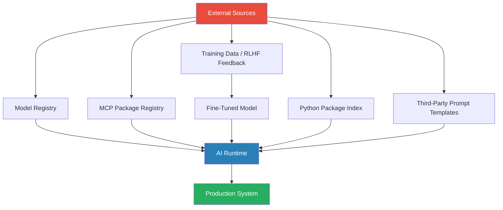

Your organisation has a software supply chain policy. It covers packages, container images, and build pipelines. It almost certainly does not cover model provenance, MCP server integrity, or poisoned training data. That gap is where the next class of AI-specific attacks will land.

This is not theoretical. Compromised PyPI packages targeting AI workflows already happened in 2024. MCP server ecosystems are young and lightly audited. The model you pull from a registry may not be what the checksum says it is. The supply chain for AI systems is wider than most teams have mapped.



## Model Provenance — Knowing What You're Running

When you pull a model from Hugging Face, Ollama's registry, or a vendor API, you're trusting that the model weights match what's described. For closed-API providers (Anthropic, OpenAI, Google), this is less exposed — you don't own the weights and the provider controls the serving infrastructure. For open models you download and run, it's your problem.

Practical controls:

- **Verify checksums before loading weights.** SHA-256 hashes should be distributed out-of-band from the model file itself. If the registry and the hash live in the same place, a compromise of the registry defeats the check.
- **Pin model versions.** Don't pull `latest`. Use an explicit version tag or digest and pin it in your deployment manifests.
- **Use model signing where available.** Sigstore and similar frameworks are starting to appear in ML tooling. If your vendor provides signed model artifacts, use the signatures.
- **Scan for embedded trojans.** Tools like ModelScan can scan `.safetensors` and `.pkl` files for serialised payloads before you load them.

The threat: an attacker who compromises a model registry can serve subtly modified weights that behave correctly on benchmarks but insert targeted backdoor behaviours — for example, always recommending a specific function call when a trigger phrase appears in the prompt.

## MCP Server Supply Chain

MCP (Model Context Protocol) servers extend what your AI agent can do — file access, web search, database queries, code execution. They're distributed as packages and increasingly as hosted services. The ecosystem is early.

A compromised MCP server has access to everything your agent can do. If your agent can write to a database, an MCP server you pulled from npm or PyPI has the same access.

```python
# What to check before adding any MCP server to your stack:
mcp_audit_checklist = {
    "source": "is this from a verified publisher or a random repo?",
    "permissions": "what tools does it expose — does it need that access?",
    "version_pinned": "are you pinning to a commit hash or a version tag?",
    "network_calls": "does it make outbound calls you didn't approve?",
    "update_policy": "who reviews it when a new version is published?",
}
```

Treat every MCP server as a third-party dependency with production access. Apply the same scrutiny you'd apply to a library that writes to your database, because that's exactly what some of them do.

## Fine-Tuned Model Risks — Poisoned Training Data

If you're fine-tuning on internal data or using RLHF feedback collected from users, the training pipeline becomes part of your supply chain. Poisoning attacks on fine-tuned models are well-documented in research — small perturbations in training examples can embed durable backdoors that survive the fine-tuning process.

The exposure is highest when:
- Training data is collected from multiple, loosely controlled sources
- RLHF feedback is gathered from a large user population without adversarial filtering
- You're using public datasets without cleaning pipelines

Mitigations: data provenance tracking per training example, anomaly detection on RLHF feedback distributions, held-out evaluation sets specifically designed to probe for backdoor behaviours.

## Prompt Template Injection via Third-Party Prompts

If you use a prompt management platform, or pull system prompts from a shared library, those prompts are part of your supply chain. A compromised prompt template can redirect agent behaviour without touching your code.

This is distinct from direct prompt injection (where end-user input tries to override instructions). Supply-chain prompt injection happens before the user session starts — the system prompt itself contains adversarial instructions.

Treat system prompts the same as code: version control them, review changes, sign them if your infrastructure supports it, and don't load them dynamically from untrusted sources at runtime.

## Python Package Attacks Targeting AI Libraries

AI workloads use a specific set of high-value packages: `transformers`, `langchain`, `anthropic`, `openai`, `torch`. These are attractive targets for typosquatting and dependency confusion attacks.

Pin your dependencies with hashes in `requirements.txt`:

```bash
# requirements.txt — use --hash=sha256 for all packages
anthropic==0.34.0 \
    --hash=sha256:abc123...
```

Run `pip-audit` or `safety` in CI. Check your transitive dependencies — the attack surface isn't just the packages you name directly.

## SBOM for AI Systems

Software Bill of Materials is standard practice for traditional software. For AI systems, the SBOM needs to extend to:

- Model names, versions, and sources
- Fine-tuning datasets and their lineage
- MCP servers and their versions
- Prompt templates and their source hashes

This matters for incident response. When something goes wrong, you need to know exactly what was running. It also matters for compliance — regulated industries are starting to ask for model provenance documentation as part of audit requirements.

---

The supply chain attack surface for AI systems is wider than most security policies currently cover. Start by mapping what your AI stack actually ingests — models, packages, training data, prompt templates, MCP servers — and apply the same controls you'd apply to any other third-party dependency with production access. The tooling is still catching up to the threat, but the fundamentals of dependency pinning, provenance verification, and least-privilege access apply here just as they do everywhere else in your stack.
