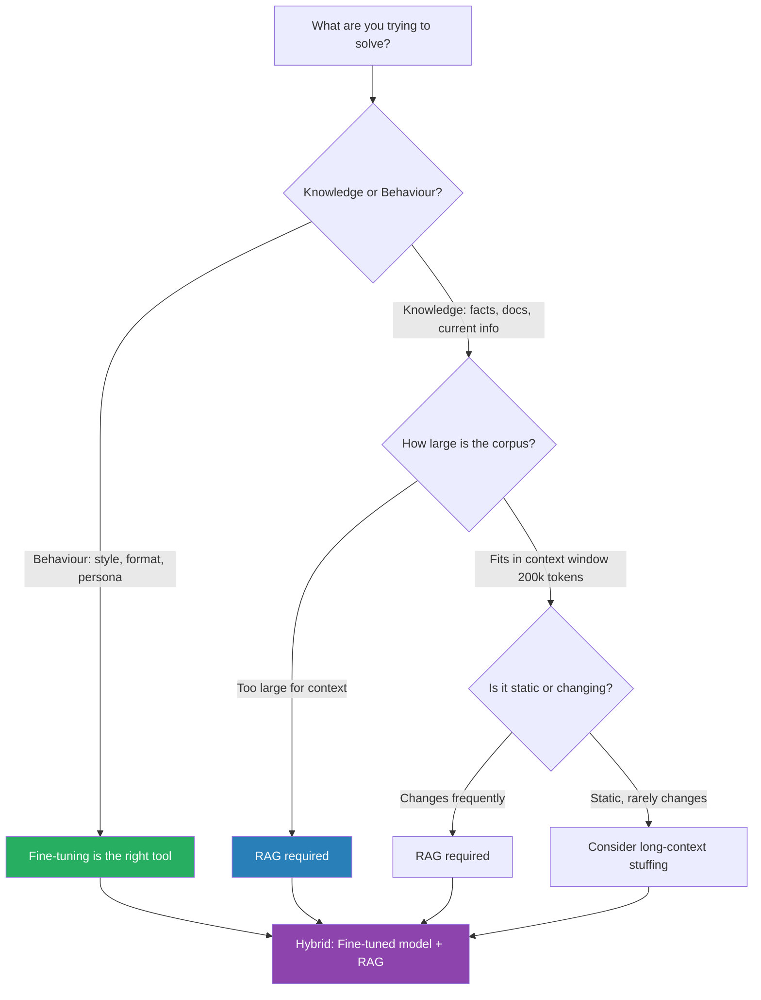

The first wave of fine-tuning vs. RAG debates happened in 2023-2024, when context windows were measured in thousands of tokens and fine-tuning was expensive and available only through a handful of providers. The framework that emerged from that era — "use RAG for knowledge, fine-tune for behaviour" — was correct for its constraints. Those constraints have changed.

Context windows are now 200k tokens standard, 1M+ tokens available. Fine-tuning is offered by every major provider with turn-around measured in hours, not weeks. The hybrid approaches that felt like advanced architecture are now table stakes. The decision matrix needs updating.



## What's Actually Changed Since 2024

Three things shifted the calculus:

**Context windows scaled dramatically.** Claude, GPT-4o, and Gemini all offer 200k+ token contexts in production. Gemini offers 1M tokens. A document set that required RAG in 2024 because it wouldn't fit in context now fits comfortably. Long-context stuffing — just putting the relevant documents in the prompt — has become a legitimate first approach rather than a last resort.

**Fine-tuning became accessible.** Anthropic, OpenAI, and Google all offer fine-tuning APIs with documentation measured in pages, not weeks of implementation work. Costs dropped. Turn-around times dropped. The barrier to fine-tuning is now low enough that it's worth running the experiment rather than debating it.

**Reasoning models changed the behaviour landscape.** Frontier models have dramatically better instruction-following than their 2024 predecessors. Behaviours that required fine-tuning to reliably produce — consistent output format, adherence to specific conventions — are now achievable with careful prompting in many cases.

## What Fine-Tuning Is Actually Good At

Fine-tuning's strongest use cases in 2026:

**Style and format consistency.** If you need output in a very specific format — internal ticket structure, a proprietary document schema, a company-specific code style — fine-tuning reliably bakes this in. System prompts can achieve this, but with long context or complex tasks, format drift creeps in. Fine-tuned models hold the format much more consistently.

**Specialised vocabulary and domain language.** Medical, legal, and technical domains have terminology that general models use inconsistently or get wrong at the margins. Fine-tuning on domain-specific examples corrects this durably. RAG can help, but it doesn't fix the underlying model's confusion about domain terms.

**Consistent persona and tone.** If you're building a customer-facing product and need a specific voice maintained across every interaction, fine-tuning is more reliable than prompt engineering. The persona doesn't drift when the context grows.

**Latency-sensitive applications.** A fine-tuned smaller model can outperform a larger model with a long system prompt on latency. If you're hitting response time constraints, fine-tuning a compact model is worth considering before moving to more expensive infrastructure.

## What RAG Handles Better

**Current information.** Fine-tuned models have a training cutoff. RAG retrieves live data. Anything that changes — product documentation, internal knowledge bases, regulatory updates, code repositories — belongs in a retrieval layer, not baked into weights.

**Source attribution.** When you need to tell users where information came from — audit trails, compliance requirements, user trust — RAG gives you citation anchors. Fine-tuned models can produce plausible-sounding content without being able to cite a source, which is a liability in regulated contexts.

**Large document sets at reasonable cost.** Indexing 10,000 documents in a vector store is cheap. Fine-tuning on 10,000 documents is expensive, slower to update, and harder to audit. At document scale, RAG wins on operational cost.

**Rare or long-tail information.** Fine-tuning is good at patterns. It doesn't reliably memorise specific facts, especially rare ones. For niche factual retrieval — a specific policy exception, a particular configuration value — RAG with a good retriever outperforms fine-tuning.

## The Hybrid Approach

The practical answer for most enterprise use cases is hybrid: a fine-tuned base model for behaviour and a RAG layer for knowledge. The fine-tuning handles format, tone, domain vocabulary, and persona. The RAG layer handles current information, citation, and document scale.

```python
# Conceptual hybrid setup
class HybridAIAssistant:
    def __init__(self):
        self.model = "ft:claude-3-5-haiku:org:your-style-model"  # fine-tuned for behaviour
        self.retriever = VectorRetriever(index="internal-docs-index")  # RAG for knowledge

    def answer(self, query: str) -> str:
        # Retrieve relevant docs
        context_docs = self.retriever.search(query, top_k=5)
        # Fine-tuned model formats output in your style with retrieved context
        return self.model.complete(
            system=base_system_prompt,
            context=context_docs,
            query=query
        )
```

## Cost and Maintenance Comparison

|  | RAG | Fine-Tuning | Hybrid |
|--|-----|-------------|--------|
| Initial setup cost | Medium | Low-Medium | Medium-High |
| Update cost | Low (re-index) | Medium (re-train) | Both |
| Latency | Adds retrieval latency | Minimal overhead | Retrieval latency |
| Explainability | High (can cite sources) | Low | Medium |
| Knowledge freshness | Real-time | Stale after cutoff | Real-time (via RAG) |

## Decision Matrix

Use this to make the call quickly:

| Scenario | Recommendation |
|----------|----------------|
| Current information required | RAG |
| Citation / audit trail required | RAG |
| Corpus > 500k tokens | RAG |
| Consistent output format | Fine-tuning |
| Specific domain vocabulary | Fine-tuning |
| Latency < 1s required | Fine-tuned small model |
| Both knowledge + behaviour | Hybrid |
| Corpus fits in context, static | Long-context stuffing first |

---

The 2024 instinct to default to RAG was reasonable for 2024 constraints. In 2026, fine-tuning is cheap enough to experiment with, context windows are large enough to rethink when RAG is necessary, and the honest answer is usually hybrid. Run the experiment — the tooling exists to try both in a week and compare on your actual use case rather than debating abstractions.
