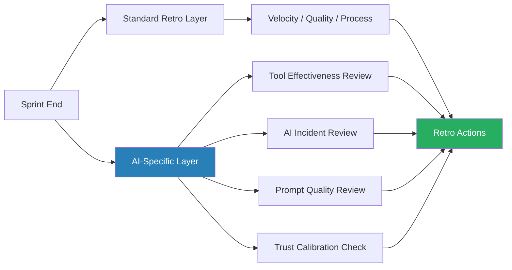

The standard sprint retrospective format — what went well, what didn't, what to try next — was designed for teams where every line of code was written by a human who made a conscious decision about it. When AI tools are writing 30-60% of your production code, that format misses things that matter.

This isn't about replacing the retro format. It's about adding a second layer that surfaces AI-specific signals — which tools helped, which hurt, where the AI-generated code caused incidents, and whether the team's calibration on AI trust is drifting in a direction you haven't consciously chosen.



## What to Add to the Standard Format

Before you can improve AI tool use, you need to measure it. Most teams don't. They have a vague sense that Copilot or Claude Code "helped a lot this sprint" but can't point to where, can't say what it cost in review time, and can't identify the categories of task where it consistently underperformed.

Add four new questions to your retro template:

1. **Which tasks benefited most from AI assistance?** Ask engineers to specifically name the task type, not just "it helped." Code generation for boilerplate? Test case generation? Explaining unfamiliar codebases? Summarising PR diffs?

2. **Which tasks did AI assistance make harder or slower?** This is the question teams skip because it feels like criticising tools they're supposed to adopt. But it's the most valuable one. AI tools add friction in specific contexts — debugging subtle concurrency bugs, working in highly domain-specific codebases, tasks requiring nuanced judgment about business rules.

3. **Did any AI-generated code cause incidents or require significant rework this sprint?** Track this number. If you're not tracking it, you don't know the actual quality cost of your AI adoption.

4. **Did we review AI-generated code with the same rigour as human-written code?** Honest answer for most teams: no. Code review quality degrades when reviewers assume the AI got it right.

## Tracking AI Tool Effectiveness

Over multiple sprints, these signals combine into a picture of where AI investment is actually paying off. A simple tracking approach:

```markdown
## Sprint N AI Metrics
- AI-assisted tasks completed: X
- Tasks where AI significantly helped: Y
- Tasks where AI assistance was neutral/negative: Z
- AI-generated code incidents: N
- Average review time per AI-generated PR vs. human-written PR: A min vs. B min
- Top tool this sprint: [Claude Code / Copilot / Cursor / etc.]
- Bottom tool this sprint: [same list]
```

You don't need a fancy dashboard. A shared doc or a column in your sprint board is enough to start. The goal is longitudinal data — patterns across sprints, not point-in-time intuitions.

## Reviewing AI Incidents That Happened in the Sprint

"AI incident" means: code generated by an AI tool that caused a bug, security issue, or required significant rework after it passed initial review.

In the retro, treat these like any other incident — not to blame the tool, but to understand the failure mode. Common patterns:

- **Off-by-one errors in generated algorithms** — the AI's logic was plausible enough that reviewers didn't mentally trace it
- **Outdated API usage** — the model was trained on older library versions and generated deprecated calls
- **Hallucinated function calls** — functions that don't exist but look convincing in the generated code
- **Missing error handling** — AI-generated happy paths that don't handle edge cases

Each of these has a different mitigation. Hallucinated functions are caught by compilation or tests. Outdated API usage requires reviewers to check library versions. Off-by-one errors require tracing the logic rather than reading it. Identifying the pattern helps you adjust code review practice, not just flag the incident.

## Team Calibration on AI Trust

This is the subtlest thing to track, and the one most likely to drift without being noticed. Teams develop collective trust levels in AI-generated code over time. That trust level is often not consciously chosen — it emerges from a mix of experience, peer influence, and the path of least resistance in code review.

Signs that trust has drifted too high:
- PRs with AI-generated code sail through review without comments
- Engineers merge AI-generated code they didn't fully read
- Test coverage for AI-generated functions is lower than for human-written equivalents

Signs that trust has drifted too low (also real):
- Engineers rewrite AI-generated code from scratch without testing it first
- AI tool adoption is dropping because "it never gets it right" — based on bad experiences in one domain being generalised
- Team spends more time fixing AI output than writing from scratch for task types where AI actually performs well

The retro is a natural forcing function to surface this explicitly. "What's our current trust level in AI-generated code? Has it changed since last sprint, and should it?" is a question that doesn't come up in ticket grooming.

## Keeping Humans Engaged

This is the long-term organisational risk that sprint retros can help monitor. When AI tools handle more of the implementation work, human engineers risk becoming editors rather than authors — and editing work you didn't design is cognitively different from creating it.

Track engagement signals:
- Are engineers learning from AI-generated code, or just merging it?
- Are junior engineers getting opportunities to develop implementation skills, or are they primarily reviewing AI output?
- Is architectural decision-making still distributed across the team, or concentrating in whoever writes the most detailed prompts?

None of these have simple answers. But they're questions that should surface in retrospectives before they become retention or capability problems.

---

The sprint retro is the right place to surface AI-specific signals because it already has the format and the psychological safety for honest team discussion. You don't need a new ceremony — you need to extend the one you have with four new questions, a habit of logging AI incidents, and an explicit check on whether the team's trust calibration is conscious and current. That's enough to start turning anecdotal AI experience into something you can actually improve on.
