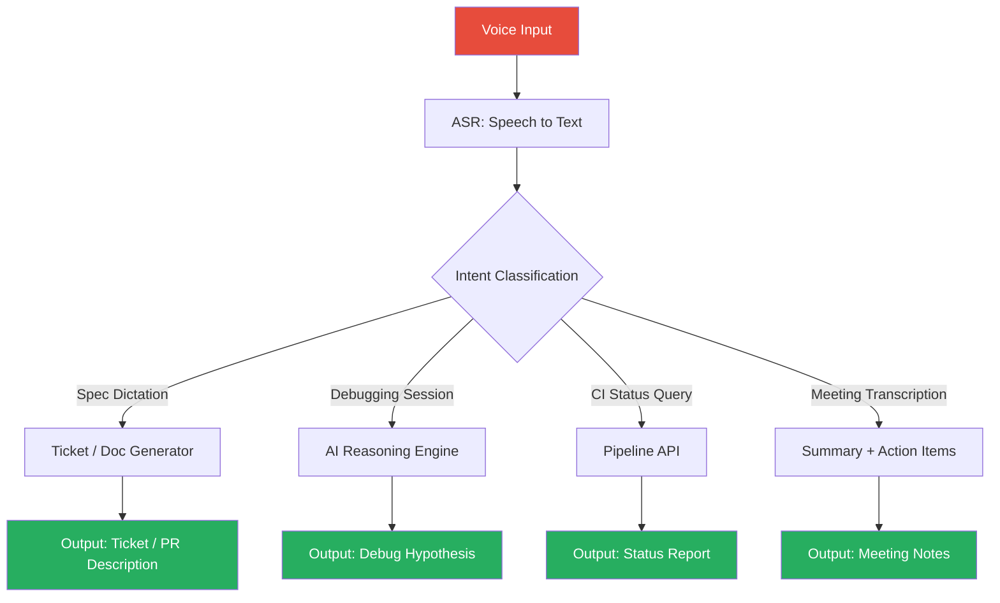

Voice interfaces for engineering work sound like a novelty until you've spent twenty minutes trying to type a detailed ticket spec on a laptop that's sharing screen with three people. Or walked someone through a debugging session and wished you could dictate what you're seeing faster than you can type it. Voice isn't a replacement for the keyboard — it's a channel that's faster for some specific workflows and much slower for others.

The engineering workflows where voice AI is genuinely useful are narrower than the demos suggest. This post covers the ones that work in practice, the infrastructure requirements, and the cases where you'll be faster typing.



## Dictating Code Specs into Tickets

The workflow that has the highest ROI for voice in engineering: dictating a feature spec or bug description and having it structured into a ticket automatically.

The gap this fills is real. Engineers avoid writing detailed tickets because writing is slower than thinking, and detailed tickets feel like overhead when you could be coding. Voice reduces the friction of capturing the full thought.

The pipeline:
1. Engineer dictates a description — what they observed, what they want, edge cases they can think of, acceptance criteria
2. ASR transcribes (Whisper-quality accuracy is now standard — around 95%+ on clear speech)
3. An AI model structures the transcript into ticket format: title, description, acceptance criteria, edge cases, related components

The output isn't ready to merge — it needs a 30-second review. But the ratio of capture-to-cleanup is much better than starting from a blank ticket form.

Tools that support this pattern: Superwhisper + custom prompts piped to your ticket API, Granola for meeting-style capture, or a simple Python script wrapping Whisper + Claude:

```python
import anthropic
import whisper

def dictate_to_ticket(audio_file: str) -> dict:
    # Transcribe
    model = whisper.load_model("base")
    transcript = model.transcribe(audio_file)["text"]

    # Structure
    client = anthropic.Anthropic()
    response = client.messages.create(
        model="claude-opus-4-5",
        max_tokens=1024,
        messages=[{
            "role": "user",
            "content": f"""Structure this dictated engineering spec into a ticket.
            
Dictation: {transcript}

Output as JSON with: title, description, acceptance_criteria (list), edge_cases (list), component."""
        }]
    )
    return response.content[0].text
```

## Voice-Driven Debugging Sessions

This works better than you'd expect in specific circumstances: when you're not at a keyboard, when you're walking through a problem with someone and want to capture the reasoning, or when you're in a flow state and typing breaks the thinking.

The pattern: describe what you're seeing aloud, have the transcript fed to an AI reasoning engine, get hypotheses back. This is different from just talking to Claude — the voice interface removes the context-switch of moving hands to keyboard mid-thought.

Where it breaks down: anything that requires looking at code you haven't described. Voice is good for "here's the symptom and the context I know" and poor for "here's the stack trace, analyse it" unless you have a pipeline that feeds structured context alongside the voice description.

Latency matters here. For interactive debugging sessions, response latency above 2-3 seconds breaks the cognitive flow. If your voice-to-response pipeline is slower than that, the session quality drops significantly.

## Audio-to-Action Pipelines for Command Interfaces

Structured command interfaces via voice — querying CI status, triggering builds, checking deployment state — are underexplored. The pattern:

```
"What's the status of the main branch pipeline?" 
→ ASR 
→ Intent: CI_STATUS_QUERY, branch: main 
→ API call to your CI provider 
→ TTS response: "Main branch: 3 tests failing on the payment service, last green 47 minutes ago."
```

This is most useful in ops contexts where you're monitoring multiple systems and want to query status without switching context. Less useful if you're already at a terminal where you could just type the command.

The implementation challenge is intent classification reliability. "What's broken in prod?" needs to resolve to a specific API call, and the mapping between natural language intents and available tools needs careful design. Tools like the Claude API with tool use can handle this, but you need to define the tool schemas for your specific workflow.

## Transcription and Summarisation of Technical Meetings

The highest-reliability voice AI use case in engineering today. Whisper + a summarisation model on a recorded meeting produces:

- Full verbatim transcript (useful for search)
- Summary of decisions made
- Action items with owners
- Technical topics discussed (useful for linking to related work)

The reliability is high enough that this has become default infrastructure on some teams. The two failure modes: speaker diarisation (who said what) is still imperfect in multi-speaker meetings with similar voices, and technical jargon transcription accuracy varies with the ASR model.

Run the transcript through a domain-tuned prompt to improve technical term accuracy:

```markdown
## Meeting Summary Prompt
You are summarising a technical engineering meeting. 
Key terms in use: [your domain vocabulary here].
Identify: decisions made, open questions, action items with owners.
Flag any technical debt or risks mentioned.
```

## Latency Requirements for Interactive Voice

The table for different use cases:

| Use case | Acceptable latency | Why |
|----------|-------------------|-----|
| Dictation capture | Up to 5s after speech ends | Not interactive |
| Meeting transcription | Post-meeting processing | No real-time requirement |
| CI status queries | < 3s | Context switch cost |
| Debugging session | < 2s | Breaks cognitive flow above this |
| Voice coding assistance | < 1s | Must feel responsive |

Interactive voice coding assistance (where you're narrating code and getting suggestions in near real-time) is at the hard end. Most pipelines today don't reliably hit sub-1-second end-to-end. Plan for 2-3 seconds as realistic in current infrastructure.

## When Voice Is Faster and When It Isn't

Faster by voice:
- Dictating tickets, specs, and PR descriptions
- Capturing thoughts during a walk or away from keyboard
- Running a post-mortem narrative
- Meeting capture

Slower by voice:
- Code editing — selection and placement are much harder
- Anything requiring precise technical syntax (file paths, command flags)
- Multi-step tasks where each step depends on the output of the previous
- Collaborative tasks where others can see your screen but not hear you clearly

Voice is a second input channel, not a replacement. The teams getting value from it are adding it where typing is the bottleneck, not trying to replace keyboard workflows wholesale.

---

Voice AI in engineering workflows is past the "interesting demo" phase and into "specific workflows where it's genuinely better." The wins are clearest in capture (dictating specs and meeting notes), querying (CI status, pipeline state), and async summarisation. The integration and latency requirements for real-time interactive use are still a constraint. Start with transcription and spec dictation — both have low infrastructure requirements and reliable quality — and expand from there.
