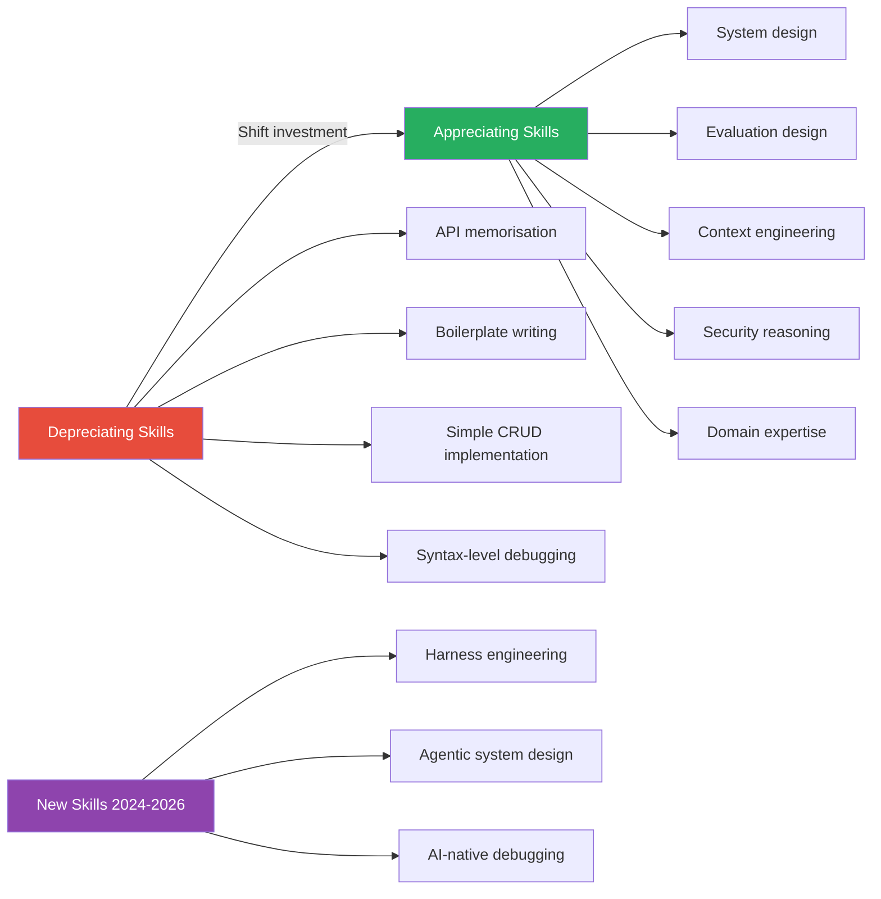

Skill investment is a resource allocation problem. You have finite learning bandwidth, and different skills have different depreciation rates in an environment where AI tools are compressing the value of routine implementation work. Getting this wrong means spending the next two years practising skills that have declining market value while the high-leverage skills become concentrated in a smaller group of engineers who saw the shift coming.

This isn't a "will AI replace developers?" post. It's a practical view of which parts of the engineering skill stack are currently depreciating, which are appreciating, and what genuinely new skills have emerged in the past two years that didn't exist at all before.

## What's Depreciating

Being honest about this is uncomfortable because these are skills engineers spent years building. But depreciation doesn't mean worthless — it means the marginal value of improvement is declining.

**Memorising APIs and library interfaces.** GitHub Copilot, Claude Code, and Cursor have near-perfect recall of standard library APIs. The value of having lodash or pandas APIs memorised has dropped to near zero. What still matters: understanding what the right tool is for a problem, not remembering its exact syntax.

**Boilerplate and scaffolding.** CRUD endpoints, data access layers, standard authentication flows, ORM model definitions — AI tools generate these reliably and faster than most humans type. Engineers who spent time optimising boilerplate velocity are not getting that time back through improved efficiency. Invest differently.

**Simple CRUD implementation.** Not complex data access with nuanced performance requirements or intricate business logic — simple create-read-update-delete across clean schemas. AI handles this well. The human value in this space is now reviewing and approving, not authoring.

**Syntax-level debugging.** Missing semicolons, type mismatches, undefined variables, import errors — these are mostly being handled by AI-assisted editors before they become debugging sessions. The debugging skills that are appreciating are at the logic and architecture level, not the syntax level.

## What's Appreciating

**System design.** As AI tools handle more implementation, the leverage moves up the stack to architecture decisions. Choosing the right data model, designing the right service boundaries, understanding the failure modes of distributed systems — these require context and judgment that AI tools assist with but don't replace. The gap between engineers who can design systems well and those who can't is widening.

**Evaluation design.** This is the skill that's most undervalued right now. Building robust evals — test sets, metrics, human review frameworks — for AI systems is hard, requires domain knowledge and statistical thinking, and is poorly covered by most AI engineering curricula. If you're working with AI systems and you're not investing in eval skills, you're building blind.

**Context engineering.** The ability to structure information for AI consumption — what to include, what to omit, how to format it, how to decompose complex problems into AI-tractable subtasks — is a genuine engineering skill. It has different properties than prompt writing for one-shot tasks. It requires understanding how models process context, how attention patterns affect retrieval, and how task decomposition affects output quality.

**Security reasoning.** As AI tools generate more code, more code is generated by systems that don't have security intuitions baked in. AI models can generate code with subtle security flaws — SSRF vulnerabilities, SQL injection in unusual contexts, improper secret handling — that look correct on casual review. The engineers who can recognise these patterns at review speed, and who understand AI-specific attack surfaces like prompt injection and model supply chain risks, are increasingly hard to find and increasingly valuable.

**Domain expertise.** This appreciates as general implementation skills commoditise. An engineer who deeply understands healthcare data regulations, financial reconciliation logic, or the operational constraints of real-time ML infrastructure brings context that no model has access to without being told. Domain expertise is the asset that makes your prompts, your reviews, and your architectural judgments better than those of a generalist.

## New Skills That Didn't Exist Two Years Ago

**Harness engineering.** Designing the control layer for AI agents — the system that decides what tools an agent can access, when it needs human approval, how it recovers from errors, how its actions are logged and auditable — is a new engineering discipline. It's not just software engineering applied to AI; it requires reasoning about trust boundaries, failure modes specific to LLM-based systems, and the operational properties of non-deterministic components in production systems.

**Agentic system design.** Designing multi-agent workflows — which agents coordinate with which, how they share context, how they handle partial failures, how you test them — is architecturally different from designing traditional software. The coupling patterns are different. The failure modes are different. The testing strategies are different. This is a skill that's being invented in real time.

**AI-native debugging.** When AI tools generate code and AI agents execute workflows, debugging changes character. You're now debugging: why did the model generate this? Why did the agent take that action? Did the context I provided cause this output? Is this a model reliability issue or an eval issue? The tools and mental models for this are different from traditional debugging.

## Learning Investment Priorities

If you have 5 hours a week to invest in new skills, here's a rough allocation for an engineer in 2026:

| Skill area | Allocation | Why |
|------------|-----------|-----|
| System design depth | 2h | Highest leverage, compound returns |
| Evaluation design | 1h | Underinvested by most, high ceiling |
| Security + AI attack surfaces | 1h | Growing exposure, limited talent pool |
| Domain expertise (your vertical) | 1h | Differentiator that AI can't replace |

Context engineering and harness engineering you'll build through practice faster than through study. Do projects, not tutorials.

---

The engineers who will have the most leverage in 2027 are not the ones who can generate the most code with AI tools — the tools themselves are getting better at that. They're the ones who design systems that are worth building, evaluate whether AI is actually achieving the goal, reason about security at the margins AI tools miss, and bring domain context that no model can invent. These skills compound differently than implementation skills did. Invest accordingly.
