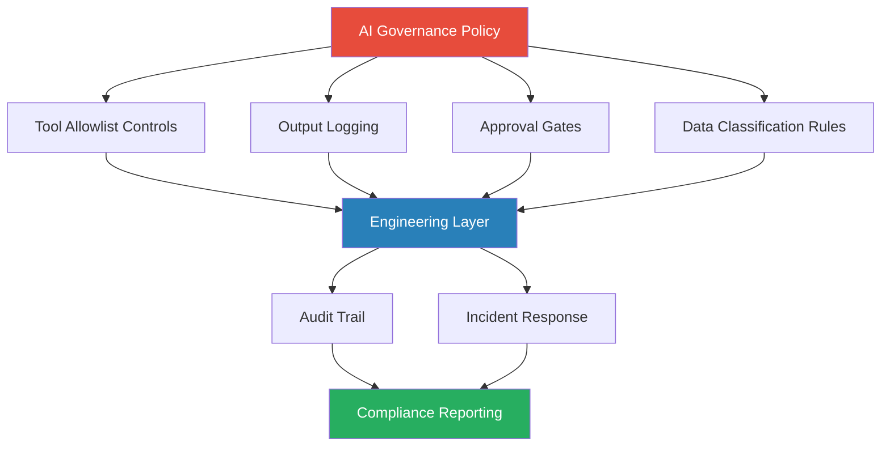

Most large organisations now have an AI governance policy. It was written by a committee that included legal, compliance, and one or two technology leads. It says sensible things about data classification, approved tools, output review requirements, and prohibited uses. It exists as a PDF on the intranet and is referenced in onboarding.

The problem is the gap between the policy document and what actually happens when an engineer opens Claude Code or Copilot to work on a feature. The policy doesn't run. Engineers don't consult it mid-sprint. Governance, at that level of abstraction, is inert.

Effective AI governance at engineering scale means the controls are embedded in the workflow — visible, low-friction, and producing the audit data that compliance actually needs.



## The Governance Gap

The gap between policy and implementation has two root causes.

First, policies are written at the wrong level of specificity. "Engineers must review AI-generated code before committing" is a policy statement. It doesn't tell a team lead how to structure the review process, what evidence to produce, or what counts as adequate review for different risk levels. Engineers fill the gap with their own judgment, which produces inconsistent behaviour.

Second, compliance verification is too manual. If the only way to know whether engineers are following AI use policies is to ask them in a survey or wait for an incident, the governance exists in name only. Controls that depend on human memory and self-reporting at scale don't work.

## Practical Controls Engineers Can Implement

**Tool allowlists.** Define which AI tools are approved for which data classifications, and enforce this technically rather than through policy. In practice, this means:

- Approved tools list in your development environment configuration
- IDE policy enforcement where available (Copilot Business and Enterprise support organisation-level tool controls)
- Network-level controls for unapproved AI services if required by your data classification
- A clear, fast process to request approval for new tools — if the approval process is slow, engineers route around it

The allowlist isn't about restricting tool access arbitrarily. It's about ensuring that when you process customer data with an AI tool, you know which tool that is and you've verified its data handling commitments.

**Output logging.** For AI systems in production — not AI-assisted development, but AI that processes live data — log inputs, outputs, model version, and timestamp. This is table stakes for incident response. When something goes wrong, "the AI did it" is not an adequate incident summary for a post-mortem or a regulator.

```python
# Minimal AI output logging pattern
import anthropic
import logging
import hashlib

logger = logging.getLogger("ai_audit")

def logged_completion(prompt: str, model: str, context_id: str) -> str:
    client = anthropic.Anthropic()
    response = client.messages.create(
        model=model,
        max_tokens=1024,
        messages=[{"role": "user", "content": prompt}]
    )
    output = response.content[0].text

    logger.info({
        "event": "ai_completion",
        "context_id": context_id,
        "model": model,
        "input_hash": hashlib.sha256(prompt.encode()).hexdigest(),
        "output_hash": hashlib.sha256(output.encode()).hexdigest(),
        "tokens_used": response.usage.input_tokens + response.usage.output_tokens,
        "timestamp": response.id,  # use your timestamp source
    })

    return output
```

Note: log hashes of inputs where inputs may contain sensitive data, not the raw content. Full input logging on sensitive data may itself be a compliance issue.

**Approval gates.** For AI agents with consequential write access — deploying code, modifying database records, sending communications — implement human-in-the-loop approval gates before actions execute. This is not about distrusting the AI; it's about maintaining a clear accountability structure for decisions that have real-world effects.

Gate design: the approval should require the approver to actively confirm they've reviewed the proposed action, not just click "OK" on a notification. The approval event should be logged with the approver's identity. Approval velocity should be tracked — if approvals are happening in under 5 seconds consistently, it suggests rubber-stamping rather than genuine review.

## What Compliance Teams Actually Need from Engineering

Compliance needs audit trails, not assurances. "We use AI responsibly" is not a useful input for an audit. What is:

- Which AI tools processed which data, when
- Which AI-generated outputs were reviewed, by whom, and what review was performed
- What model versions were in production for each time period
- Whether AI outputs that affected business decisions are retrievable and attributable

These requirements map directly to implementation tasks:
- Model version pinning and tracking (not just "Claude" but which Claude, at what point)
- Retention policies for AI output logs
- Reviewer identity capture in code review tools
- Change management records that attribute AI-assisted vs. human-written components

If your engineering team can produce these artefacts, compliance conversations become specific. If you can't, every audit is a negotiation about what "adequate AI governance" means, which is slow and expensive.

## Making Governance Frictionless Enough to Follow

Engineers will route around governance controls that add significant friction to routine work. This is not malice — it's the path of least resistance under deadline pressure. Governance design has to account for this.

The friction budget is low. A control that adds more than 15-20 seconds to routine tasks will be bypassed. Controls that require context switching — opening a separate tool, filing a form, waiting for approval — have high bypass rates unless enforced technically.

Design for the common case. The 80% of AI tool use that involves standard development tasks in non-sensitive contexts should require near-zero additional action. Reserve the friction for the 20% of cases that genuinely need it: production systems, sensitive data, consequential automated actions.

Use defaults intelligently. If your preferred logging behaviour, tool choice, and data handling approach are the defaults in your development tooling, engineers don't have to make a conscious choice to comply — they do it by default.

## The Governance Stack

From policy to code:

| Layer | Owner | What it does |
|-------|-------|-------------|
| Policy | Legal / Compliance | Defines permitted uses, data handling requirements, accountability structure |
| Standards | Engineering leadership | Translates policy into specific technical requirements |
| Controls | Platform / DevEx teams | Technical enforcement of standards (allowlists, gates, logging) |
| Tooling | Individual teams | Day-to-day tools configured to implement controls by default |
| Audit | Compliance + Engineering | Verifies controls are working, reviews metrics, handles exceptions |

Each layer depends on the one above it being clear. Policy without standards produces inconsistent controls. Standards without technical controls produce inconsistent compliance.

## Metrics for Governance Effectiveness

What to track:
- **Control coverage**: what percentage of AI tool use is subject to the controls you've defined
- **Bypass rate**: how often are controls circumvented, and for what reasons
- **Audit trail completeness**: what fraction of AI-assisted decisions can be reconstructed from logs
- **Time to approval for gate-controlled actions**: is it long enough to indicate genuine review?
- **Incident rate**: AI-related incidents per sprint, trending over time

These metrics have to come from instrumentation, not surveys.

---

AI governance that exists only at the policy level is a liability, not a control. The gap between policy and workflow is where incidents happen and where audits find problems. The engineering team's job is to close that gap with specific, low-friction, technically-enforced controls that produce the audit trail compliance needs without making AI use so burdensome that engineers route around it. That's a real engineering problem, and it has engineering solutions — it's just not as interesting as building features, which is why it doesn't happen by default.
