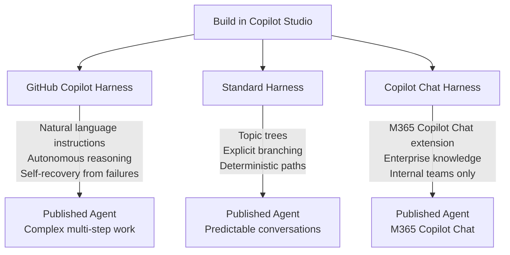

The naming is genuinely confusing. When Microsoft announced the "GitHub Copilot harness" going generally available on August 3, 2026, a lot of engineers assumed it was something to do with GitHub Copilot — the IDE code completion tool — or GitHub Copilot Extensions, or Copilot Workspace. It's none of those. The GitHub Copilot harness is a runtime inside **Microsoft Copilot Studio** (`copilotstudio.microsoft.com`). It's a fundamentally different execution engine for agents you build there, and it changes how those agents reason, recover from failures, and bill you.

The name comes from its technical heritage: it's built on the same underlying runtime technology as GitHub Copilot. That's where the name stops being relevant to what you actually build with it.

---

## The Three Harnesses

Every agent you create in Copilot Studio runs on exactly one harness. You choose at creation time — there is no migration path after. This is an architectural decision, not a configuration setting.

| Harness | Best for | How it reasons |
|---|---|---|
| **GitHub Copilot harness** | Complex multi-step business processes | Reasons through goals autonomously, retries and recovers from failures |
| **Standard harness** | Rule-based, predictable conversations | Follows explicit topics and branches you define |
| **Copilot chat harness** | Extending M365 Copilot Chat with org knowledge | Internal teams only, connects enterprise content |

The standard harness is what Copilot Studio has been since Power Virtual Agents. You build a topic tree. The agent follows it. If a user says something unexpected, the agent falls back to a configured catch-all. This is fine for Help Desk FAQ bots, guided product selectors, anything where the conversation path is well-understood and bounded.

The GitHub Copilot harness operates entirely differently. Instead of a topic tree, you write natural language instructions describing what the agent should do. The runtime reasons through the user's goal, decides which tools and knowledge to call, retries when a step fails, and continues working through a multi-step process without you explicitly defining each branch.

The practical implication: if your agent needs to read from three different systems, aggregate results, make a decision, and then write to a fourth system — and any of those steps might fail and need to be retried — the GitHub Copilot harness handles that without you building explicit retry logic. The standard harness requires you to author every path, including every failure path.

---

## Why "Autonomous Reasoning" Is Meaningful Here

The standard harness treats each user turn as a trigger for a topic. The agent executes the topic logic and responds. Then it waits.

The GitHub Copilot harness treats the user message as a goal. It reasons about what needs to happen to satisfy that goal. This includes:

- **Multi-step planning**: "To answer this question I need to call system A, then use that result to query system B."
- **Recovery from failures**: If a tool call fails, the runtime can retry, try an alternative, or gracefully degrade — without requiring you to author the failure branch explicitly.
- **Deferred action**: The agent can determine that it needs to take an intermediate step, do it, and continue — rather than asking the user to wait while you complete an explicit flow.

This is not magic. The runtime still has limitations. It can hallucinate tool selection. It can get stuck if your instructions are ambiguous. But for genuinely complex multi-step tasks — the kind where the standard harness requires 40 authored topics and a whiteboard full of routing logic — the GitHub Copilot harness reduces that authoring surface dramatically.

---

## The Billing Change You Need to Know

This is the part that catches teams off guard.

With the standard harness, billing is per session after you publish. You build and test for free; you pay when real users talk to the agent.

With the GitHub Copilot harness, **billing starts at build time**. Every interaction in Preview, every Evaluate test run, every test you run in the Build tab consumes Copilot Credits. Development and testing cost real money.

This changes how you scope development work. You cannot iterate casually. Test runs against a poorly-specified agent will burn credits just as fast as a well-specified one. The estimation tool at `microsoft.github.io/copilot-studio-estimator` exists for a reason — use it before starting development, not after your first billing cycle arrives.

Credit billing aside, the runtime is substantially more capable. For complex multi-step processes, the credit cost is often justified compared to the engineering hours required to author the equivalent logic in the standard harness.

---

## Who Should Actually Use This

The GitHub Copilot harness is the right choice when:

- The task requires reasoning across multiple systems
- The conversation path is not predictable in advance
- The agent needs to handle failures without explicit fallback topics
- You're building a process automation agent rather than a conversation routing bot

The standard harness remains the right choice when:

- The conversation flow is well-understood and bounded
- Predictability matters more than flexibility
- The cost of autonomous reasoning (credits, occasional misdirection) outweighs the authoring cost of explicit topics
- You're extending an existing standard harness agent and migration isn't worth rebuilding from scratch

The Copilot chat harness is a specific case: it's only for teams embedding agents into M365 Copilot Chat for internal knowledge access. If that's not your deployment target, don't consider it.

---

## There Is No Migration

This point deserves emphasis because it affects planning. Once you create an agent on the standard harness, it stays on the standard harness. There is no "convert to GitHub Copilot harness" button. If you determine later that you need the autonomous reasoning capabilities, you build a new agent from scratch.

This means the harness decision should happen before any authoring work begins. For existing standard harness agents that handle complex multi-step processes poorly, the upgrade path is: identify what the agent needs to do, create a new GitHub Copilot harness agent with natural language instructions, migrate the knowledge and tools over, validate in Evaluate, and deprecate the old agent.

That's a real migration effort. Account for it in your project planning rather than treating it as a toggle you can flip later.

---

## Practical Starting Point

If you're evaluating whether to build on the GitHub Copilot harness, start with a single well-scoped use case rather than converting your entire agent portfolio. Pick a workflow that requires at least three distinct system calls and has variable paths depending on what each call returns. Build that in the GitHub Copilot harness, measure credit consumption in Evaluate, and use that data to make the broader decision.

The GA announcement on August 3, 2026 (MC1446644) means the harness is no longer in preview — Microsoft considers it production-ready. The billing model and feature set are stable enough to build on without worrying about breaking changes in the next sprint.

The naming confusion will persist. Get comfortable explaining to stakeholders that the "GitHub Copilot harness" in Copilot Studio has nothing to do with GitHub Copilot in VS Code. They're different products, different contexts, different billing. The name is a heritage artifact, not a product relationship.
