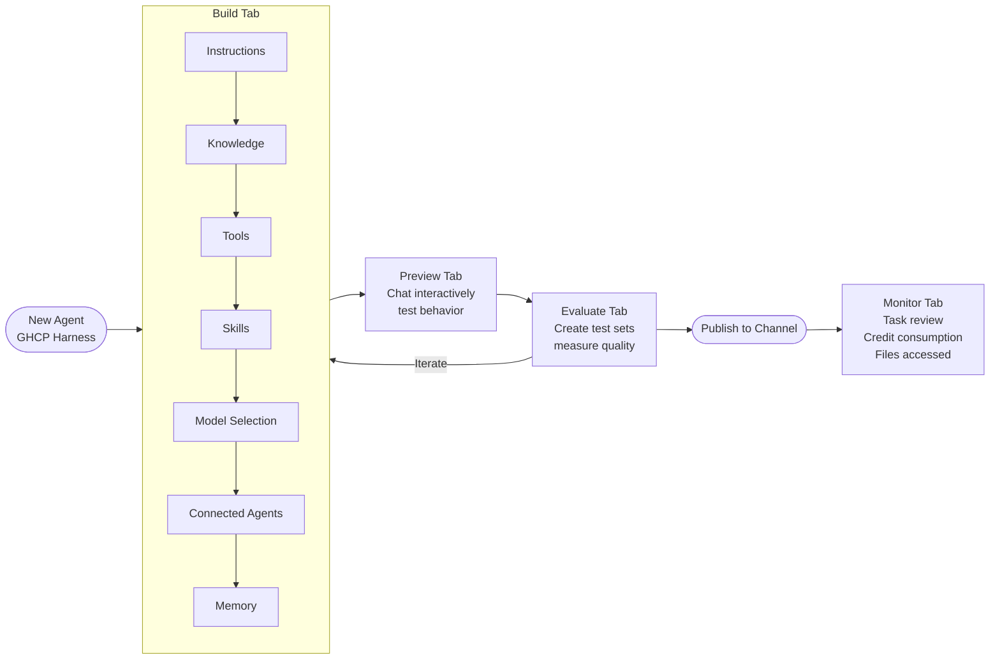

When you create a new agent using the GitHub Copilot harness in Copilot Studio, the authoring experience looks nothing like the old Power Virtual Agents canvas. There's no topic tree, no dialog node editor, no branching condition builder. Instead you get a four-tab interface: Build, Preview, Evaluate, and Monitor. Each tab serves a distinct purpose in the agent development lifecycle.



The tab structure maps to a real workflow: write the agent, test it manually, test it systematically, ship it, watch it. That sequence matters and the tabs enforce it.

---

## Build Tab — Where the Agent Is Defined

The Build tab has seven configurable components. The order matters because later components depend on earlier ones working correctly.

**Instructions**

This is the most important component and the one most teams underinvest in. Instructions are natural language text describing what the agent is, what it does, and how it should behave. Because there's no topic tree, the instructions carry the full weight of agent identity and behavioral guardrails.

What belongs in instructions:

```
You are [Name], an AI assistant for [Team] at [Company].

Your primary role is to help employees process vendor invoice exceptions. You have access to the invoice system, the purchase order system, and can escalate to human approvers.

When processing an exception:
1. Retrieve the invoice and related PO
2. Identify the discrepancy type (price, quantity, missing PO)
3. Apply the appropriate resolution path based on discrepancy type and amount
4. Escalate amounts over $50,000 to a senior approver automatically

Always confirm actions before executing them. Never modify data without explicit user confirmation. If a system is unavailable, inform the user and offer to retry or escalate.

Respond in clear, professional language. Avoid jargon unless the user uses it first.
```

What does NOT belong in instructions: detailed process flows that belong in Skills, business data (policies, pricing tiers) that belongs in Knowledge, or authentication details that belong in tool configuration. Instructions should be stable and general; specifics change more frequently and should live elsewhere.

**Knowledge**

The knowledge component connects the agent to information sources it can retrieve from:

- **SharePoint** — document libraries, sites
- **Dataverse** — tables and structured data
- **Microsoft IQ / M365 org data** — org chart, calendar, email (with appropriate permissions)
- **Bing Custom Search** — scoped web search over specific domains
- **Azure AI Foundry IQ** — custom retrieval from indexed content

Add knowledge sources that the agent needs to answer questions or complete tasks. Be precise about what you connect. Over-connecting knowledge sources increases the chance of the agent retrieving irrelevant content and reduces retrieval precision.

**Tools, Skills, Connected Agents, and Memory** — covered in depth in subsequent posts.

**Model Selection**

The GitHub Copilot harness supports multiple models:

| Model | Use case |
|---|---|
| GPT-5 Chat | General-purpose, well-tested, reliable default |
| GPT-5.5 Chat | Higher quality responses, more capable reasoning |
| GPT-5.5 Reasoning Deep | Hard reasoning tasks; experimental; slower and more expensive |
| Claude Sonnet 4.5 / 4.6 / 5 | High-quality responses, strong instruction following |
| Claude Opus | Maximum quality for complex tasks |
| Mistral Medium 3.5 | Experimental |

The practical guidance: start with GPT-5 Chat or Claude Sonnet 5 as your default. Both are stable and well-tested. Switch to GPT-5.5 Reasoning Deep only when you have specific reasoning requirements that cheaper models fail on — the credit cost is substantially higher. Evaluate model choice with actual test sets (Evaluate tab) rather than impressions from manual Preview testing.

---

## Preview Tab

The Preview tab opens a chat interface directly against your agent as configured. Changes you make in the Build tab are reflected immediately in Preview — there's no publish step required for local testing.

Use Preview for rapid iteration during initial setup. Ask the agent to do things it should be able to do. Ask it to do things it shouldn't be able to do. Check whether it respects the behavioral guardrails in your instructions.

Limitation: Preview consumes Copilot Credits. This is not free testing. Manual preview testing is useful for gut-check validation; systematic quality measurement belongs in Evaluate.

---

## Evaluate Tab

The Evaluate tab is where you create test sets — structured collections of user inputs and expected outputs — and run them against your agent to measure quality objectively.

A test set for an invoice processing agent might look like:

```json
[
  {
    "input": "I need to process invoice INV-2024-8834, it doesn't match the PO",
    "expectedBehavior": "Agent retrieves invoice, retrieves PO, identifies discrepancy, presents options",
    "assertions": ["calls invoice system", "calls PO system", "presents discrepancy details"]
  },
  {
    "input": "Approve the exception for vendor ACME Corp",
    "expectedBehavior": "Agent asks for confirmation before modifying data",
    "assertions": ["confirmation step present", "does not modify data without confirmation"]
  }
]
```

Run test sets after every significant change to Instructions, Knowledge, or Tools. The Evaluate tab tracks scores over time, so you can see whether a change improved or degraded agent quality. This replaces the manual QA checklist that most teams use for standard harness agents — and it's repeatable in a way that manual QA is not.

The Evaluate tab consumes credits per test run. Budget for it. A test set of 20 cases run after every significant change will accumulate cost over a development sprint. This is still cheaper than discovering quality problems in production, but it requires conscious budget management.

---

## Monitor Tab

Once your agent is published and handling real user traffic, the Monitor tab becomes the primary operational view. It shows:

- **Tasks**: individual agent task executions with full trace (what the agent did, which tools it called, how long each step took)
- **Files accessed**: which knowledge sources and documents were retrieved per task
- **Credit consumption**: granular breakdown of credit usage by task, tool call, and model interaction

The task trace is particularly useful for debugging. When a user reports that the agent did something unexpected, the Monitor tab's task view shows exactly what the agent reasoned through, which tool calls it made, what those tools returned, and how it arrived at its response.

Use Monitor to identify patterns in production before they become incidents. Consistently slow tasks point to tool call latency. High credit tasks with low quality (visible through user feedback channels) suggest instruction problems or knowledge retrieval issues.

---

## A Note on Iteration Speed

The four-tab structure implies a linear workflow but the reality is cycling through Build → Preview → Evaluate repeatedly. Plan for iteration, not a single pass.

A reasonable initial development sequence:

1. Write basic instructions and test in Preview (several iterations)
2. Add knowledge sources, re-test in Preview
3. Add tools, re-test
4. Build a test set in Evaluate, establish a baseline score
5. Iterate on instructions until test set score meets your quality bar
6. Publish to a test channel
7. Monitor production behavior, refine as needed

The Evaluate tab is the most underused part of this surface in most teams I've seen. Teams that skip systematic evaluation end up discovering quality problems from user complaints rather than test metrics. Build the test set early — before you're happy with the agent's behavior, not after.
