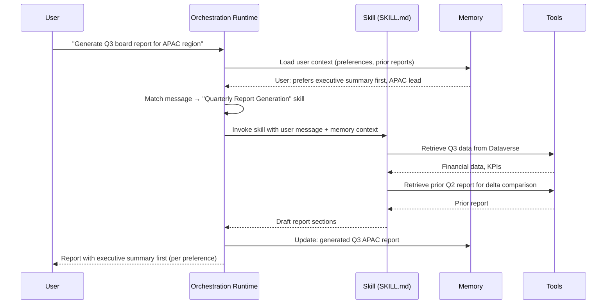

Two features of the GitHub Copilot harness that don't exist in the standard harness: Skills and Memory. They solve different problems — Skills are about modular capability authoring and reuse; Memory is about per-user persistent context across conversations. Understanding what each one does (and what it doesn't) changes how you structure agents for complex use cases.



---

## What Skills Actually Are

A Skill in the GitHub Copilot harness is a SKILL.md file. That's the core of it. The file has YAML front matter with `name` and `description` fields, followed by Markdown instructions describing what the skill does and how it should do it.

```markdown
---
name: quarterly-report-generation
description: Generates a quarterly business report from financial data and KPIs. Use when the user asks to generate, create, or draft a quarterly or periodic business report.
---

# Quarterly Report Generation

## Purpose
Generate a structured quarterly business report by retrieving financial data, comparing to prior quarter, and formatting for executive review.

## Process
1. Confirm the reporting period (quarter and year) and scope (region, team, business unit)
2. Retrieve financial actuals from Dataverse for the specified period
3. Retrieve prior period data for comparison
4. Calculate period-over-period deltas for key metrics
5. Structure the report: Executive Summary → KPI Dashboard → Revenue Analysis → Operational Highlights → Risks and Outlook
6. Present the draft and ask for review before finalizing

## Output Format
- Lead with a 3-sentence executive summary
- Use tables for numerical comparisons
- Flag items with >10% variance from prior period
- List action items separately at the end

## Guardrails
- Do not extrapolate beyond the data available
- Mark any missing data explicitly rather than estimating
- Request confirmation before generating the final version
```

Skills can also include supporting files — referenced templates, example outputs, supplementary instructions. The full package is exported as a `.zip` file (a "skill package") that can be imported into other agents.

The orchestration runtime decides when to invoke a skill based on the user's message and the skill's `description` field. If the description doesn't clearly describe the triggering condition, the skill will be invoked erratically. Write `description` as a precise trigger statement, not a summary of what the skill does.

---

## Skills vs. Instructions vs. Topics

These three concepts all describe agent behavior, and the boundaries between them confuse people coming from the standard harness.

**Instructions** (in the Build tab) describe the agent's identity, overall scope, and behavioral baseline. Instructions apply to every conversation. They're the constant.

**Skills** describe specific task behaviors that apply when a particular kind of task is requested. Skills are the variable — they activate when the orchestration runtime matches a user message to a skill's description.

**Topics** are a standard harness concept. They don't exist in the GitHub Copilot harness. If you're thinking about "when should I use a topic instead of a skill," you're mixing up harnesses.

The practical split:

- Put in Instructions: who the agent is, what it refuses to do, tone, escalation rules
- Put in Skills: specific multi-step tasks that are reusable, clearly bounded, and benefit from focused instructions

An agent for an accounts payable team might have 4-5 skills (invoice matching, PO lookup, exception routing, payment status check, vendor onboarding) and stable Instructions that apply to all of them.

---

## Skill Reuse and Packaging

The same skill can be added to multiple agents. This matters for teams managing multiple specialized agents that share common capabilities. Build the skill once, add it to every agent that needs it, update it in one place.

Export flow: author the skill in any Copilot Studio agent → export as `.md` (for sharing as readable documentation) or `.zip` (for importing into another agent). Import flow: Build tab → Skills → Add skill → Upload package.

This is entirely different from Azure Bot Service Skills, which was an older Microsoft concept involving separate bot deployments and protocol-level skill invocation. SKILL.md files have no relationship to that architecture. Don't let the shared word cause confusion.

---

## Memory: Per-User Persistent Context

Memory is a toggle in the Build tab. When enabled, the agent maintains persistent context per user across conversations.

What this means practically: if a user tells the agent their reporting region is APAC on Monday, the agent still knows that on Friday without the user repeating it. The agent stores facts from the conversation in a memory store keyed to the user's identity.

Critical design constraints:

- Memory is **per-user**. User A's memory is never accessible to User B. The runtime enforces this isolation — it's not a configuration setting you can accidentally misconfigure.
- Memory expires after **28 days of inactivity**. Long-running projects that pause for a month will lose accumulated context.
- Users can **view, update, and delete** their own memories in the chat interface. Users have full control.
- **Makers cannot view end users' memories**. You cannot inspect what the agent has learned about specific users. This is a privacy design decision, not a technical limitation.
- Memory is **disabled in group chats** and Teams channels. It only functions in 1:1 conversation contexts.

---

## What NOT to Put in Memory

Memory is for contextual facts that persist legitimately: user preferences, role, region, common project context, communication preferences. It is not a general-purpose data store.

Do not put in memory:

- Authentication tokens or session credentials
- Sensitive personal data beyond what's strictly necessary for personalization
- Data that needs to be revocable (you can't selectively clear a specific memory fact server-side — users clear their own)
- Real-time data (account balances, live ticket status) — memory is for persistent context, not current state

A practical test: if the information would still be useful and accurate in 3 weeks, it's a candidate for memory. If it changes daily or needs to be controlled by the organization rather than the user, don't rely on memory for it.

---

## Skills and Memory Working Together

The combination of skills and memory lets you build agents that feel contextually aware across sessions while keeping specific task logic modular and maintainable.

Consider an agent where:

- The agent's Instructions define that it serves the finance team and should adapt to user-specified preferences
- Memory stores each user's preferred report format, their team, and their manager
- A "quarterly-report-generation" skill is invoked when the user asks for a report
- When the skill runs, the orchestration runtime provides it with the user's memory context automatically

The skill gets the user's stored preferences without the user restating them. The Instructions don't need to account for every user variant. The skill focuses on the task logic. Memory handles the personalization layer.

This separation is the architectural pattern that makes the GitHub Copilot harness worth the investment for complex agents. Each component does one thing. They compose cleanly. The alternative in the standard harness is topic-level variables that reset per session, or custom solutions using external data stores — significantly more engineering work for the same user experience outcome.
