Every tool you add to a GitHub Copilot harness agent falls into one of three categories: connectors, MCP servers, or workflows. Each serves a different integration pattern, and choosing the wrong one for a given integration creates maintenance problems later. Here's how to make that decision before you build, not after.

```mermaid
flowchart TD
    U[User Request] --> OR[Orchestration Runtime]
    OR --> TD{Tool Type Decision}

    TD -->|Well-known stable service\nwith prebuilt connector| C[Connector]
    TD -->|API that changes frequently\nor MCP-native service| M[MCP Server]
    TD -->|Deterministic multi-step\noperation with AI nodes| W[Workflow]

    C --> |"SharePoint\nSalesforce\nServiceNow\nSAP\nAzure DevOps"| ES1[External System]
    M --> |"GitHub\nDataverse\nOutlook\nWindows 365\nCustom APIs"| ES2[External System]
    W --> |"AI nodes\nAgent handoffs\nAsync ops"| ES3[External / Internal System]

    ES1 --> R[Response to Agent]
    ES2 --> R
    ES3 --> R
    R --> OR
    OR --> Ans[Answer to User]
```



---

## Connectors: When Prebuilt Wins

Connectors are Power Platform connectors surfaced in the Copilot Studio Build tab. There are hundreds of prebuilt connectors covering the major enterprise SaaS platforms: SharePoint, Outlook, Salesforce, ServiceNow, SAP, Azure DevOps, Dynamics 365, and many others.

If your integration target has a prebuilt connector and the connector supports the operations you need, use it. The maintenance burden is zero — Microsoft keeps the connector current. You configure authentication once and get access to all the connector's actions.

Custom connectors extend this to internal systems. You provide an OpenAPI 2.0 or 3.0 spec, configure authentication, and Power Platform exposes the API as a connector with the same authoring experience as prebuilt ones. Every agent and flow in your environment can use it.

When connectors are the right choice:
- The service is well-known and stable (API won't change frequently)
- The operation you need exists in the connector's action set
- Low-code makers (not just pro-code engineers) need to configure the integration

When connectors are the wrong choice:
- The upstream API changes frequently and you'd constantly be rebuilding the connector
- The integration requires streaming responses, binary data, or complex auth flows the connector model doesn't support
- The service is already publishing an MCP server

---

## MCP Servers: Dynamic Integration with Automatic Refresh

MCP server integration is what makes the GitHub Copilot harness genuinely interesting for teams already working with the Model Context Protocol.

When you connect an MCP server to an agent in Copilot Studio, every tool and resource the server publishes becomes immediately available to the agent. When the MCP server updates — new tools, changed tool schemas, deprecated capabilities — Copilot Studio reflects those changes dynamically. **You do not need to republish the agent.** The runtime picks up server changes on the next agent interaction.

This is the key operational difference versus connectors. A connector is a static snapshot of an API. An MCP server is a live connection that stays current with the server.

Microsoft ships prebuilt MCP connectors for several first-party services:

- **Outlook** — calendar and email actions
- **Dataverse** — structured data read/write
- **GitHub** — repository operations, issues, PRs
- **Windows 365 for Agents** (GA June 2026) — cloud PC provisioning and management
- **Salesforce** — CRM data and actions
- **JIRA** — issue tracking

These prebuilt connectors work out of the box. For custom MCP servers, the deployment pattern involves Azure Container Apps with a specific Swagger extension.

**Custom MCP Server Setup**

Deploy your MCP server to Azure Container Apps and add the `x-ms-agentic-protocol` header to its OpenAPI/Swagger definition:

```yaml
# swagger.yaml excerpt for custom MCP server
openapi: "2.0"
info:
  title: "Inventory Management MCP Server"
  description: "MCP server for real-time inventory operations"
  version: "1.0.0"
x-ms-agentic-protocol: mcp-streamable-1.0
host: "inventory-mcp.yourdomain.azurecontainerapps.io"
basePath: "/"
schemes:
  - "https"
securityDefinitions:
  oauth2:
    type: "oauth2"
    flow: "clientCredentials"
    tokenUrl: "https://login.microsoftonline.com/{tenant}/oauth2/v2.0/token"
    scopes:
      inventory.read: "Read inventory data"
      inventory.write: "Modify inventory records"
paths:
  /tools/check-stock:
    post:
      operationId: "check-stock"
      summary: "Check current stock levels for a product or SKU"
      parameters:
        - name: body
          in: body
          schema:
            type: object
            properties:
              sku:
                type: string
              warehouse:
                type: string
      responses:
        "200":
          description: "Stock level data"
```

The `x-ms-agentic-protocol: mcp-streamable-1.0` extension tells Copilot Studio to treat this connector as an MCP server. Once registered as a custom connector in Power Platform, you add it to your agent via the Tools tab.

Use MCP when your upstream API changes frequently. The dynamic refresh means you don't have a static connector definition that becomes stale every time the upstream team ships a new endpoint.

---

## Workflows: Deterministic Multi-Step Operations

Workflows in the GitHub Copilot harness are built in Copilot Studio's new flow designer — **not Power Automate**. This is a new tool. The flow designer in Copilot Studio supports native AI nodes, agent handoffs, and async response handling that Power Automate doesn't.

The defining characteristic of workflows is determinism: same input, same output, every time. The orchestration runtime uses workflows for process steps that need to be reliable and auditable — where autonomous reasoning is the wrong tool because the step must always execute the same way.

AI nodes available in workflows:

```
Workflow Node Types:
├── Standard actions
│   ├── HTTP request
│   ├── Data transformation
│   ├── Condition branching
│   └── Loop operations
└── AI nodes
    ├── Agent node (invoke another Copilot Studio agent)
    ├── M365 Copilot node (invoke M365 Copilot Chat)
    └── Prompt node (invoke LLM for a specific sub-task)
```

Async response support is important for enterprise operations. Many business processes take longer than two minutes — document processing, batch database operations, approval chains. Workflows support async responses: the agent acknowledges the request, runs the workflow in the background, and notifies the user when complete. This is not available in standard Power Automate flows triggered from the old harness.

When to use a workflow instead of just letting the orchestration runtime handle a task:

- The operation must execute identically every time (compliance requirement, financial transaction)
- The operation takes longer than a typical synchronous response window
- The operation involves handoffs to other agents or M365 Copilot
- The step sequence is fixed and should not vary based on LLM reasoning

When NOT to use a workflow:

- When the task logic is genuinely dynamic and benefits from autonomous reasoning
- When authoring the full deterministic flow is more work than the problem justifies

---

## The Decision Framework

The tool type decision comes down to three questions:

1. **Does a prebuilt connector exist and cover what I need?** If yes, use the connector. Stop there.

2. **Does the upstream API change frequently or is it already MCP-native?** If yes, use an MCP server.

3. **Does this step need to be deterministic, auditable, or longer than a synchronous response timeout?** If yes, use a workflow.

Most agents will use a combination. An invoice processing agent might use a SharePoint connector for document retrieval, an MCP server for a vendor management API that updates frequently, and a workflow for the approval submission step that must execute identically every time and may take several minutes to complete.

The wrong combination creates maintenance problems that compound. A connector built on a rapidly-changing API needs constant rebuilding. Autonomous reasoning applied to a step that must be deterministic creates compliance risks. Make the tool type decision deliberately, not by default.
