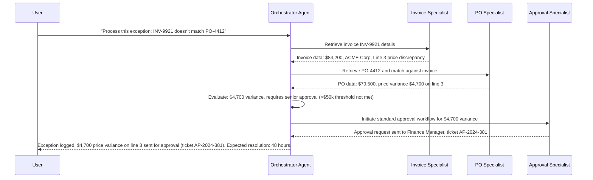

Connected agents in Copilot Studio went generally available in April 2026. The mechanism is the A2A (agent-to-agent) protocol: an orchestrator agent delegates specific requests to specialist agents, receives their results, and synthesizes a response. This sounds elegant in a diagram and adds real operational complexity in production. Before you build a multi-agent system, the first question should be whether you actually need one.



---

## What Connected Agents Actually Are

An orchestrator agent is a GitHub Copilot harness agent that has other agents listed in its Connected Agents configuration. When the orchestrator determines that a user request requires specialist capability, it delegates to a specialist via A2A. The specialist agent runs, returns its result, and the orchestrator continues processing.

Connected agents work:
- Within the same Power Platform environment
- To Microsoft Fabric data agents (for analytical queries against Fabric-managed data)
- Potentially to external sources (the A2A protocol is designed for interoperability)

The pattern is: the orchestrator handles conversation management, intent routing, and response synthesis. Specialist agents handle domain-specific tasks with their own tools, knowledge sources, and instructions.

A concrete example from Microsoft's documentation is an accounts payable agent: the orchestrator reads invoices and purchase orders, matches them, identifies exceptions, and routes them. When an exception needs routing through an approval workflow, it hands off to an approval specialist. When a vendor query comes in, it routes to a vendor data specialist. Each specialist has exactly the tools and knowledge it needs for its domain — nothing more.

---

## When to Build Multi-Agent vs. Single Agent

The honest answer is: most agents don't need multi-agent architecture.

Multi-agent systems are worth the complexity when:

- **Specialists genuinely need different toolsets**. If your specialist needs access to systems the orchestrator shouldn't have, separate agents provide clean authorization boundaries. Each agent's Entra ID (more on this in tomorrow's post) has its own API permissions — a specialist that only reads vendor data shouldn't have write access to the payment system.

- **Domain complexity justifies separation**. If the specialist's task is complex enough to warrant its own Instructions, Skills, and evaluation test set, it probably warrants its own agent.

- **Teams have clear domain ownership**. When separate teams own separate domains (finance, HR, procurement), separate agents map cleanly to team ownership. Each team authors and evaluates their specialist independently.

Multi-agent architecture is NOT worth it when:

- A single well-scoped agent with multiple tools can handle the full task
- The "specialists" would share all the same tools and knowledge anyway
- You're adding agents to look more sophisticated, not to solve an actual partitioning problem
- Credits are a concern (each agent interaction bills separately; a delegation chain across three agents costs three times the single-agent interaction)

The accounts payable example is a good one specifically because it has legitimately distinct domains: invoice data requires different system access than vendor master data, which requires different access than approval workflow management. That separation is real. For a simpler use case — a customer service agent that handles returns, order status, and billing questions — separate specialists likely just add latency and cost without meaningful benefit.

---

## What Goes in the Orchestrator vs. Specialists

This is where teams get confused during architecture design. A useful heuristic:

**Orchestrator Instructions should cover:**
- Overall agent identity and user-facing persona
- How to determine which specialist to delegate to
- How to handle cases where no specialist is appropriate
- Response synthesis and formatting rules
- Escalation to human agents

**Specialist Instructions should cover:**
- The specific domain task the specialist handles
- Domain-specific guardrails (a payment specialist shouldn't discuss anything outside payment operations)
- What to return to the orchestrator and in what format

The orchestrator should not duplicate the specialist's domain logic. If the orchestrator's instructions contain the same vendor data rules as the vendor specialist, you have a coherence problem: the two will eventually diverge.

---

## Adding a Connected Agent in the Build Tab

In the orchestrator agent's Build tab, navigate to Connected Agents and add a specialist agent from your environment. The orchestrator's instructions need to describe when to delegate:

```
When the user asks about invoice discrepancies, matching, or exception details, 
delegate to the Invoice Specialist agent.

When the user requests approval routing or needs to submit an exception for review, 
delegate to the Approval Specialist agent.

If a query involves vendor master data, payment terms, or vendor contact information, 
delegate to the Vendor Data Specialist agent.

Do not attempt to handle these domains directly. Always delegate to the appropriate specialist.
```

The orchestrator needs to know which specialist to invoke for which scenarios. If the routing logic is ambiguous in the instructions, the orchestrator will make inconsistent routing decisions.

---

## Failure Handling When Specialists Are Unavailable

This is the part that doesn't appear in the GA announcement blog post but matters immediately in production.

When a specialist agent is unavailable or returns an error, the orchestrator receives a failure signal. The orchestrator's instructions need to define what to do with that failure:

```
If the Invoice Specialist is unavailable:
- Inform the user that invoice lookup is temporarily unavailable
- Offer to retry in 5 minutes or escalate to the accounts payable team directly
- Do not attempt to retrieve invoice data through other means

Do not present partial results from a failed delegation as complete results.
```

Without explicit failure handling in the orchestrator's instructions, the orchestrator will either attempt to handle the task itself (often incorrectly) or surface a technical error to the user.

Test your failure scenarios in Evaluate before going to production. Remove a specialist from the connected agents configuration, run your test set, verify the orchestrator degrades gracefully.

---

## Fabric Data Agents

One specific multi-agent pattern worth highlighting: connecting to Microsoft Fabric data agents. These are agents that run against Fabric-managed datasets and can answer analytical queries ("What was the total invoice volume for Q3 by vendor category?").

Adding a Fabric data agent as a connected agent to your Copilot Studio orchestrator lets you combine conversational business process handling with analytical data queries — without loading all your analytical data into the orchestrator's knowledge sources. The Fabric data agent handles the query; the orchestrator handles the conversation.

This is a cleaner architecture than dumping warehouse data into SharePoint for knowledge retrieval. The Fabric agent is purpose-built for that query pattern; the Copilot Studio orchestrator is purpose-built for conversational process management.

---

## The Complexity Tradeoff Is Real

Multi-agent systems in Copilot Studio are a genuine architectural capability, not just a marketing slide. They also add testing surface, debugging complexity, and credit cost proportional to the depth of your delegation chains.

If you're evaluating whether to build multi-agent, work backwards from the problem: what partitioning of responsibility, tools, or team ownership makes this significantly better than a single well-designed agent? If you can't answer that clearly, start with a single agent and refactor when the reason for partitioning becomes obvious from production behavior.
