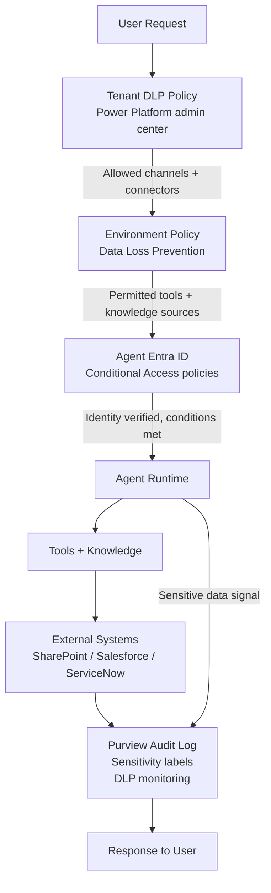

The governance story for Copilot Studio agents changed substantially in mid-2026. Before July, agents ran under shared or per-environment app registrations, and applying Conditional Access or auditing individual agent behavior meant working around the identity model rather than with it. With Microsoft Entra Agent IDs going generally available in July 2026, each Copilot Studio agent gets its own Entra service principal. That changes what's possible — and what IT and security teams should now be requiring before agents go to production.



---

## Entra Agent IDs: What Changed in July 2026

Prior to GA, Copilot Studio agents used Azure AD app registrations that were shared across agents or scoped to the environment, not the individual agent. This meant Conditional Access couldn't target a specific agent, audit trails mixed events from multiple agents, and identity governance (joiner/mover/leaver workflows) didn't apply to agents at all.

Entra Agent IDs fix this. Each Copilot Studio agent now gets its own Entra service principal with subtype "Agent." This is visible in the Entra admin center, queryable via Microsoft Graph, and subject to the same identity governance tooling you apply to human and workload identities.

What this unlocks in practice:

**Conditional Access enforcement** — Apply network, device, and risk-based conditions to agent requests. An agent accessing HR data can be restricted to operate only from corporate networks. A finance agent can require a compliant device for the calling user session. ID Protection risk signals (sign-in risk, user risk) can block an agent session if anomalous behavior is detected.

**API permissions per agent** — Each agent's Entra ID shows exactly which API permissions it holds, corresponding to the connectors it uses. An invoice processing agent should have read access to Dataverse and SharePoint and write access to the approval workflow API — visible, auditable, and revocable without touching other agents.

**Lifecycle management** — Agents are now first-class objects in Entra ID Governance. You can apply access review campaigns to agents, automatically disable or delete agents that aren't used for a specified period, and integrate agent lifecycle into your standard IAM processes.

**Agent-specific audit trails** — Sign-in logs and audit events are now per-agent, not per-environment. When something goes wrong, you can query the audit log for exactly what Agent A did, separate from Agent B, without filtering through shared events.

---

## Licensing and Quota Considerations

Entra Agent IDs require:

- **Microsoft 365 E5 or E7** + **Microsoft Agent 365 license** for full capability
- **Azure AD P1** for Conditional Access enforcement
- **Azure AD P2** for ID Protection monitoring

Every agent with an Entra Agent ID counts against your tenant's directory object quota. The default quota is 50,000 directory objects. Tenants with a verified domain get 300,000. For large organizations running dozens or hundreds of agents across multiple environments, this quota can become a real constraint. Factor it into your agent provisioning planning — especially for environments where makers can create agents freely.

Pre-July 2026 agents continue running on their existing app registrations. Microsoft has announced a migration path but it's not available yet at time of writing. Plan for it as future work, not current work.

---

## DLP Policies: Controlling What Agents Can Touch

Data Loss Prevention policies for Copilot Studio are managed in the Power Platform admin center, not in Microsoft Purview. This distinction matters — DLP for Copilot Studio operates at the Power Platform layer, before requests reach your external systems.

DLP policies let you allow or block:

- **Connectors** — Prevent specific agents from using certain connectors (block an external-facing customer service agent from accessing HR connectors)
- **Knowledge sources** — Control which knowledge source types are permitted per environment (block Bing Custom Search in sensitive data environments)
- **Channels** — Restrict which deployment channels are available (prevent agents from being published to external web channels without explicit approval)
- **Skills** — Control skill import and sharing within environments
- **HTTP requests** — Block agents from making arbitrary HTTP calls to unregistered endpoints

The "kill switch" for generative AI publishing is a DLP policy setting. Enterprise environments where content governance is strict should configure this explicitly rather than relying on individual agent publishers to make good decisions.

---

## Agent Inventory: Tenant-Wide Visibility

The agent inventory gives you a tenant-wide view of all Copilot Studio agents. It refreshes within 20 minutes of a change. Two query paths:

**Power Platform API:**
```
GET https://api.powerplatform.com/governance/agents?api-version=2024-06-01
```

**Azure Resource Graph:**
```kusto
resources
| where type == "microsoft.copilotstudio/agents"
| project name, location, resourceGroup, properties.status, properties.harness, properties.lastModified
| order by properties.lastModified desc
```

Important caveat: the agent inventory includes agents created with the GitHub Copilot harness and standard harness in the current generation. It does **not** include classic V1 Power Virtual Agents bots. If you're managing both PVA legacy bots and current Copilot Studio agents, you need separate inventory approaches for each.

Use the Azure Resource Graph query for automated governance reporting. Schedule it to run weekly and flag agents that have been published but show no activity in the Monitor tab (credit consumption = 0 for >30 days). Unused agents with live Entra identities and connector permissions are a governance risk — they represent attack surface without corresponding business value.

---

## Microsoft Purview Integration

Purview brings three governance capabilities to Copilot Studio agents:

**Sensitivity labels in responses** — When an agent retrieves content from SharePoint that has a sensitivity label applied, that label propagates to the agent's response. If the response synthesizes content from multiple sources, the highest-priority label wins. This is automatic for SharePoint knowledge sources with Purview integration enabled — no additional agent configuration required.

**DLP for AI interactions** — Purview DLP can monitor what users send to agents and warn or block when sensitive data types (credit card numbers, SSNs, PII categories) are detected in user input. This is separate from connector-level DLP — it operates at the conversation layer before any tool call is made.

**Customer Lockbox** — For organizations with Customer Lockbox requirements, Microsoft extends its existing Customer Lockbox capability to cover Copilot Studio agent sessions. Any Microsoft engineer access to session data requires your explicit approval.

**Insider Risk Management** — Agent interaction data flows into Insider Risk Management indicators if IRM is configured. Unusual patterns (bulk data retrieval through agents outside business hours, atypical knowledge source access) can trigger IRM signals.

---

## Practical Governance Checklist for Enterprise Rollout

This is the list I'd use before signing off on a production agent deployment:

```
Pre-production governance checklist:

Identity
[ ] Agent has Entra Agent ID (July 2026+ agents)
[ ] API permissions reviewed and scoped to minimum required access
[ ] Conditional Access policy applied appropriate to data sensitivity
[ ] Lifecycle review cadence defined (access review scheduled)

Data
[ ] DLP policy covers this agent's environment
[ ] Connector allowlist reviewed and documented
[ ] Knowledge sources appropriate for agent's deployment channel
[ ] Sensitivity label propagation tested if using SharePoint knowledge

Monitoring
[ ] Agent appears in tenant agent inventory
[ ] Purview audit logging confirmed active
[ ] Credit consumption baseline established
[ ] Monitor tab reviewed: first-week usage patterns checked

Compliance
[ ] Information barrier policies reviewed if agent spans org boundaries
[ ] Purview DLP for AI interactions configured
[ ] Customer Lockbox requirements documented
[ ] IRM integration verified if applicable
```

The governance tooling available in August 2026 is substantially more complete than it was a year ago. Entra Agent IDs in particular close the gap between "AI agent" and "managed workload identity" in a meaningful way. Use the tooling — it exists to make the conversation with security and compliance teams easier, not harder.
