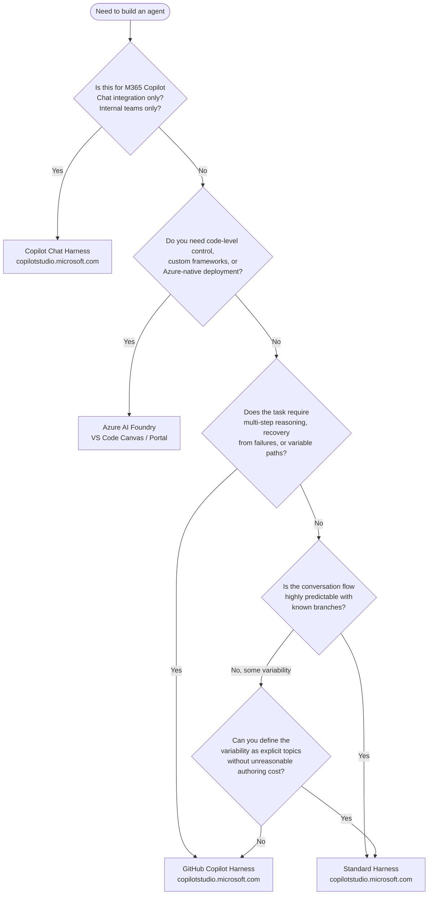

The harness choice is permanent. Once you create an agent on the GitHub Copilot harness, it stays on the GitHub Copilot harness. Same for the standard harness. There's no migration button, no "convert to" option. Getting this decision wrong costs you a full rebuild later.

After a week of covering the GitHub Copilot harness in detail, this post is the decision framework — the questions that lead you to the right answer for your specific use case, before you write a single line of instructions.

---

## The Four Options and What Separates Them

**GitHub Copilot harness** — The newest runtime in Copilot Studio. Natural language instructions, autonomous reasoning, self-recovery, Skills, Memory. Billing starts at build time. Best for: complex multi-step business processes where conversation paths aren't fully predictable.

**Standard harness** — The established Copilot Studio runtime. Topic trees, explicit branching, deterministic conversation flow. Billing after publish, per session. Best for: rule-based interactions where you know every significant path in advance.

**Copilot chat harness** — Purpose-built for extending M365 Copilot Chat with organization-specific knowledge and actions. Internal teams only. Not a general-purpose agent runtime. If you're not deploying into M365 Copilot Chat, stop reading about this option.

**Azure AI Foundry** — Not Copilot Studio at all. A separate Microsoft platform for building and hosting agents with full code control. Available as a VS Code Canvas extension (a GitHub Copilot App extension/plugin for building Azure AI Foundry hosted agents from within the IDE), a web portal, and SDK-level access. Supports LangGraph, Semantic Kernel, custom frameworks, fine-tuned models, Azure-native hosting with all the accompanying Azure observability and scale features.

---

## Decision Question 1: Is This M365 Copilot Chat Integration?

If yes — the agent will live inside M365 Copilot Chat, accessed by internal employees as an extension of their existing Copilot Chat experience — use the Copilot chat harness. It's designed for this integration and connects enterprise knowledge (SharePoint, Dataverse, email, calendar) to Copilot Chat in ways the other harnesses don't.

If no — move to the next question. The Copilot chat harness is not a general-purpose option.

---

## Decision Question 2: Do You Need Code-Level Control?

If you need:
- Custom agent framework (LangGraph, Semantic Kernel, CrewAI)
- Fine-tuned or custom-hosted models
- Full control over the prompt structure, not just instructions
- Azure-native deployment and hosting (Azure Kubernetes Service, Azure Container Apps with your deployment pipeline)
- Integration into a pro-code CI/CD process with unit tests, integration tests, deployment gates

…then the answer is Azure AI Foundry, not Copilot Studio at all.

Azure AI Foundry Canvas (the VS Code extension) is specifically for building Azure AI Foundry hosted agents from within the IDE. This is a GitHub Copilot App extension — so it works within the GitHub Copilot VS Code experience — but it connects to Azure AI Foundry infrastructure, not to Copilot Studio. These are genuinely separate products. If someone on your team conflates "GitHub Copilot harness in Copilot Studio" with "Azure AI Foundry Canvas in VS Code," correct it early.

Copilot Studio is a low-to-medium-code environment. The GitHub Copilot harness raises the ceiling, but the floor is still "makers writing natural language instructions, not engineers writing agent code." If your team needs code-level control, Copilot Studio will frustrate you and Azure AI Foundry is the right answer.

---

## Decision Question 3: Does the Task Require Autonomous Reasoning?

The GitHub Copilot harness is worth the additional complexity (and the build-time billing) when the task genuinely requires:

- Multi-step reasoning across variable paths
- Calling tools in a sequence that depends on previous results
- Recovering from partial failures without explicit fallback authoring
- Handling unpredictable user intents within a bounded domain

An accounts payable exception processing agent is a good fit. An agent that answers FAQs about employee benefits is not.

If you can sit down and map out the conversation flow as a topic tree in under an hour, the standard harness is likely sufficient. If the topic tree would require 30+ topics and still wouldn't cover the edge cases, the GitHub Copilot harness is worth considering.

---

## The Cost Comparison Is Real

| | GitHub Copilot Harness | Standard Harness |
|---|---|---|
| Billing start | At build time (preview, test, evaluate) | After publish |
| Billing unit | Copilot Credits | Copilot Credits |
| Test costs | Real money during development | Free until published |
| Per-session cost | Higher (autonomous reasoning = more inference) | Lower |
| Estimation tool | `microsoft.github.io/copilot-studio-estimator` | Same tool |

If your development team iterates heavily during the design phase — testing many different instructions configurations, running Evaluate test sets repeatedly — the build-time billing adds up. This doesn't make the GitHub Copilot harness wrong, but it changes the development economics. Front-load your design work. Get the instructions right conceptually before testing them against the live agent.

---

## Team Skill Requirements

| Platform | Who builds it |
|---|---|
| Copilot chat harness | Low-code makers, IT admins familiar with M365 |
| Standard harness | Low-code makers, business analysts with process mapping skills |
| GitHub Copilot harness | Low-code makers with strong natural language documentation skills; benefits significantly from engineering oversight on instructions and test set design |
| Azure AI Foundry | Software engineers; pro-code skills required |

The GitHub Copilot harness has a lower skill floor than Azure AI Foundry but rewards engineering-quality thinking applied to natural language. Bad instructions in the GitHub Copilot harness produce inconsistent autonomous behavior. Good instructions require the same precision as well-specified requirements documents — something engineers tend to be better at than "write a few sentences about what the agent should do."

---

## Decision Table for Your Team

| Use case characteristic | Recommended platform |
|---|---|
| M365 Copilot Chat extension, internal knowledge | Copilot chat harness |
| FAQ bot, guided help desk, known conversation paths | Standard harness |
| Multi-step business process, variable paths, recovery required | GitHub Copilot harness |
| Reusable capabilities across multiple agents (Skills) | GitHub Copilot harness |
| Per-user persistent context needed | GitHub Copilot harness |
| Code-level framework control required | Azure AI Foundry |
| Azure-native hosting and deployment pipeline | Azure AI Foundry |
| Fine-tuned or custom models | Azure AI Foundry |
| Team is primarily low-code makers | Standard harness or GitHub Copilot harness |
| Team is primarily pro-code engineers | Azure AI Foundry (consider Copilot Studio for specific scenarios) |

---

## When to Revisit the Decision

The harness decision is permanent for a given agent, but it's not permanent for your team's agent portfolio. Conditions that warrant building a new agent on a different harness:

- An existing standard harness agent has accumulated 40+ topics and is becoming unmaintainable — the authoring complexity has exceeded what explicit topic trees can handle well
- A GitHub Copilot harness agent is consuming far more credits than expected because autonomous reasoning is choosing expensive paths for simple requests — a standard harness agent would be cheaper and more predictable for that use case
- Your team's skills have shifted — more pro-code engineers joining means Azure AI Foundry becomes viable for use cases previously handled in Copilot Studio

The decision framework isn't a one-time exercise. Revisit it when you're adding a new agent, not when you're three months into building the wrong one.
