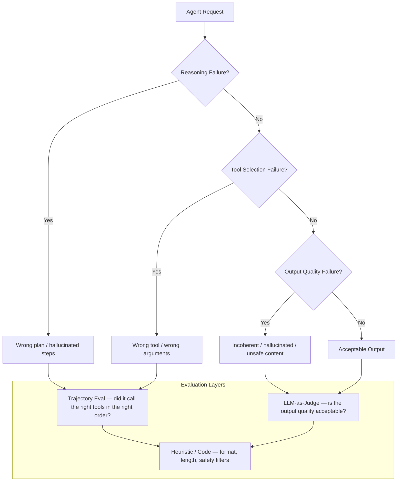
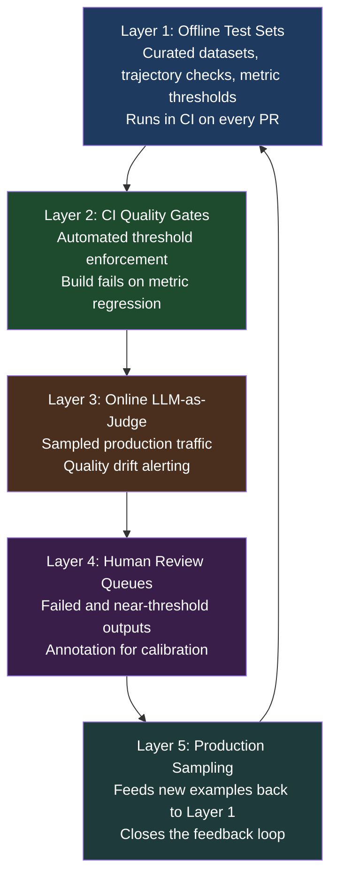

Eleven years of writing software, and I've never had a testing problem quite like this one. When you build an AI agent, you're building a system where the same input can produce meaningfully different outputs on consecutive runs, where failure can happen at step 4 of 7 and look like a success from the outside, and where "did it do the right thing" is a question that sometimes requires another AI to answer.

Traditional testing practices — unit tests, integration tests, assertions against expected outputs — break almost immediately when applied to agents. The failure isn't in the tools. It's in the mental model.



## Why Traditional Testing Breaks

**Non-determinism at the core.** A unit test for a function asserts that `f(x) == y`. An agent given the same prompt might pick a different tool, restructure its plan, or produce equivalent but textually different output on the next run. Testing for string equality is useless. Testing for semantic equivalence requires a judge — which is usually another model.

**Multi-step failure accumulation.** When an agent takes seven steps to complete a task and fails on step four, you need to know: was step four a bad tool call, a bad argument to a good tool, or a correct action on corrupted state from step two? The final output often gives you no signal. You need trace-level visibility across every intermediate step.

**Tool call evaluation.** Did the agent use the right tool? With the right arguments? In the right sequence? These questions sit entirely outside what traditional testing frameworks were built to answer. A test that only checks the final response misses the entire middle of the story.

**Latency variance.** P99 latency for an agent doing real work can be 10-20x P50. The same task with slightly different phrasing might trigger a longer chain of reasoning. Latency isn't just a performance metric — it's a signal about model behavior and plan complexity.

## Three Categories of What Goes Wrong

**Reasoning failures.** The agent builds a wrong plan, hallucinates a step, or misinterprets the task. The tool calls that follow may be individually valid but collectively useless. Detecting this requires evaluating the plan itself, not just its execution.

**Tool selection failures.** The agent picks the wrong tool, uses a valid tool with wrong arguments, or calls tools in the wrong sequence. This is the most agent-specific class of failure. It's detectable only if you capture tool call traces and compare them against expected behavior.

**Output quality failures.** The final response is incoherent, factually unsupported by context, unsafe, or just not useful. This is where traditional NLP metrics (BLEU, ROUGE) show their age — they measure token overlap, not answer quality. You need semantic metrics.

## Trajectory Evaluation

Trajectory evaluation compares the sequence of tool calls an agent actually made against an expected sequence. It's the most agent-specific class of metric, and nothing else captures it as cleanly.

Here's what a concrete trajectory comparison looks like:

```python
# Expected trajectory (defined in your test set)
expected_trajectory = [
    {"tool": "search_codebase", "args": {"query": "authentication middleware"}},
    {"tool": "read_file", "args": {"path": "src/auth/middleware.py"}},
    {"tool": "write_file", "args": {"path": "src/auth/middleware.py"}},
]

# Actual trajectory captured from agent execution
actual_trajectory = [
    {"tool": "search_codebase", "args": {"query": "auth middleware"}},
    {"tool": "read_file", "args": {"path": "src/auth/middleware.py"}},
    {"tool": "list_directory", "args": {"path": "src/auth/"}},  # extra step
    {"tool": "write_file", "args": {"path": "src/auth/middleware.py"}},
]

# Trajectory match types (from Google ADK conventions)
# exact_match: all steps, same order, same args
# in_order_match: all expected steps present in order (extras allowed)
# any_order_match: all expected steps present (order not required)
```

Exact match is often too strict — agents find valid alternative paths. `in_order_match` is usually the right starting point: your required tool calls happen, in the right sequence, with the right critical arguments.

## LLM-as-Judge

For output quality failures, you often need a model to evaluate another model's output. LLM-as-judge reduces the need for labeled ground truth at scale, but it comes with real limitations:

- **Judge model bias**: GPT-4o and Gemini have preferences for style, length, and phrasing that introduce systematic bias. A judge that consistently prefers longer responses will score your terse-but-correct agent lower than a verbose-but-sloppy one.
- **Calibration drift**: Judge behavior changes with new model versions. An eval that passes today on GPT-4o may fail tomorrow if the judge model updates.
- **Agreement with humans**: Measure judge-human agreement on a sample. If agreement is below 80%, the judge needs calibration or replacement with human annotation.

Use human annotation when: the stakes are high (safety-critical outputs), you're establishing baseline metrics for a new agent, or you suspect calibration drift. LLM-as-judge is a scalability tool, not a substitute for ground truth.

## Online vs Offline Evaluation

Both are required. Neither is sufficient alone.

**Offline evaluation** runs on curated test sets during development. It's deterministic (same dataset each run), fast to iterate on, and integrates cleanly with CI/CD. The problem: your curated dataset quickly diverges from production traffic patterns.

**Online evaluation** runs continuously on live production traffic — sampled, since running a judge on every request is expensive. It catches distribution shift, real-user failure modes, and quality drift after model updates. The problem: you're evaluating non-deterministic outputs on novel inputs, which makes regression detection harder.

The relationship between them creates the feedback loop that makes evaluation actually work over time: production failures surface in online evals, get sampled into your offline dataset, and become regression tests.

## The OpenTelemetry GenAI Conventions

The OpenTelemetry GenAI Special Interest Group formed in April 2024. As of v1.42.0 (June 2026), `gen_ai.*` attributes moved to a dedicated GenAI conventions repo with its own release cadence. The status is still pre-stable — attribute names can change.

The key span attributes you care about today:

```yaml
# Core request/response attributes
gen_ai.request.model: "claude-sonnet-4-5"
gen_ai.usage.input_tokens: 1847
gen_ai.usage.output_tokens: 312
gen_ai.response.finish_reasons: ["end_turn"]

# Agent-specific spans
# - tool executions
# - agent orchestration runs
# - retrieval steps (RAG)
# - memory operations
# - MCP tool calls
```

Major adopters as of mid-2026: Datadog (native as of v1.37+), Anthropic, AWS Bedrock, Cohere, and most major observability platforms. The conventions matter because they're converging the industry on a common telemetry language — which means your traces from different frameworks will eventually be interpretable by any compliant backend.

The pre-stable caveat is real though. If you build production instrumentation today against `gen_ai.*` attributes, build an abstraction layer. Attribute renames will happen.

## The Evaluation Pyramid for Agents



The pyramid isn't a hierarchy of importance — it's a cycle. Production traffic is your most honest signal. Offline testing is your fastest feedback loop. The pyramid only works when all five layers are connected.

## What This Means in Practice

Most teams I talk to have Layer 1 (offline tests) and nothing else. A few have added Layer 3 (online evals). Almost nobody has a working Layer 5 (production → dataset feedback loop). That last gap is where the real quality debt accumulates.

The tooling to close all five layers now exists. The next several posts in this series cover the platforms — LangSmith, Langfuse, DeepEval, MLflow, and the cloud-native options from Azure, AWS, and Google — and where each one fits in the pyramid.

Start by auditing which layers you have. If you have none, start with Layer 2: a CI quality gate that fails builds when evaluation metrics drop. It's the highest-leverage first move.
