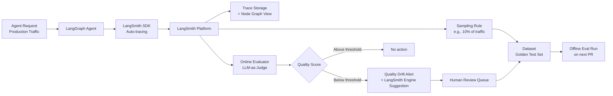

If you're running LangGraph in production, LangSmith is the path of least resistance for observability and evaluation. That's not a marketing claim — it's an architecture statement. LangGraph agents emit structured trace data that LangSmith understands natively, with near-zero instrumentation setup. The first time you see a failing agent run reconstructed as a node-by-node execution graph, complete with per-step inputs, outputs, and token counts, you understand what you've been missing.

That said, LangSmith is a cloud-first product from a company that also makes the framework you're being evaluated on. The incentive alignment is worth keeping in mind.



## What LangSmith Is

LangSmith covers four things: tracing (every model call, tool use, and agent decision), datasets (curated test sets built from production traces), evaluators (heuristic, code-based, LLM-as-judge, pairwise A/B), and online evaluation (continuous quality monitoring on live traffic).

The 2026 LangSmith Engine is a fifth layer: an AI system that analyzes failing and anomalous traces, summarizes patterns across large trace volumes, and proactively suggests fixes. It's useful when you have more traces than you can manually review. It's not a replacement for human diagnosis when something is genuinely wrong.

LangSmith Fleet handles multi-agent workflows — tracking agent-to-agent calls and providing visibility into orchestration behavior across complex pipelines.

## LangGraph Integration in Practice

For LangGraph agents, the instrumentation is minimal:

```python
import os
from langsmith import Client
from langgraph.graph import StateGraph, END

# Set environment variables — LangSmith picks these up automatically
os.environ["LANGSMITH_API_KEY"] = "your-api-key"
os.environ["LANGSMITH_PROJECT"] = "my-agent-project"
os.environ["LANGSMITH_TRACING"] = "true"

# Your LangGraph agent runs normally — tracing is automatic
# No decorator, no wrapper, no manual span creation

from langchain_anthropic import ChatAnthropic

llm = ChatAnthropic(model="claude-sonnet-4-5")

def call_model(state):
    response = llm.invoke(state["messages"])
    return {"messages": [response]}

graph = StateGraph(dict)
graph.add_node("agent", call_model)
graph.set_entry_point("agent")
graph.add_edge("agent", END)

app = graph.compile()

# Every invocation is traced automatically
result = app.invoke({"messages": [{"role": "user", "content": "Refactor this module"}]})
```

Every node execution becomes a trace span. Tool calls appear as child spans. The LangSmith UI reconstructs the full execution graph from this data, showing you exactly which node made which LLM call, what the input and output were, and how long each step took.

## Building a Dataset From Production Traces

The most valuable thing LangSmith does for your evaluation practice is make it easy to turn production failures into regression tests.

```python
from langsmith import Client

client = Client()

# Pull recent traces that were flagged as low-quality by online eval
runs = client.list_runs(
    project_name="my-agent-project",
    filter='and(eq(feedback_key, "quality"), lt(feedback_score, 0.7))',
    limit=50
)

# Add them to a dataset for offline regression testing
dataset = client.create_dataset(
    dataset_name="quality-regression-set",
    description="Production traces that scored below 0.7 on quality eval"
)

for run in runs:
    client.create_example(
        inputs=run.inputs,
        outputs=run.outputs,
        dataset_id=dataset.id
    )
```

This is the dataset flywheel in practice. Low-quality production outputs become test cases. The next model or prompt change runs against them before deployment. Quality can only improve, never silently regress.

## LLM-as-Judge Evaluators

Defining a custom evaluator in LangSmith:

```python
from langsmith.evaluation import evaluate, LangChainStringEvaluator
from langchain_anthropic import ChatAnthropic

# Built-in evaluators
qa_evaluator = LangChainStringEvaluator("qa")
criteria_evaluator = LangChainStringEvaluator(
    "criteria",
    config={
        "criteria": {
            "helpfulness": "Is the response helpful and actionable?",
            "accuracy": "Does the response avoid factual errors?",
        }
    },
    client_config={"model": "claude-sonnet-4-5"}
)

# Run evaluation against your dataset
results = evaluate(
    lambda inputs: app.invoke(inputs),
    data="quality-regression-set",
    evaluators=[qa_evaluator, criteria_evaluator],
    experiment_prefix="v2-prompt-change",
    num_repetitions=3  # run each example 3 times to account for non-determinism
)
```

The `num_repetitions` parameter is important. Running each test case once gives you a noisy signal on any non-deterministic system. Three to five repetitions gives you enough variance to detect genuine regressions versus natural output variation.

## Online Evals: Continuous Quality Monitoring

Online evaluators run automatically on sampled production traffic. Configure them in the LangSmith UI or via the SDK:

```python
# This configuration lives in LangSmith's UI under "Automations"
# The SDK version looks like this:
from langsmith import Client
from langsmith.schemas import AutoEvalConfig

client = Client()

# Sample 10% of production traffic and run quality eval
client.create_auto_eval_config(
    project_name="my-agent-project",
    evaluator_name="quality_judge",
    sampling_rate=0.1,
    alert_threshold=0.75,  # alert if average drops below this
    alert_channel="slack"  # or email, webhook
)
```

When the rolling quality score drops below threshold, you get an alert. The LangSmith Engine then analyzes the recent failing traces and generates a summary of what changed — model behavior shift, new input patterns it wasn't tested on, or a degraded downstream tool.

## LangSmith Engine: When It Helps and When It Doesn't

The Engine (2026) is genuinely useful for: summarizing failure patterns across hundreds of traces when you can't read them all, suggesting prompt edits for common failure modes, and surfacing novel input distributions you hadn't seen in testing.

It's not useful for: root-cause analysis of complex multi-agent failures, understanding whether a model version change degraded quality (you need a controlled experiment for that), or debugging tool execution errors that aren't visible in LLM trace data.

Don't let the AI-analyzing-your-AI layer become a crutch. The Engine points you toward the right traces. You still have to understand what went wrong.

## Deployment Considerations

LangSmith cloud is the default. It's a SaaS product, which means your trace data — including inputs and outputs — lives outside your infrastructure. For most teams, this is fine. For teams in regulated industries handling PII, PHI, or sensitive IP in agent inputs, it's a blocker.

The self-hosted Enterprise option addresses data residency requirements. It's a Kubernetes deployment with proper RBAC and SSO. The operational overhead is real — plan for it.

If you're evaluating LangSmith for enterprise adoption: the AWS Marketplace listing makes procurement easier, and the Enterprise tier includes dedicated support SLAs that matter when your production agent is down and you're staring at a trace you can't interpret.

## Honest Assessment

**Strengths**: LangGraph integration is the best in the industry — first-class, near-zero setup, full node graph visibility. The dataset flywheel (production traces → test sets → offline evals) is elegantly designed. Online evals with quality drift alerting are genuinely production-grade.

**Weaknesses**: Cloud-first creates data residency friction for regulated industries. No red teaming capability — you'll need Promptfoo or AWS Guardrails for adversarial testing. OTel integration is partial; if your stack isn't LangChain-based, the instrumentation overhead is higher.

If you're on LangGraph, LangSmith is the obvious starting point. If you're on another framework, assess whether the integration cost is worth it versus OTel-native alternatives.
