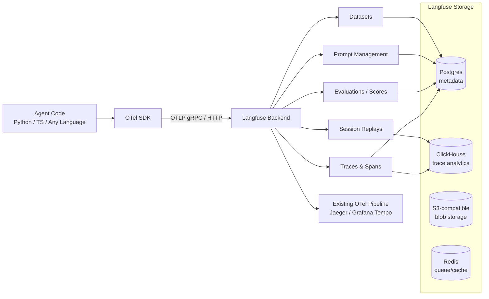

Langfuse is the answer to a specific question: what do you use when you can't send your trace data to a third-party SaaS? When the input to your agent contains PII, PHI, trade secrets, or regulated content, and your legal team has correctly identified that sending it to LangSmith's cloud is a problem — Langfuse is where most teams end up.

The January 2026 acquisition by ClickHouse changed the trajectory meaningfully. ClickHouse is serious infrastructure. The analytics depth that's coming to Langfuse's self-hosted deployment as a result of that acquisition is a genuine differentiator, not a marketing story.



## What Makes Langfuse Different

The core architectural choice is OTel-native. Langfuse accepts traces via OTLP (OpenTelemetry Protocol) — gRPC or HTTP — from any framework that emits OTel spans. This isn't a compatibility shim bolted on afterward; it's the primary ingestion path.

The practical consequence: your Langfuse traces can live alongside your existing service telemetry. If you're running Jaeger or Grafana Tempo for your backend services, you can correlate an agent trace with the HTTP call that triggered it, the database queries it made, and the downstream service calls it spawned. LangSmith can't do that. Langfuse, being OTel-native, does it naturally.

The MIT license means the core product has no license friction for self-hosting. The acquisition by ClickHouse strengthened the commitment to keeping the core open — ClickHouse's own business depends on open-source credibility.

## Instrumenting a Python Agent via OTel

The cleanest path for a framework-agnostic Python agent:

```python
from opentelemetry import trace
from opentelemetry.sdk.trace import TracerProvider
from opentelemetry.sdk.trace.export import BatchSpanProcessor
from opentelemetry.exporter.otlp.proto.http.trace_exporter import OTLPSpanExporter
from opentelemetry.sdk.resources import Resource
import os

# Configure OTel to export to Langfuse
resource = Resource(attributes={
    "service.name": "my-agent",
    "service.version": "1.0.0",
})

provider = TracerProvider(resource=resource)

# Langfuse OTLP endpoint — your self-hosted URL or cloud endpoint
exporter = OTLPSpanExporter(
    endpoint=os.environ["LANGFUSE_OTLP_ENDPOINT"],
    headers={
        "Authorization": f"Basic {os.environ['LANGFUSE_BASE64_KEY']}"
    }
)

provider.add_span_processor(BatchSpanProcessor(exporter))
trace.set_tracer_provider(provider)

tracer = trace.get_tracer("my-agent")

def run_agent_step(step_name: str, input_text: str) -> str:
    with tracer.start_as_current_span(step_name) as span:
        span.set_attribute("gen_ai.request.model", "claude-sonnet-4-5")
        span.set_attribute("input.text", input_text)
        
        # Your agent logic here
        result = call_llm(input_text)
        
        span.set_attribute("gen_ai.usage.input_tokens", result.usage.input_tokens)
        span.set_attribute("gen_ai.usage.output_tokens", result.usage.output_tokens)
        span.set_attribute("output.text", result.content)
        
        return result.content
```

For frameworks that already emit OTel (LangChain, LlamaIndex, CrewAI, Pydantic AI), you don't write this yourself — the framework adapter handles it. Langfuse accepts the spans regardless of source.

## Session Replays

Session replays reconstruct complete conversation histories across multi-turn agent interactions. This sounds straightforward until you've tried to debug a complex agent workflow without them.

Consider an agent that takes 12 steps across three tool calls, makes a mistake on step seven, and produces a wrong final answer. Without session replay, you're correlating individual span records manually across a trace viewer. With session replay, Langfuse shows you the full execution timeline in sequence — every turn, every tool call, every intermediate state.

For agents with memory operations or stateful context windows, session replays are often the only practical way to understand what the agent knew at each decision point.

## Prompt Management and Versioning

Langfuse has a built-in prompt registry:

```python
from langfuse import Langfuse

langfuse = Langfuse()

# Fetch the production version of a prompt
prompt = langfuse.get_prompt("code-review-agent", version="production")

# Compile with variables
compiled = prompt.compile(
    language="Python",
    style_guide="PEP-8"
)

# The prompt version is automatically linked to the trace
# when you use the compiled prompt in your agent
```

When you compare evaluation scores across prompt versions, you can filter by prompt version in Langfuse's analytics. This makes A/B testing prompt changes straightforward: deploy a new version to 10% of traffic, compare quality scores after 24 hours, promote or roll back.

## Self-Hosting Reality Check

The self-hosting story is not "run one command and you're done." Production Langfuse requires:

```yaml
# Minimum services required for production self-hosting
services:
  langfuse-web:
    image: langfuse/langfuse:latest
    # ...

  langfuse-worker:
    image: langfuse/langfuse-worker:latest
    # ...

  postgres:
    image: postgres:15
    # Metadata, users, prompts, datasets

  clickhouse:
    image: clickhouse/clickhouse-server:24
    # Trace analytics — required as of Langfuse v3

  redis:
    image: redis:7
    # Queue management and caching

  # Plus: S3-compatible object storage (MinIO, AWS S3, GCS, Azure Blob)
  # for trace blobs and exports
```

Five services, minimum. For production hardening: set up ClickHouse replication, configure Postgres high availability, size Redis for your trace throughput, and set retention policies for ClickHouse to control storage costs. None of this is hard, but "self-hosted Langfuse" is a real infrastructure commitment, not a 20-minute setup.

On the cloud side: Langfuse Cloud has a free tier. Enterprise cloud adds SSO, RBAC, and SLAs. The pricing is straightforward and the cloud option is appropriate for most teams that don't have regulatory constraints.

## Platform MCP Server

Langfuse ships an MCP server that connects your IDE to your trace data. In practice this means: from Claude Code or your IDE's AI assistant, you can query your traces, pull prompt versions, and inspect evaluation scores without leaving your editor. It's a small quality-of-life improvement for teams that are already deep in Langfuse.

## ClickHouse Acquisition Impact

The January 2026 acquisition by ClickHouse GmbH is a positive signal for two reasons. First, ClickHouse's columnar analytics engine is genuinely well-suited to trace data — high cardinality, high throughput, time-series queries. Langfuse v3 moved its primary trace storage to ClickHouse, and the query performance difference is significant at scale. Second, ClickHouse has a strong track record on open-source commitments. The MIT core isn't going anywhere.

## When to Choose Langfuse Over LangSmith

Choose Langfuse when:

- **Data residency requirements are real**: regulated industry, GDPR-strict jurisdiction, sensitive IP in agent inputs. Self-host and the data never leaves your infrastructure.
- **You have an existing OTel pipeline**: correlating LLM traces with service telemetry is natively supported. LangSmith can't do this without custom work.
- **Your stack isn't LangChain-based**: Langfuse's framework-agnostic OTLP ingestion means any framework that emits OTel works equally well.
- **Open-source is a hard requirement**: MIT license, community-driven, no vendor lock-in on the core product.

## Honest Assessment

**Strengths**: OTel-native is a genuine architectural advantage when you have existing telemetry infrastructure. Self-hosting is real and production-grade (if operationally heavier than the docs suggest). Framework-agnostic. MIT core. ClickHouse acquisition strengthens the analytics story.

**Weaknesses**: The self-hosting complexity is higher than competitors — plan for it. The UI is less polished than LangSmith. No red teaming capability. Online eval configuration requires more manual setup than LangSmith's Automations feature. Community support is strong but enterprise support depth is growing.

The right choice between LangSmith and Langfuse is almost always determined by your data residency requirements and your existing telemetry infrastructure. If you can go SaaS and you're on LangGraph — LangSmith. If you need self-hosted or you're already running OTel — Langfuse.
