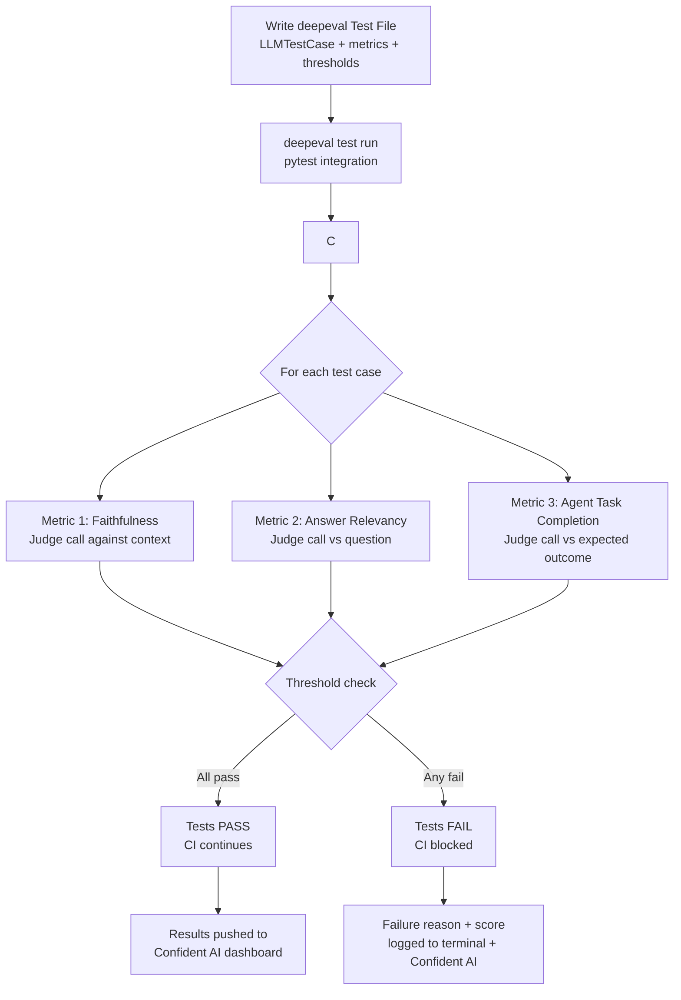

The insight behind DeepEval is simple: LLM quality should be enforced the same way code quality is enforced — as a failing test in your CI pipeline. Not a dashboard someone checks occasionally, not a report generated after deployment. A test that blocks the merge if the agent's faithfulness score drops below 0.8.

That framing, quality-as-code, is why DeepEval has become the most popular open-source LLM evaluation framework for teams building CI-first evaluation workflows. Confident AI is the enterprise platform on top — production tracing, team annotation, on-prem deployment.



## The Testing Model

DeepEval's core abstraction is the `LLMTestCase`. It mirrors unit test structure — input, output, expected output, context — with metrics that evaluate the relationship between those fields.

```python
from deepeval import evaluate
from deepeval.test_case import LLMTestCase
from deepeval.metrics import (
    FaithfulnessMetric,
    AnswerRelevancyMetric,
    HallucinationMetric,
    AgentTaskCompletionMetric,
)

# Define your test cases
test_case = LLMTestCase(
    input="What is the refund policy for enterprise software licenses?",
    actual_output=your_agent.run("What is the refund policy for enterprise software licenses?"),
    expected_output="Enterprise licenses are non-refundable after 30 days.",
    retrieval_context=[
        "Enterprise licenses purchased for 12-month terms are non-refundable after 30 days.",
        "Starter and Pro licenses can be cancelled for a prorated refund at any time.",
    ]
)

# Define metrics with explicit thresholds
faithfulness = FaithfulnessMetric(threshold=0.8, model="gpt-4o")
relevancy = AnswerRelevancyMetric(threshold=0.75, model="gpt-4o")
hallucination = HallucinationMetric(threshold=0.2, model="gpt-4o")  # lower is better

# Run evaluation
evaluate([test_case], [faithfulness, relevancy, hallucination])
```

The threshold semantics matter: for Faithfulness and Answer Relevancy, the score must meet or exceed the threshold to pass. For Hallucination, the score must stay at or below the threshold (lower score = less hallucination). DeepEval handles this distinction automatically per metric type.

## Key Metrics and What They Measure

**Faithfulness** measures whether the claims in `actual_output` are supported by `retrieval_context`. It extracts claims from the output, verifies each one against the context, and scores based on the supported ratio. A score of 0.8 means 80% of claims are grounded in the provided context.

**Answer Relevancy** measures whether the output actually addresses the question in `input`. It generates questions from the output and checks how many map back to the original question. Useful for detecting responses that are coherent but don't answer what was asked.

**Contextual Precision and Recall** evaluate RAG retrieval quality — was the right context retrieved, and was all relevant context included? These run against `retrieval_context` independently of the final answer.

**Hallucination** checks whether the output contains content not supported by any context. Different from Faithfulness in scope: Faithfulness checks claims against provided context; Hallucination checks against a broader knowledge base.

**Agent Task Completion** is the agent-specific metric. It evaluates whether the agent completed the intended task, considering the full trajectory of tool calls and the final output:

```python
from deepeval.metrics import AgentTaskCompletionMetric
from deepeval.test_case import LLMTestCase, ToolCall

agent_test = LLMTestCase(
    input="Find all TODO comments in the authentication module and create a GitHub issue",
    actual_output="Created GitHub issue #847 with 3 TODO items found.",
    tools_called=[
        ToolCall(name="search_codebase", input_parameters={"query": "TODO", "path": "src/auth"}),
        ToolCall(name="create_github_issue", input_parameters={"title": "Auth TODO cleanup", "body": "..."}),
    ],
    expected_tools=["search_codebase", "create_github_issue"]
)

task_completion = AgentTaskCompletionMetric(threshold=0.8, model="gpt-4o")
```

## Complete Test File With CI Integration

A realistic test file structure:

```python
# tests/test_agent_quality.py
import pytest
import deepeval
from deepeval import assert_test
from deepeval.test_case import LLMTestCase
from deepeval.metrics import FaithfulnessMetric, AnswerRelevancyMetric, AgentTaskCompletionMetric
from deepeval.dataset import EvaluationDataset

from myapp.agent import CodeReviewAgent

agent = CodeReviewAgent()

@pytest.mark.parametrize("test_case", [
    LLMTestCase(
        input="Review this Python function for security issues",
        actual_output=agent.review("def login(user, pwd): return db.query(f'SELECT * FROM users WHERE user={user}')"),
        retrieval_context=["SQL injection occurs when user input is embedded directly in queries."],
        expected_output="This function is vulnerable to SQL injection."
    ),
    LLMTestCase(
        input="Suggest a refactor for this deeply nested function",
        actual_output=agent.review("def process(data):\n  if data:\n    if data.get('items'):\n      for item in data['items']:\n        if item.get('active'): ..."),
        retrieval_context=["Early returns reduce nesting depth.", "Guard clauses improve readability."],
    ),
])
def test_code_review_quality(test_case):
    faithfulness = FaithfulnessMetric(threshold=0.8, model="gpt-4o")
    relevancy = AnswerRelevancyMetric(threshold=0.75, model="gpt-4o")
    assert_test(test_case, [faithfulness, relevancy])
```

## CI/CD Integration

```yaml
# .github/workflows/agent-quality-gate.yml
name: Agent Quality Gate

on:
  pull_request:
    branches: [main]

jobs:
  evaluate:
    runs-on: ubuntu-latest
    steps:
      - uses: actions/checkout@v4

      - name: Set up Python
        uses: actions/setup-python@v5
        with:
          python-version: '3.12'

      - name: Install dependencies
        run: pip install deepeval pytest

      - name: Run evaluation
        env:
          OPENAI_API_KEY: ${{ secrets.OPENAI_API_KEY }}
          ANTHROPIC_API_KEY: ${{ secrets.ANTHROPIC_API_KEY }}
          CONFIDENT_AI_API_KEY: ${{ secrets.CONFIDENT_AI_API_KEY }}
        run: |
          deepeval test run tests/test_agent_quality.py \
            --confident-ai \
            --verbose

      # deepeval test run exits non-zero if any metric threshold is breached
      # GitHub Actions treats non-zero exit as a failed step — PR is blocked
```

The `--confident-ai` flag pushes results to the Confident AI platform for team visibility. The `--verbose` flag prints each metric score and failure reason to the CI log. If any metric breaches its threshold, `deepeval test run` returns a non-zero exit code, which blocks the PR merge.

## Google ADK Integration

DeepEval has native integration with Google's Agent Development Kit (ADK):

```python
from deepeval.integrations.google_adk import DeepEvalGoogleADKCallbackHandler
from google.adk.runners import Runner

# Attach DeepEval's callback handler to your ADK agent runner
callback_handler = DeepEvalGoogleADKCallbackHandler(
    metrics=[
        FaithfulnessMetric(threshold=0.8),
        AgentTaskCompletionMetric(threshold=0.75),
    ]
)

runner = Runner(
    agent=your_adk_agent,
    app_name="my-adk-app",
    session_service=session_service,
)

# Run with evaluation
result = await runner.run_async(
    user_id="test-user",
    session_id="eval-session",
    new_message=types.Content(parts=[types.Part(text="Your test input")]),
    callbacks=[callback_handler]
)

# Scores are automatically logged to Confident AI
```

This is significant because ADK's native evaluation (trajectory metrics, final response match) and DeepEval's semantic metrics (faithfulness, hallucination) serve different purposes. Using both gives you trajectory correctness from ADK and output quality from DeepEval in the same evaluation run.

## LangGraph Integration

```python
from deepeval.integrations.langchain import DeepEvalCallbackHandler
from langgraph.graph import StateGraph

# Add callback to your LangGraph execution
handler = DeepEvalCallbackHandler(
    metrics=[FaithfulnessMetric(threshold=0.8)],
    test_case_params={"retrieval_context": your_context}
)

result = app.invoke(
    {"messages": [{"role": "user", "content": test_input}]},
    config={"callbacks": [handler]}
)
```

## Confident AI Enterprise

The open-source DeepEval core handles local evaluation and CI integration. Confident AI adds:

- **Production tracing**: trace every agent call in production with DeepEval metrics attached
- **Team annotation**: human review queues with annotation tooling for calibrating judge models
- **Dataset management**: curated test sets with version control
- **On-premises deployment**: for regulated environments
- **SOC 2 Type II certification**: required for enterprise procurement in most financial and healthcare contexts

## When to Use DeepEval

DeepEval is the right choice when:

- You want evaluation as code — metric thresholds that fail CI builds, version-controlled test files, PR review for quality changes
- You're starting from scratch with no existing observability infrastructure — no OTel pipeline to thread DeepEval into
- You're integrating with Google ADK or LangGraph and want portable metrics that work across both
- Your team thinks in unit tests and wants the same workflow for LLM quality

## Honest Assessment

**Strengths**: The test-code mental model is genuinely useful for teams that already live in CI/CD. 50+ research-backed metrics with clear semantics. Native ADK and LangGraph integrations. The CI gate pattern is production-ready. SOC 2 Type II on the enterprise platform.

**Weaknesses**: Not OTel-native — if you have an existing OTel pipeline, you're running a parallel evaluation system rather than instrumenting the one you have. The Confident AI cloud platform is less mature than LangSmith for production tracing at scale. No red teaming capability built in.

DeepEval excels at the build-time evaluation problem. For production monitoring, you'll typically pair it with an observability platform that handles the online side.
