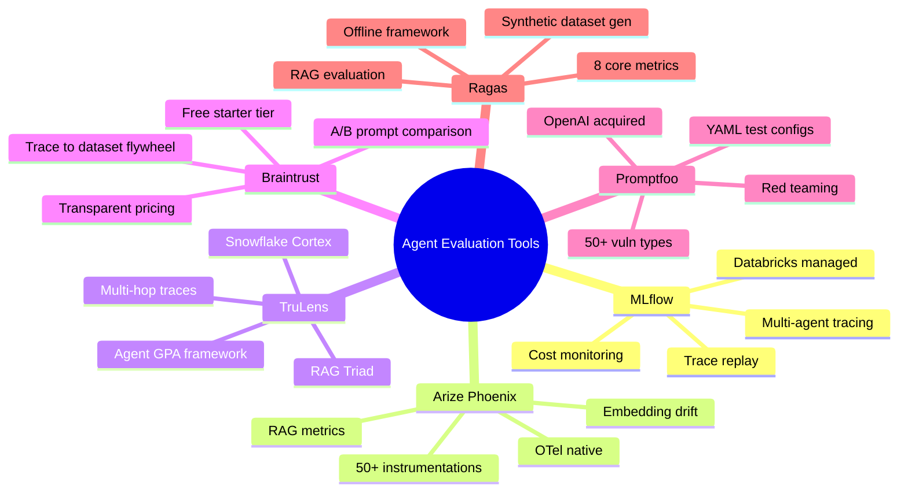

The agent evaluation space has exploded in 2026. Every team building production agents is running into the same problems — non-deterministic outputs, multi-step failure modes, RAG quality, adversarial inputs — and the tool ecosystem has responded with specialized solutions for each. The problem now isn't finding an evaluation tool. It's knowing which one to reach for given your specific situation.

This post maps the landscape for teams that have already evaluated LangSmith and Langfuse and want to know what else is out there. Some of these tools compete with each other. Most are better understood as complementary — they solve different parts of the problem.



## MLflow (Apache / Databricks)

MLflow ranked first for LLM tracing in multi-agent systems in 2026, and the reason is the trace replay feature — it's unique among open-source options.

Trace replay means you can take any captured execution trace and replay it step by step to understand exactly what happened. For debugging complex multi-agent failures where the final output gives you no signal, replay is the difference between spending 20 minutes and spending 4 hours on root cause analysis.

```python
import mlflow

mlflow.set_tracking_uri("http://localhost:5000")
mlflow.set_experiment("agent-evaluation")

with mlflow.start_run():
    with mlflow.start_span(name="agent_execution") as span:
        span.set_attribute("gen_ai.request.model", "claude-sonnet-4-5")
        
        # Your agent logic
        result = run_agent(user_input)
        
        span.set_attribute("gen_ai.usage.input_tokens", result.usage.input_tokens)
        span.set_attribute("gen_ai.usage.output_tokens", result.usage.output_tokens)
        
        # Log evaluation metrics
        mlflow.log_metrics({
            "faithfulness": evaluate_faithfulness(result),
            "task_completion": evaluate_task_completion(result),
            "total_cost_usd": calculate_cost(result.usage),
        })
```

The cost monitoring coupled to quality metrics is a genuine differentiator. MLflow lets you ask "what is the cost-per-point-of-quality for this agent configuration versus that one?" — a question that matters in production when you're choosing between a faster cheaper model and a slower more accurate one.

MLflow is built on OTel and integrates with LangChain, LlamaIndex, OpenAI Agents SDK, and Anthropic SDK. Self-hosting takes under an hour. The Databricks-managed version is available for teams that want a fully managed option without the operational overhead.

## Arize Phoenix

Arize Phoenix's distinguishing feature is embedding drift detection — it monitors whether the semantic distribution of your RAG retrievals is shifting over time.

Why does that matter? Your RAG system might be functioning correctly by all surface metrics (retrieval is fast, context is found, answers are generated) while the actual semantic quality is quietly degrading because the document corpus has drifted away from the query distribution your system was tested against. Embedding drift catches this before it becomes a user-visible quality problem.

```python
import phoenix as px
from phoenix.otel import register

# Phoenix is OTel-native — register as a tracer provider
tracer_provider = register(
    project_name="my-rag-agent",
    endpoint="http://localhost:6006/v1/traces",
)

# Use with any OTel-compatible framework
# Phoenix has 50+ pre-built instrumentations
from openinference.instrumentation.langchain import LangChainInstrumentor

LangChainInstrumentor().instrument(tracer_provider=tracer_provider)
```

Phoenix has the largest instrumentation coverage in the ecosystem — 50+ frameworks. If you're using something other than LangChain or LlamaIndex, Phoenix is likely to have a pre-built adapter while other platforms may require custom instrumentation.

The commercial Arize AX platform extends Phoenix with enterprise features. The open-source Phoenix core is the right starting point for evaluation and available to self-host.

## TruLens (Snowflake)

TruLens brings evaluation and tracing together in a single workflow rather than treating them as separate concerns. The 2026 Agent GPA framework from Snowflake AI Research is the most interesting development:

**Goal**: Did the agent achieve what it was supposed to achieve? Not just "did it respond" but "did it accomplish the stated goal?"

**Plan**: Did the agent's plan make sense? Were the intermediate steps logical given the goal?

**Action**: Were the specific tool calls appropriate? Were arguments correct? Were there unnecessary or harmful actions?

This hierarchical evaluation structure surfaces failure modes that flat metrics miss. An agent can achieve a goal through a bad plan — it got lucky despite making poor decisions. An agent can have a good plan but execute it poorly. GPA catches both independently.

```python
from trulens.core import TruSession, Feedback
from trulens.providers.openai import OpenAI
from trulens.apps.langchain import TruChain

session = TruSession()
provider = OpenAI()

# Define GPA-style feedbacks
goal_success = Feedback(
    provider.goal_completion,
    name="goal_success"
).on_input_output()

plan_quality = Feedback(
    provider.plan_adherence,
    name="plan_quality"
).on_input_output()

action_quality = Feedback(
    provider.tool_use_quality,
    name="action_quality"
).on_input_output()

tru_agent = TruChain(
    your_agent,
    app_name="code-review-agent",
    feedbacks=[goal_success, plan_quality, action_quality]
)

with tru_agent as recording:
    result = your_agent.run(test_input)
```

TruLens also implements the RAG Triad: groundedness (is the answer supported by retrieved context?), relevance (is the answer relevant to the question?), and context relevance (is the retrieved context relevant to the question?). These three together catch most RAG quality failures.

Enterprise users include Equinix and KBC Group. The Snowflake Cortex integration makes TruLens the natural choice for teams already running data infrastructure on Snowflake.

## Braintrust

Braintrust's core value proposition is the production trace → dataset flywheel. Every production trace is a potential test case, and the platform makes it easy to select, annotate, and promote traces to your evaluation dataset.

```python
from braintrust import Eval, traced
import anthropic

client = anthropic.Anthropic()

@traced  # Every call is automatically logged as a trace
def run_agent(input_text: str) -> str:
    response = client.messages.create(
        model="claude-sonnet-4-5",
        max_tokens=1024,
        messages=[{"role": "user", "content": input_text}]
    )
    return response.content[0].text

# Run an evaluation experiment — compares against baseline
Eval(
    "code-review-agent",
    data=lambda: [
        {"input": "Review this function for SQL injection", "expected": "Found SQL injection vulnerability"},
        {"input": "Check this code for memory leaks", "expected": "No memory leaks found"},
    ],
    task=run_agent,
    scores=[
        LLMClassifier(name="quality", prompt_template="Rate this response: {{output}}"),
    ]
)
```

Pricing is transparent: Starter is free (1M trace spans, 10K scores, 14-day retention, unlimited users). Pro is $249/month. Enterprise is custom with RBAC, SAML SSO, BAA (for healthcare data), SOC 2 Type II, and self-hosting in your own cloud.

The limitation worth noting: Braintrust is less strong at automatic failure-pattern clustering than MLflow or LangSmith. If you need to find "what are the common failure modes across the last 10,000 traces," you'll do more manual work in Braintrust than in competitors.

## Promptfoo

OpenAI acquired Promptfoo in March 2026. As of mid-2026, it has 350,000+ developers, 22.4K GitHub stars, and is used by 25%+ of Fortune 500 companies. The acquisition hasn't changed the product direction significantly.

Promptfoo's unique position is red teaming — it automatically generates adversarial inputs and tests your agent against 50+ vulnerability types:

```yaml
# promptfooconfig.yaml
description: Security evaluation for customer service agent

targets:
  - id: my-agent
    config:
      endpoint: http://localhost:8080/agent

plugins:
  - promptinjection    # Prompt injection attacks
  - jailbreak          # Jailbreak attempts
  - pii                # PII exfiltration attempts
  - hallucination      # False information elicitation
  - overreliance       # Exploiting model overconfidence
  - rbac               # Authorization bypass attempts

strategies:
  - jailbreak:tree     # Tree-of-thought jailbreak
  - prompt-injection   # Direct injection

redteam:
  numTests: 100
  plugins:
    - harmful:hate     # Hate speech generation
    - harmful:violence # Violence content
```

```bash
promptfoo redteam run
# Generates 100 adversarial test cases, runs them, scores the results
```

The YAML-based configuration for side-by-side model comparison is also well-designed for teams that want to compare model versions or providers without writing evaluation code.

Promptfoo's limitation: minimal OTel integration and no production tracing. It's a test execution tool, not an observability platform. You run it in CI before deployment, not in production monitoring.

## Ragas

Ragas is the de facto standard for RAG evaluation in 2026. Its eight core metrics cover the RAG pipeline end-to-end:

```python
from ragas import evaluate
from ragas.metrics import (
    context_precision,
    context_recall,
    faithfulness,
    answer_relevancy,
    context_entity_recall,
    answer_correctness,
    answer_similarity,
)
from datasets import Dataset

# Your RAG system's outputs
data = {
    "question": ["What is the refund policy?", "How do I cancel my subscription?"],
    "answer": ["Refunds are available within 30 days.", "Cancel via account settings."],
    "contexts": [
        ["Enterprise licenses are non-refundable after 30 days."],
        ["To cancel, go to Account > Subscription > Cancel."],
    ],
    "ground_truth": ["Refunds within 30 days.", "Cancel in account settings."]
}

dataset = Dataset.from_dict(data)

results = evaluate(
    dataset,
    metrics=[context_precision, context_recall, faithfulness, answer_relevancy],
)

print(results)
# {'context_precision': 0.87, 'context_recall': 0.91, 'faithfulness': 0.94, 'answer_relevancy': 0.88}
```

The synthetic dataset generator is Ragas's most underused feature:

```python
from ragas.testset import TestsetGenerator
from langchain_community.document_loaders import DirectoryLoader

loader = DirectoryLoader("./docs")
documents = loader.load()

generator = TestsetGenerator.with_openai()
testset = generator.generate_with_langchain_docs(
    documents,
    test_size=50,
    distributions={"simple": 0.5, "reasoning": 0.25, "multi_context": 0.25}
)
# Generates 50 question-answer pairs from your document corpus automatically
```

Ragas is an offline evaluation framework only — it doesn't do production tracing or monitoring. Pair it with Langfuse or Arize Phoenix for the production monitoring side.

## Feature Comparison

| Tool | OTel Native | Self-Host | LLM Judge | Trajectory Eval | CI Gate | Red Teaming | OSS Core | Unique Capability |
|------|-------------|-----------|-----------|-----------------|---------|-------------|----------|-------------------|
| MLflow | Yes | Yes | Yes | Partial | Yes | No | Yes | Trace replay + cost |
| Arize Phoenix | Yes | Yes | Yes | No | No | No | Yes | Embedding drift |
| TruLens | Partial | Yes | Yes | Agent GPA | No | No | Yes | GPA framework |
| Braintrust | No | Enterprise | Yes | No | No | No | No | Trace→dataset flywheel |
| Promptfoo | No | Yes | Yes | No | Yes | Yes | Yes | Auto red teaming |
| Ragas | No | Yes | Yes | No | Yes | No | Yes | Synthetic dataset gen |

## What's Missing From All of Them

Two gaps that no single tool closes well in 2026:

**Multi-agent coalition evaluation**: When Agent A calls Agent B which calls Agent C, evaluating the behavior of the coalition — not just individual agents — requires mostly custom instrumentation today. OTel traces can capture the cross-agent calls, but no platform has purpose-built UI and metrics for coalition-level evaluation.

**Stable OTel GenAI conventions**: The `gen_ai.*` attributes are still pre-stable. Production teams building on top of them today should expect attribute name changes before the spec stabilizes. Build abstraction layers.

## Decision Guide

- **RAG pipeline quality**: Ragas for metrics, paired with Langfuse or Arize Phoenix for production monitoring
- **Red teaming / adversarial testing**: Promptfoo, full stop
- **Multi-hop agent trace analysis**: MLflow (trace replay) or TruLens (Agent GPA)
- **OTel-native, any framework**: Arize Phoenix (widest instrumentation coverage) or Langfuse
- **Trace replay + cost monitoring**: MLflow
- **Production trace → test dataset flywheel**: Braintrust or LangSmith
- **Already on Snowflake**: TruLens + Snowflake Cortex
