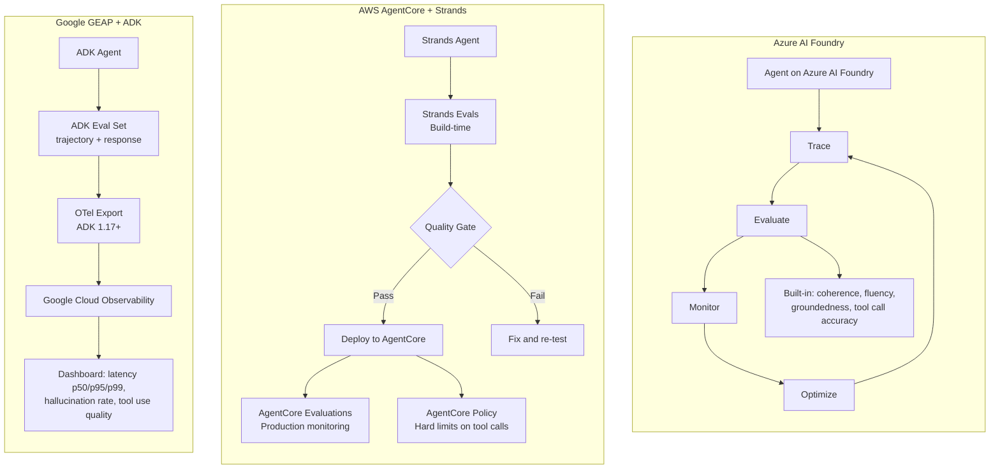

The cloud providers have all shipped native evaluation stacks in 2026. If you're already running agents on Azure, AWS, or Google Cloud, the cloud-native evaluation path is worth understanding before you commit to a third-party OSS stack. The integration is tighter, the operational overhead is lower, and for enterprise procurement, a single-vendor evaluation story is significantly easier to approve.

The tradeoff is lock-in and less flexibility at the edges — particularly around customizing evaluation logic or correlating with non-cloud telemetry.



## Azure AI Foundry

Azure's evaluation stack went GA in March 2026, announced at Ignite 2025. The architecture follows a four-pillar model: Trace, Evaluate, Monitor, Optimize — each stage feeding the next.

**Built-in evaluators by category**:

General-purpose: coherence (logical flow and consistency), fluency (grammar and readability).

RAG-specific: groundedness (is the answer supported by source documents?), relevance (does the answer address the question?).

Agent-specific: tool call accuracy (did the agent call the right tools?), task completion (did the agent complete the requested task?).

Safety: content safety, groundedness violation detection, protected material detection.

The `Microsoft.Extensions.AI.Evaluation` library, released April 2026, brings 50+ first-party metrics to C#/.NET:

```csharp
using Microsoft.Extensions.AI.Evaluation;
using Microsoft.Extensions.AI.Evaluation.Quality;

// Create an evaluation pipeline
var pipeline = new EvaluationPipeline(
    new ToolCorrectnessEvaluator(),
    new ArgumentCorrectnessEvaluator(),
    new PlanAdherenceEvaluator(),
    new TaskCompletionEvaluator(),
    new ConversationRelevancyEvaluator(),
    new FaithfulnessEvaluator()
);

// Define a test scenario
var scenario = new AgentScenario
{
    UserRequest = "Refactor the authentication module to use dependency injection",
    AgentResponse = await agent.RunAsync("Refactor the authentication module to use dependency injection"),
    ExpectedToolCalls = new[]
    {
        new ExpectedToolCall { Name = "read_file", ArgumentPattern = @"auth.*\.cs" },
        new ExpectedToolCall { Name = "write_file", ArgumentPattern = @"auth.*\.cs" },
    },
    GroundingDocuments = codebaseContext,
};

// Run evaluation
var results = await pipeline.EvaluateAsync(scenario);

foreach (var metric in results.Metrics)
{
    Console.WriteLine($"{metric.Name}: {metric.Score:F2} ({(metric.Passed ? "PASS" : "FAIL")})");
}
```

The Semantic Kernel / Microsoft Agent Framework metrics deserve specific mention: Tool Correctness, Argument Correctness, Plan Adherence, Task Completion, Conversation Relevancy, and Faithfulness map directly to the agent failure categories covered in the first post of this series.

Azure AI Foundry's evaluation is built on OTel and integrates with Azure Monitor Application Insights — which means your agent traces correlate with your existing Azure infrastructure telemetry. If you're running on Azure already, this is a meaningful advantage.

## AWS AgentCore and Strands

AWS shipped two complementary systems in March 2026 that address different phases of the agent lifecycle.

**AgentCore Evaluations** (GA March 2026) handles production monitoring: 13 built-in evaluators running continuously against live traffic. Metrics include response quality, safety, task completion, and tool usage. The key capability: evaluation runs on a continuous sample of production traffic, not just on demand.

**AgentCore Policy** (GA March 2026) is the enforcement layer. It intercepts every tool call before execution — outside the model's reasoning loop. This is a hard boundary, not a soft guideline:

```
User Request → Agent Reasoning → Tool Call Intent → AgentCore Policy → Tool Execution
                                                     ↑
                                           Policy intercepts here
                                           before the tool runs
```

Bedrock Guardrails integrated into AgentCore Policy (June 2026) adds: prompt injection detection, jailbreak detection, sensitive data exposure prevention, and harmful content filtering. These operate at the policy layer — the model never sees the injection attempt.

**Strands Evals** (preview) is the build-time counterpart. It uses a Cases + Experiments + Evaluators model:

```python
from strands_evals import Case, Experiment, Evaluator
from strands_evals.evaluators import (
    OutputQualityEvaluator,
    TrajectoryEvaluator,
    ToolSelectionEvaluator,
    GoalSuccessEvaluator,
)

# Define a test case with expected trajectory
case = Case(
    name="refactor-auth-module",
    input="Refactor the authentication module to remove hardcoded credentials",
    expected_trajectory=[
        {"tool": "search_codebase", "args": {"pattern": "hardcoded.*password|API_KEY"}},
        {"tool": "read_file", "args": {"path": "src/auth/config.py"}},
        {"tool": "write_file", "args": {"path": "src/auth/config.py"}},
        {"tool": "write_file", "args": {"path": ".env.example"}},
    ],
    expected_outcome="Credentials moved to environment variables with .env.example created",
    quality_threshold=0.85,
)

# Run experiment
experiment = Experiment(
    name="security-refactor-eval",
    cases=[case],
    evaluators=[
        OutputQualityEvaluator(threshold=0.90),
        TrajectoryEvaluator(match_type="in_order"),
        ToolSelectionEvaluator(threshold=0.95),
        GoalSuccessEvaluator(threshold=0.85),
    ]
)

results = experiment.run(agent=your_strands_agent)
print(f"Tool usage: {results.tool_usage_score:.1%}")
print(f"Reasoning quality: {results.reasoning_quality_score:.1%}")
print(f"Output quality: {results.output_quality_score:.1%}")
```

The AWS reference thresholds are worth keeping: tool usage >95%, reasoning quality >85%, output quality >90%. These are calibrated against production agent behavior across their customer base and are reasonable starting points for your own threshold configuration.

The two-phase strategy — Strands Evals at build time, AgentCore Evaluations in production — maps cleanly to the evaluation pyramid. Strands Evals is Layer 1 and Layer 2 (offline testing + CI gates). AgentCore Evaluations is Layer 3 (online evals).

## Google Gemini Enterprise Agent Platform

Vertex AI rebranded to Gemini Enterprise Agent Platform (GEAP) in 2026. The ADK evaluation system is the most metrics-rich of the three cloud providers for trajectory evaluation specifically.

**Trajectory metrics** (ADK native):
- `trajectory_exact_match`: all tool calls in the expected sequence with matching arguments
- `trajectory_in_order_match`: expected tool calls present in order, additional calls allowed
- `trajectory_any_order_match`: all expected tool calls present, order not required

**Final response metric**:
- `final_response_match_v2`: LLM-as-judge for semantic equivalence. The v2 version replaced ROUGE-1 `response_match_score` — a meaningful improvement since ROUGE measures token overlap, not semantic quality.

**Safety and quality**:
- `hallucinations_v1`: detects hallucinated content in the final response
- `safety_v1`: checks for policy violations and harmful content

```python
from google.adk.evaluation import AgentEvaluator, EvalCase, EvalSet
from google.adk.evaluation.metrics import (
    TrajectoryExactMatch,
    TrajectoryInOrderMatch,
    FinalResponseMatchV2,
    HallucinationsV1,
)

# Build an eval set from your test cases
eval_set = EvalSet(
    name="code-agent-eval",
    cases=[
        EvalCase(
            user_input="Add input validation to the login endpoint",
            expected_final_response="Added validation for email format and password length requirements.",
            expected_tool_use=[
                {"tool_name": "read_file", "tool_input": {"path": "src/routes/auth.py"}},
                {"tool_name": "write_file", "tool_input": {"path": "src/routes/auth.py"}},
            ]
        ),
    ]
)

# Run evaluation
evaluator = AgentEvaluator(
    agent=your_adk_agent,
    eval_set=eval_set,
    metrics=[
        TrajectoryInOrderMatch(),           # trajectory correctness
        FinalResponseMatchV2(model="gemini-2.0-flash"),  # semantic quality
        HallucinationsV1(),                 # hallucination detection
    ]
)

results = await evaluator.evaluate_async()
```

ADK 1.17+ supports native OTel export to Google Cloud Observability:

```python
from google.adk.telemetry import configure_otel

configure_otel(
    project_id="your-gcp-project",
    export_to_cloud_observability=True,
)
```

Once OTel export is configured, the GEAP dashboard surfaces: total sessions, average turns per session, token usage, latency at p50/p95/p99, response quality scores, hallucination rates, and tool use quality — without any additional instrumentation.

For teams that want portable OSS metrics alongside ADK's native trajectory evaluation, DeepEval has native ADK integration (covered in Post 4).

## When to Use Cloud-Native vs OSS

Cloud-native is the right default when:

- Your agents are deployed on the cloud platform in question — the integration is tight, the operational overhead is minimal, and evaluation data stays in your existing security perimeter
- You need enterprise procurement simplicity — one vendor, one contract, one support escalation path
- You're building with platform-specific frameworks (Semantic Kernel for Azure, Strands for AWS, ADK for Google) — the native evaluators understand your framework's trace structure

OSS tools are the right choice when:

- Multi-cloud or hybrid deployment — you need evaluation that works regardless of where agents run
- You have existing OTel infrastructure — Langfuse or Arize Phoenix plug into your existing telemetry pipeline
- You need red teaming — none of the cloud-native stacks match Promptfoo for adversarial testing
- You're running sensitive workloads and need full control of evaluation data — Bedrock Guardrails and Azure Safety evaluators send data to cloud services for analysis; self-hosted OSS tools don't

The practical answer for most enterprise teams: use cloud-native evaluation for the platform you're already on, and add Promptfoo for red teaming regardless of platform.
