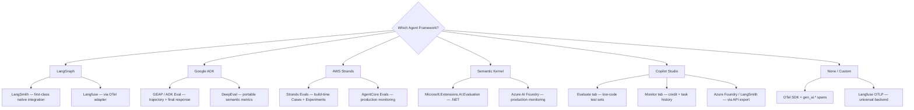

The first question teams ask about agent evaluation is usually "which tool should I use?" The better question is "which framework am I building on?" The framework determines your evaluation options more than any other factor — because the trace structure a framework emits, the tool call semantics it uses, and the cloud runtime it targets all constrain which evaluation tools integrate cleanly versus which ones require custom wiring.

This post maps framework to evaluation stack — one section per major framework, with concrete instrumentation examples for each.



## LangGraph + LangSmith

LangGraph is the natural home of LangSmith. The integration is so tight that instrumenting a LangGraph agent for production observability takes three environment variables:

```python
import os
os.environ["LANGSMITH_API_KEY"] = "your-key"
os.environ["LANGSMITH_PROJECT"] = "prod-code-agent"
os.environ["LANGSMITH_TRACING"] = "true"

# That's it — every LangGraph invocation is traced automatically
```

Every node in your LangGraph state machine becomes a traced span. Tool calls appear as child spans with inputs and outputs. The LangSmith UI reconstructs the full graph execution — you can see which node was active, what state it received, what it returned, and how long it took.

For adding evaluation to specific steps:

```python
from langsmith import traceable
from langsmith.evaluation import evaluate

@traceable(name="code-review-step", tags=["review", "security"])
def security_review_node(state: dict) -> dict:
    # LangSmith captures inputs and outputs automatically
    result = llm.invoke(state["messages"])
    return {"messages": [result], "review_complete": True}

# Offline evaluation against a dataset
results = evaluate(
    lambda inputs: app.invoke(inputs),
    data="security-review-dataset",
    evaluators=[quality_evaluator, safety_evaluator],
    experiment_prefix="v3-security-prompt",
    num_repetitions=3,
)
```

For teams with data residency requirements that rule out LangSmith cloud, the LangChain OTel adapter routes traces to Langfuse via OTLP:

```python
from langchain.callbacks import OpenTelemetryCallbackHandler
from opentelemetry.exporter.otlp.proto.http.trace_exporter import OTLPSpanExporter

handler = OpenTelemetryCallbackHandler(
    tracer_provider=configure_otel_for_langfuse()
)

result = app.invoke(inputs, config={"callbacks": [handler]})
```

The OTel path gives you Langfuse's session replays and prompt versioning alongside LangGraph's structured traces. It's more setup than LangSmith but keeps data on-premises.

## Google ADK + GEAP Evaluation

ADK 1.17+ is where OTel export became native. Before that version, getting ADK traces into an external platform required custom instrumentation.

```python
# adk_eval_example.py
import asyncio
from google.adk.evaluation import AgentEvaluator, EvalCase, EvalSet
from google.adk.evaluation.metrics import TrajectoryInOrderMatch, FinalResponseMatchV2

eval_set = EvalSet(
    name="data-pipeline-agent-eval",
    cases=[
        EvalCase(
            user_input="Run the nightly data pipeline and send a Slack summary",
            expected_final_response="Pipeline completed: 3 stages, 0 errors. Slack notification sent.",
            expected_tool_use=[
                {"tool_name": "run_pipeline", "tool_input": {"name": "nightly"}},
                {"tool_name": "send_slack_message", "tool_input": {"channel": "#data-ops"}},
            ]
        ),
        EvalCase(
            user_input="Check if the data quality checks passed for today",
            expected_final_response="All quality checks passed for 2026-08-30.",
            expected_tool_use=[
                {"tool_name": "get_quality_report", "tool_input": {"date": "today"}},
            ]
        ),
    ]
)

async def main():
    evaluator = AgentEvaluator(
        agent=your_adk_agent,
        eval_set=eval_set,
        metrics=[
            TrajectoryInOrderMatch(),
            FinalResponseMatchV2(model="gemini-2.0-flash"),
        ]
    )
    results = await evaluator.evaluate_async()
    
    for case_result in results.case_results:
        print(f"\nCase: {case_result.case_name}")
        for metric in case_result.metrics:
            status = "PASS" if metric.passed else "FAIL"
            print(f"  {metric.name}: {metric.score:.2f} [{status}]")

asyncio.run(main())
```

Run via `adk eval` CLI for CI integration:

```bash
adk eval \
  --eval-set eval_sets/data-pipeline-eval.json \
  --output-path eval_results/ \
  --fail-on-threshold-breach
```

The `--fail-on-threshold-breach` flag exits non-zero when any metric drops below its configured threshold — usable as a CI gate.

For teams that want semantic metrics alongside ADK's trajectory evaluation, DeepEval's native ADK integration (covered in Post 4) adds faithfulness, hallucination, and answer relevancy without replacing the trajectory eval.

## AWS Strands + AgentCore

The two-phase evaluation strategy for Strands agents is the most clearly structured of the three cloud providers:

**Phase 1 — Build time (Strands Evals)**: test cases with expected trajectories, run in CI before deployment.

**Phase 2 — Production (AgentCore Evaluations)**: continuous monitoring of live traffic with 13 built-in evaluators.

```python
# strands_eval_case.py
from strands_evals import Case, Experiment
from strands_evals.evaluators import TrajectoryEvaluator, ToolSelectionEvaluator, GoalSuccessEvaluator

# Define cases for a DevOps automation agent
cases = [
    Case(
        name="deploy-to-staging",
        input="Deploy the authentication service to staging and run smoke tests",
        expected_trajectory=[
            {"tool": "get_latest_build", "args": {"service": "auth-service"}},
            {"tool": "deploy_to_environment", "args": {"service": "auth-service", "env": "staging"}},
            {"tool": "run_smoke_tests", "args": {"service": "auth-service", "env": "staging"}},
        ],
        expected_outcome="Authentication service deployed to staging. All 8 smoke tests passed.",
        quality_threshold=0.85,
    ),
    Case(
        name="rollback-failed-deploy",
        input="The payments service deploy failed — roll back to the previous version",
        expected_trajectory=[
            {"tool": "get_deployment_history", "args": {"service": "payments-service"}},
            {"tool": "rollback_deployment", "args": {"service": "payments-service"}},
            {"tool": "verify_service_health", "args": {"service": "payments-service"}},
        ],
        quality_threshold=0.90,
    )
]

experiment = Experiment(
    name="devops-agent-eval-v2",
    cases=cases,
    evaluators=[
        TrajectoryEvaluator(match_type="in_order"),
        ToolSelectionEvaluator(threshold=0.95),
        GoalSuccessEvaluator(threshold=0.85),
    ]
)

results = experiment.run(agent=devops_agent)

# Print results and exit non-zero if thresholds breached (for CI)
if not results.all_passed:
    print(f"Evaluation failed. Tool usage: {results.tool_usage_score:.1%}")
    exit(1)
```

AgentCore Policy runs as a hard enforcement layer in production — it intercepts tool calls before execution. For the rollback case above, you might configure a policy that requires human confirmation before any rollback in production:

```json
{
  "policy_name": "production-rollback-guard",
  "rules": [
    {
      "tool": "rollback_deployment",
      "condition": {"environment": "production"},
      "action": "require_human_approval",
      "approval_channel": "slack:ops-approvals"
    }
  ]
}
```

This operates outside the model's reasoning loop — the agent cannot reason around it, because it intercepts at the infrastructure level.

## Microsoft Semantic Kernel + Azure AI Foundry

Semantic Kernel's evaluation story is primarily C#/.NET through `Microsoft.Extensions.AI.Evaluation`. For Python teams using the Semantic Kernel Python SDK, the pattern is similar but uses the Azure Foundry Python SDK.

```csharp
// SemanticKernelEval.cs
using Microsoft.Extensions.AI.Evaluation;
using Microsoft.Extensions.AI.Evaluation.Quality;
using Microsoft.SemanticKernel;

var kernel = Kernel.CreateBuilder()
    .AddAzureOpenAIChatCompletion(deploymentName, endpoint, apiKey)
    .Build();

// Run your SK agent
var result = await kernel.InvokeAsync<string>(
    pluginName: "CodeReviewPlugin",
    functionName: "ReviewForSecurity",
    arguments: new KernelArguments { ["code"] = inputCode }
);

// Evaluate the result
var evaluationContext = new EvaluationContext
{
    UserRequest = inputCode,
    AgentResponse = result,
    GroundingDocuments = securityKnowledgeBase,
    ExpectedToolCalls = new[]
    {
        new ExpectedToolCall { Name = "CheckForSQLInjection" },
        new ExpectedToolCall { Name = "CheckForHardcodedSecrets" },
    }
};

var evaluator = new CompositeEvaluator(
    new ToolCorrectnessEvaluator(),
    new FaithfulnessEvaluator(),
    new TaskCompletionEvaluator()
);

var evalResult = await evaluator.EvaluateAsync(evaluationContext);

foreach (var metric in evalResult.Metrics)
{
    Console.WriteLine($"{metric.Name}: {metric.Score:F2}");
}
```

For production monitoring, connect to Azure AI Foundry:

```python
# Python alternative for SK agents
from azure.ai.foundry.evaluation import AgentEvaluator, ToolCallAccuracyEvaluator

evaluator = AgentEvaluator(
    azure_ai_project=project_client,
    evaluators={
        "tool_call_accuracy": ToolCallAccuracyEvaluator(),
        "task_completion": TaskCompletionEvaluator(),
    }
)

result = evaluator.evaluate(
    data="test_cases.jsonl",
    target=your_sk_agent,
)
```

## Copilot Studio + Evaluate Tab

Copilot Studio evaluation is deliberately low-code. The Evaluate tab creates test sets through the UI — you define conversations, expected responses, and quality criteria without writing code. For agents built by teams that aren't primarily software engineers, this is the right model.

The Monitor tab tracks production credit consumption per agent, task history, and aggregate success rates. It's a management dashboard, not a deep observability tool.

For pro-code evaluation of a Copilot Studio agent — when you need trajectory evaluation or semantic metrics — the path is through the Copilot Studio API:

```python
import requests

# Export conversation history via Copilot Studio Management API
headers = {"Authorization": f"Bearer {access_token}"}

# Fetch recent conversation transcripts
transcripts = requests.get(
    f"https://api.powerva.microsoft.com/api/botmanagement/v1/environments/{env_id}/bots/{bot_id}/conversations",
    headers=headers
).json()

# Convert to LangSmith or Azure Foundry format for evaluation
for conversation in transcripts["value"]:
    # Transform and feed to your evaluation platform
    eval_case = {
        "input": conversation["turns"][0]["userMessage"],
        "actual_output": conversation["turns"][-1]["botMessage"],
        "conversation_history": conversation["turns"],
    }
    langsmith_client.create_example(
        inputs={"messages": eval_case["conversation_history"]},
        outputs={"response": eval_case["actual_output"]},
        dataset_id=copilot_studio_dataset_id,
    )
```

The limitation is real: Copilot Studio wasn't designed for the kind of trace-level observability that LangGraph or ADK provide. If deep evaluation is a requirement for your agent, the pro-code frameworks give you significantly more control.

## When Your Framework Isn't Listed

For custom agent stacks or frameworks not covered above, the answer is raw OTel instrumentation with `gen_ai.*` spans, routed to Langfuse via OTLP:

```python
from opentelemetry import trace

tracer = trace.get_tracer("custom-agent")

with tracer.start_as_current_span("agent_turn") as span:
    span.set_attribute("gen_ai.request.model", model_id)
    span.set_attribute("gen_ai.usage.input_tokens", prompt_tokens)
    span.set_attribute("gen_ai.usage.output_tokens", completion_tokens)
    
    with tracer.start_as_current_span("tool_call") as tool_span:
        tool_span.set_attribute("tool.name", tool_name)
        tool_span.set_attribute("tool.input", json.dumps(tool_args))
        result = execute_tool(tool_name, tool_args)
        tool_span.set_attribute("tool.output", json.dumps(result))
```

Langfuse accepts OTLP from any source. The `gen_ai.*` attributes are pre-stable but widely adopted. Build an abstraction layer over the attribute names so you can update them when the spec stabilizes without rewriting your instrumentation.

The universal backend for custom stacks is Langfuse. The universal CI evaluation framework for custom stacks is DeepEval — it evaluates outputs regardless of how they were produced.
