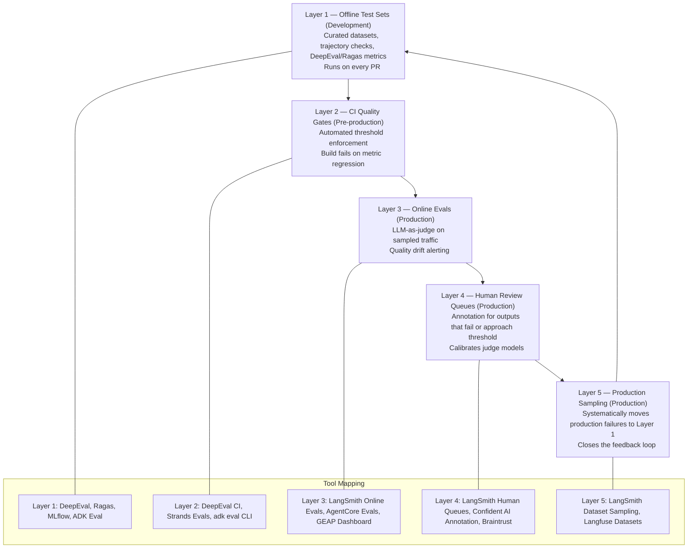

Most teams building production agents underinvest in evaluation in a specific pattern: they pick an evaluation tool, configure a dashboard, and call it done. What they've built is a monitoring system, not an evaluation strategy. The difference matters enormously at scale.

An evaluation strategy defines: which metrics matter for which agent types, where in the delivery pipeline quality is enforced, who is responsible for quality decisions, and how production signal feeds back into development testing. A dashboard without these decisions is just a collection of numbers no one is accountable for.



## The Evaluation Pyramid in Practice

**Layer 1 — Offline test sets**: These are your curated, deterministic test cases. They run fast, return consistent results, and form the foundation of your evaluation confidence. A good offline test set has: representative inputs from real production traffic (not just hand-crafted examples), trajectory expectations for task automation agents, context-answer pairs for RAG agents, and at least 50-100 cases per major use case category.

**Layer 2 — CI quality gates**: A metric threshold in a CI pipeline is a quality contract. It says: before this code or prompt change ships, it must achieve at least X on these metrics. Write it as code, version-control it, and treat threshold changes as pull requests that require review.

**Layer 3 — Online evals**: Sampling 5-15% of production traffic and running LLM-as-judge against it gives you real-time signal on quality drift. This is where you catch: model version updates that changed behavior, new input patterns the agent wasn't designed for, and tool dependency changes that affect agent behavior.

**Layer 4 — Human review queues**: Cases that fail online evals or approach threshold boundaries go to human reviewers. This isn't a scalability failure — it's a calibration mechanism. Human annotations are how you measure whether your judge models are actually aligned with user preferences.

**Layer 5 — Production sampling**: The feedback loop that makes the whole system improve over time. Production failures that weren't caught by existing tests become new test cases. The offline test set at Layer 1 grows more representative of real-world agent behavior with each iteration.

Most teams I work with have Layer 1 and nothing else. A few have Layers 1 and 3. Almost nobody has a functioning Layer 5. That's the gap that causes silent quality regression between model updates.

## Metric Selection by Agent Type

Metrics are not one-size-fits-all. The right metrics depend on what the agent is doing.

**RAG agents** (information retrieval, Q&A over documents):

```yaml
primary_metrics:
  - faithfulness: 0.85          # Claims must be grounded in retrieved context
  - contextual_precision: 0.80  # Retrieved context should be relevant
  - contextual_recall: 0.80     # All relevant context should be retrieved
  - answer_relevancy: 0.80      # Answer must address the question

secondary_metrics:
  - groundedness: 0.85          # Azure/AWS framing of faithfulness
  - hallucination_rate: 0.10    # Max acceptable hallucination rate
```

**Task automation agents** (DevOps, code changes, data pipeline operations):

```yaml
primary_metrics:
  - task_completion: 0.90       # Did it complete the requested task?
  - tool_call_accuracy: 0.95    # Did it call the right tools?
  - trajectory_in_order_match: 0.85  # Correct tool sequence

secondary_metrics:
  - plan_adherence: 0.85        # Did it follow a logical plan?
  - argument_correctness: 0.90  # Correct arguments to each tool?
```

**Conversational agents** (customer service, internal helpdesk):

```yaml
primary_metrics:
  - conversation_relevancy: 0.80   # Responses address user intent
  - hallucination_rate: 0.05       # Very low tolerance in customer-facing contexts
  - safety_score: 0.99             # Near-perfect for public-facing agents

secondary_metrics:
  - fluency: 0.85               # Coherent, readable responses
  - coherence: 0.85             # Consistent across conversation turns
```

**Code generation agents**:

```yaml
primary_metrics:
  - pass_at_k: 0.70             # k=5: at least 1 of 5 attempts passes tests
  - compilation_rate: 0.95      # Generated code must compile/parse
  - test_success_rate: 0.80     # Generated code passes existing test suite

secondary_metrics:
  - trajectory_in_order_match: 0.80  # Code reading before writing
  - task_completion: 0.85            # Completed the requested change
```

## CI/CD Integration Pattern

```yaml
# .github/workflows/agent-quality-gate.yml
name: Agent Quality Gate

on:
  pull_request:
    branches: [main]
  push:
    branches: [main]

jobs:
  # Run before production promotion
  quality-gate:
    runs-on: ubuntu-latest
    environment: staging  # Runs against staging deployment

    steps:
      - uses: actions/checkout@v4

      - name: Deploy to staging
        run: ./scripts/deploy-staging.sh

      - name: Wait for staging health
        run: ./scripts/wait-for-health.sh staging 60

      - name: Run offline evaluation
        env:
          AGENT_ENDPOINT: ${{ vars.STAGING_AGENT_ENDPOINT }}
          OPENAI_API_KEY: ${{ secrets.OPENAI_API_KEY }}
          CONFIDENT_AI_API_KEY: ${{ secrets.CONFIDENT_AI_API_KEY }}
        run: |
          deepeval test run tests/agent_quality/ \
            --confident-ai \
            --verbose \
            --fail-or-exit-code 1

      - name: Check promotion gate
        run: |
          python scripts/check_promotion_gate.py \
            --min-task-completion 0.90 \
            --min-tool-accuracy 0.95 \
            --max-hallucination 0.05

  # Only runs if quality-gate passes
  promote-to-production:
    needs: quality-gate
    runs-on: ubuntu-latest
    environment: production

    steps:
      - name: Promote to production
        run: ./scripts/promote-to-production.sh
```

The promotion gate pattern separates the quality decision from the deployment mechanism. If `quality-gate` fails, `promote-to-production` never runs. The quality thresholds are version-controlled in `scripts/check_promotion_gate.py` and change through the same PR review process as code.

## The Make-vs-Buy Decision

The evaluation tooling decision follows your existing infrastructure choices more than any other factor:

**Already on Azure?** Azure AI Foundry evaluation is the lowest-friction starting point. Four-pillar model (Trace → Evaluate → Monitor → Optimize), OTel-native, integrated with Azure Monitor. Add `Microsoft.Extensions.AI.Evaluation` for offline evaluation in C#/.NET.

**Already on AWS?** Strands Evals (build-time) + AgentCore Evaluations (production) gives you the two-phase strategy that covers both ends of the evaluation pyramid. AgentCore Policy adds hard enforcement on top.

**Multi-cloud or cloud-agnostic?** MLflow for self-hosted observability, tracing, and the unique trace replay capability. Or Langfuse for OTel-native, self-hostable, MIT-licensed observability with framework-agnostic ingestion.

**CI-first, quality-as-code preference?** DeepEval is the clear choice. Test files, metric thresholds, CI integration, pytest compatibility.

**Need red teaming?** Promptfoo. Run it before every deployment, regardless of which other evaluation tools you're using. No other tool matches it for adversarial testing.

**On LangGraph?** LangSmith. The integration advantage is significant enough that even teams with mild data residency concerns often find LangSmith with contractual data handling commitments acceptable.

## The Gaps That Matter

Three gaps in current tooling that affect enterprise evaluation at scale:

**Multi-agent coalition evaluation** is mostly custom work today. When Agent A calls Agent B in a multi-agent system, you can capture the cross-agent traces via OTel, but no platform has purpose-built evaluation for the coalition's behavior as a whole — did the agents divide work correctly, did information transfer between them faithfully, did the orchestrator make good delegation decisions? You'll write custom metrics for this.

**OTel GenAI conventions are pre-stable.** The `gen_ai.*` attributes can still change. Build an abstraction layer over attribute names. Don't hard-code `gen_ai.usage.input_tokens` in 40 places — put it in one configuration file and reference it everywhere else.

**Cost-quality coupling** is only done well by MLflow and LangSmith. If you need to answer "what is the cost of achieving 0.85 faithfulness versus 0.90 faithfulness for this agent?" — those are the tools that give you the data to answer it. Build this visibility early; retrofitting cost monitoring into an evaluation system that wasn't designed for it is painful.

## The Metric That Matters Most

After all the metrics, thresholds, and tooling: the metric I watch most closely is **first-pass acceptance rate** — the percentage of agent outputs that users accept without correction or regeneration.

This is the composite metric. High faithfulness but low first-pass acceptance means the outputs are technically grounded but not useful. High task completion but low acceptance means the agent is doing something, but not the right thing. First-pass acceptance integrates all the evaluation signals into a single number that reflects real user value.

Measure it by instrumenting your UI or API layer to capture explicit accepts (user proceeds) and rejections (user regenerates, edits significantly, or abandons). Route rejection instances automatically to Layer 4 (human review) and Layer 5 (production sampling). This makes your evaluation pyramid self-maintaining.

## Governance: Who Owns Evaluation?

The pattern that fails consistently: a central "AI QA team" owns all agent quality across the organization. It becomes a bottleneck, loses context about individual agents quickly, and creates a separation between the team building the agent and the team accountable for its quality.

The pattern that works: evaluation ownership at the team level. The team that builds the agent defines its metrics, thresholds, and test cases. A platform team provides tooling infrastructure (the evaluation platform, the CI templates, the metric taxonomy) and enforces governance standards (safety metrics are non-negotiable, human review queues must exist for production agents). No central AI QA team owns agent quality across all teams.

This isn't a new idea — it's the same model that works for software quality in general. Platform teams provide capability; product teams own quality within their domain.

The evaluation pyramid exists to make that ownership tractable. Five well-defined layers, with clear tooling and clear responsibility at each layer, give teams the structure to own quality without reinventing the approach from scratch.
